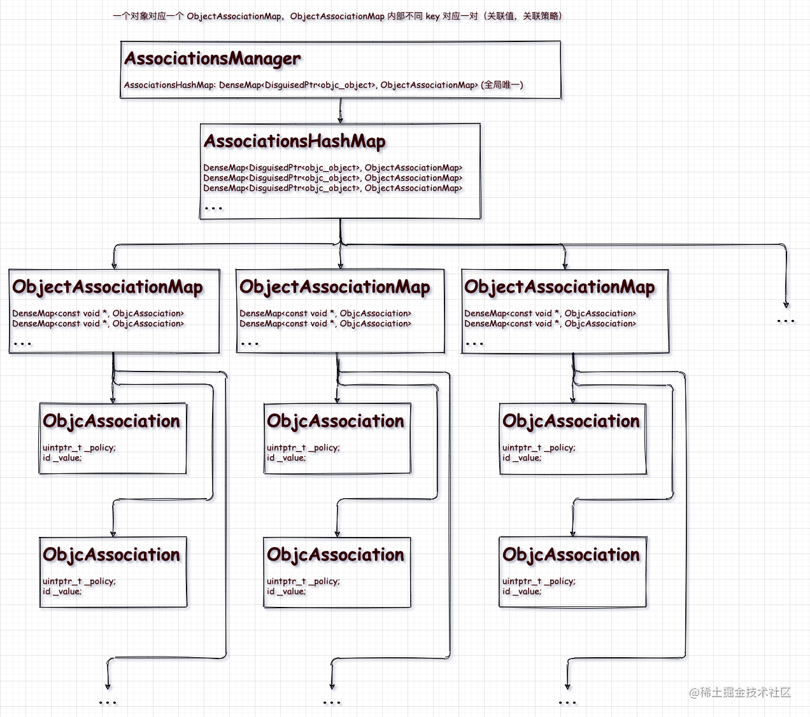
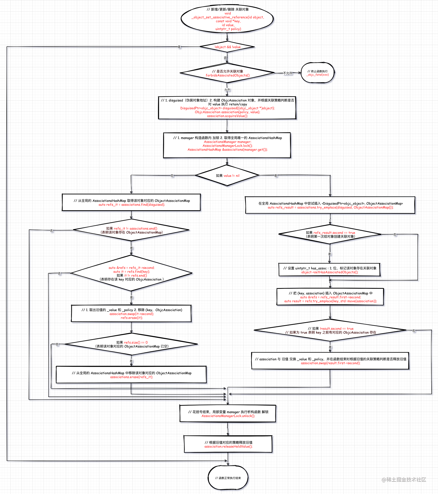

> 析构函数(destructor) 与构造函数相反，当对象结束其[生命周期](https://baike.baidu.com/item/生命周期)，如对象所在的[函数](https://baike.baidu.com/item/函数/301912)已[调用](https://baike.baidu.com/item/调用/3351318)完毕时，系统自动执行析构函数。析构函数往往用来做“清理善后” 的工作（例如在建立对象时用new开辟了一片内存空间，delete会自动调用析构函数后释放[内存](https://baike.baidu.com/item/内存/103614)）。析构函数不释放内存，释放内存是调用 `free` 函数，还有`OC`的`dealloc`。最终都是调用 free。dealloc 也可以理解为是 free 函数调用前做“清理善后” 的工作

## 1. 前言

使用 `Category` 为已经存在的类添加方法是我们很熟悉的常规操作，但是如果在 `Category` 中为类添加属性 `@property`，则编译器会立即给我们如下警告:

```jsx
Property 'categoryProperty' requires method 'categoryProperty' to be defined - use @dynamic or provide a method implementation in this category.
Property 'categoryProperty' requires method 'setCategoryProperty:' to be defined - use @dynamic or provide a method implementation in this category
```

提示我们需要手动为属性添加 `setter` `gettr` 方法或者使用 `@dynamic` 在运行时实现这些方法。

**即明确的告诉我们在分类中 `@property` 并不会自动生成实例变量以及存取方法。**

不是说好的使用 `@property`，编译器会自动帮我们生成下划线实例变量和对应的 `setter` 和 `getter` 方法吗。此机制只能在类定义中实现，因为在分类中，类的实例变量的布局已经固定，使用 `@property` 已经无法向固定的布局中添加新的实例变量，所以我们需要使用关联对象以及两个方法来模拟构成属性的三个要素。

示例代码:

```jsx
#import "HMObject.h"

NS_ASSUME_NONNULL_BEGIN

@interface HMObject (category)

// 在分类中添加一个属性
@property (nonatomic, copy) NSString *categoryProperty;

@end

NS_ASSUME_NONNULL_END

```

```jsx
#import "HMObject+category.h"
#import <objc/runtime.h> 

@implementation HMObject (category)

- (NSString *)categoryProperty {
    // _cmd 代指当前方法的选择子，即 @selector(categoryProperty)
    return objc_getAssociatedObject(self, _cmd);
}

- (void)setCategoryProperty:(NSString *)categoryProperty {
    objc_setAssociatedObject(self,
                             @selector(categoryProperty),
                             categoryProperty,
                             OBJC_ASSOCIATION_COPY_NONATOMIC);
}

@end
```

此时我们可以使用关联对象 `Associated Object` 来手动为 `categoryProperty` 添加存取方法，接下来我们对示例代码一步一步进行分析。

## 2. 在类定义中使用 @property

在类中使用`@property`为类添加属性时，如果不使用`@dynamic`，编译器会自动生成带下划线的实例变量和该属性的`setter`和`getter`方法。

```jsx
// .h 中如下书写
#import <Foundation/Foundation.h>

NS_ASSUME_NONNULL_BEGIN

@interface HMObject : NSObject

@property (nonatomic, copy) NSString *cusProperty;

@end

NS_ASSUME_NONNULL_END

// .m 中什么都不做
#import "HMObject.h"
@implementation HMObject
// @dynamic cusProperty;

@end
```

编译器会做如下事情：

- 添加实例变量：`_xxx`
- 添加`setter`方法：`setXxx`
- 添加`getter`方法：：`xxx`

即实现如下：

```jsx
#import "HMObject.h"

@implementation HMObject
// @dynamic cusProperty;
{
    NSString *_cusProperty;
}

- (void)setCusProperty:(NSString *)cusProperty {
    _cusProperty = cusProperty;
}

- (NSString *)cusProperty {
    return _cusProperty;
}

@end
```

## 3. Associated Object

使用`objc_setAssociatedObject`和`objc_getAssociatedObject`来分别模拟属性的存取方法，而使用关联对象模拟实例变量。`runtime.h`中定义了如下三个与关联对象相关的接口：

```jsx title="objc_setAssociatedObject"
/** 
 * Sets an associated value for a given object using a given key and association policy.
 * 使用给定的 key 和关联策略为给定的对象设置关联值
 *
 * @param object The source object for the association.
 * // 关联的源对象
 *
 * @param key The key for the association.
 * // 关联的 key
 *
 * @param value The value to associate with the key key for object. Pass nil to clear an existing association.
 * 与对象的key 相关联的值,如果传 nil,则清除现在的关联
 *
 * @param policy The policy for the association. For possible values, see “Associative Object Behaviors.”
 * 关联策略. 有关值,参考Associative Object Behaviors(objc_AssociationPolicy)
 * @see objc_setAssociatedObject
 * @see objc_removeAssociatedObjects
 */
OBJC_EXPORT void
objc_setAssociatedObject(id _Nonnull object, const void * _Nonnull key,
                         id _Nullable value, objc_AssociationPolicy policy)
    OBJC_AVAILABLE(10.6, 3.1, 9.0, 1.0, 2.0);
```

```jsx title="objc_getAssociatedObject"
/** 
 * Returns the value associated with a given object for a given key.
 * 返回与给定键的给定对象关联的值。
 *
 * @param object The source object for the association.
 * 关联源对象
 *
 * @param key The key for the association.
 * // 关联 key
 *
 * @return The value associated with the key \e key for \e object.
 *
 * @see objc_setAssociatedObject
 */
OBJC_EXPORT id _Nullable
objc_getAssociatedObject(id _Nonnull object, const void * _Nonnull key)
    OBJC_AVAILABLE(10.6, 3.1, 9.0, 1.0, 2.0);
```

```jsx title="objc_removeAssociatedObjects"
/** 
 * Removes all associations for a given object.
 * 删除给定对象所有的关联
 *
 * @param object An object that maintains associated objects.
 * 维护关联对象的对象
 *
 * @note The main purpose of this function is to make it easy to return an object 
 *  to a "pristine state”. You should not use this function for general removal of
 *  associations from objects, since it also removes associations that other clients
 *  may have added to the object. Typically you should use \c objc_setAssociatedObject 
 *  with a nil value to clear an association.
 *  此函数的主要目的是删除全部关联,把对象还原到没有关联的时候.
 *  因此不应该用该函数从对象中删除关联,因为它还会删除其他clients可能已添加到对象中的关联.
 *  通常应该用objc_setAssociatedObject 和 nil 一起使用以清除指定关联.
 *
 * @see objc_setAssociatedObject
 * @see objc_getAssociatedObject
 */
OBJC_EXPORT void
objc_removeAssociatedObjects(id _Nonnull object)
    OBJC_AVAILABLE(10.6, 3.1, 9.0, 1.0, 2.0);
```

### 3.1 const void *  key

存储函数中参数`key`我们使用了`@selector(xxx)`，其实也可以使用静态指针 `static void *`类型的参数来代替，不过这里建议使用`@selector(xxx)`作为`key`传入，因为这种方法省略了声明参数的代码，并且能很好的保证`key`的唯一性。

### 3.2 objc_AssociationPolicy policy

`policy`代表关联策略：

```jsx title="objc_AssociationPolicy"
/* Associative References */
// 关联引用
/**
 * Policies related to associative references.
 * 关联引用相关的策略
 * These are options to objc_setAssociatedObject()
 * 这些选项与 objc_setAssociatedObject 函数一起使用
 */
typedef OBJC_ENUM(uintptr_t, objc_AssociationPolicy) {
    /**< Specifies a weak reference to the associated object. */
    // 指定对关联对象的弱引用(weak reference), 其实这里等于 assign/unsafe_unretained
    OBJC_ASSOCIATION_ASSIGN = 0,
    /**< Specifies a strong reference to the associated object.
                                            *   The association is not made atomically. */
    // 强引用,非原子属性.属性关键词 nonatomic
    OBJC_ASSOCIATION_RETAIN_NONATOMIC = 1,
    /**< Specifies that the associated object is copied.
                                            *   The association is not made atomically. */
    // 属性关键词 nonatomic/copy
    OBJC_ASSOCIATION_COPY_NONATOMIC = 3,
    /**< Specifies a strong reference to the associated object.
                                            *   The association is made atomically. */
    // 属性关键词 atomic/retain
    OBJC_ASSOCIATION_RETAIN = 01401,
    /**< Specifies that the associated object is copied.
                                            *   The association is made atomically. */
    // 属性关键词 atomic/copy
    OBJC_ASSOCIATION_COPY = 01403
};
```

不同的策略对应不同的属性修饰符：

- `OBJC_ASSOCIATION_ASSIGN`：`assing`、`unsafe_unretained`
- `OBJC_ASSOCIATION_RETAIN_NONATOMIC`: `nonatomic`
- `OBJC_ASSOCIATION_COPY_NONATOMIC`: `nonatomic`/`copy`
- `OBJC_ASSOCIATION_RETAIN`: `atomic`/`retain`
- `OBJC_ASSOCIATION_COPY`: `atomic`/`copy`

`objc-references.mm`包含了关联对象所有的核心操作，下面来分析下该文件。

### 3.3 ObjcAssociation

`associated object` 机制中用来保存关联策略和关联值。

```jsx title="ObjcAssociation"
class ObjcAssociation {
    uintptr_t _policy; // 关联策略
    id _value; // 关联值
public:
    // 构造函数,初始化列表初始化 policy 和 value
    ObjcAssociation(uintptr_t policy, id value) : _policy(policy), _value(value) {}
    // 构造函数,初始化列表, policy = 0,value = nil
    ObjcAssociation() : _policy(0), _value(nil) {}
    // 复制构造函数采用默认
    ObjcAssociation(const ObjcAssociation &other) = default;
    // 赋值操作符,采用默认
    ObjcAssociation &operator=(const ObjcAssociation &other) = default;
    // 和 other 交换 policy 和 value
    ObjcAssociation(ObjcAssociation &&other) : ObjcAssociation() {
        swap(other);
    }

    inline void swap(ObjcAssociation &other) {
        std::swap(_policy, other._policy);
        std::swap(_value, other._value);
    }
    
    // 内联函数,获取 policy
    inline uintptr_t policy() const { return _policy; }
    // 内联函数,获取 value
    inline id value() const { return _value; }

    // 在 setter 时使用,判断是否需要持有 value
    inline void acquireValue() {
        if (_value) {
            switch (_policy & 0xFF) {
            case OBJC_ASSOCIATION_SETTER_RETAIN:
                _value = objc_retain(_value);
                break;
            case OBJC_ASSOCIATION_SETTER_COPY:
                _value = ((id(*)(id, SEL))objc_msgSend)(_value, @selector(copy));
                break;
            }
        }
    }

    // 在 setter 时使用,与上面的 acquireValue 函数对应,释放旧值 value
    inline void releaseHeldValue() {
        if (_value && (_policy & OBJC_ASSOCIATION_SETTER_RETAIN)) {
            objc_release(_value);
        }
    }
    // 在 getter 的时候使用,根据关联策略判断是否对关联值进行 retain 操作
    inline void retainReturnedValue() {
        if (_value && (_policy & OBJC_ASSOCIATION_GETTER_RETAIN)) {
            objc_retain(_value);
        }
    }
    
    // 在 getter 时使用,根据关联策略判断是否需要把关联值放进自动释放池
    inline id autoreleaseReturnedValue() {
        if (slowpath(_value && (_policy & OBJC_ASSOCIATION_GETTER_AUTORELEASE))) {
            return objc_autorelease(_value);
        }
        return _value;
    }
};
```

### 3.4 ObjectAssociationMap

```jsx title="ObjectAssociationMap"
typedef DenseMap<const void *, ObjcAssociation> ObjectAssociationMap;
```

`ObjectAssociationMap` 是以``const void *``为 `key`，`ObjcAssociation`为 `value`的哈希表

### 3.5 AssociationsHashMap

```jsx title="AssociationsHashMap"
typedef DenseMap<DisguisedPtr<objc_object>, ObjectAssociationMap> AssociationsHashMap;
```

`AssociationsHashMap`是以`DisguisedPtr<objc_object>`为`key`，`ObjectAssociationMap`为`value`的哈希表。
`DisguisedPtr<objc_object>`可以理解为把`objc_object`地址变成一个证书.可以参考`DisguisedPtr`的注释。

### 3.6 AssociationsManager


```jsx title="AssociationsManager"
// class AssociationsManager manages a lock / hash table singleton pair.
// AssociationsManager 管理一个 lock/哈希表的单例pair
// Allocating an instance acquires the lock
// 分配实例获取锁

class AssociationsManager {
    // Convenience class for Dense Maps & Sets
    // template <typename Key, typename Value>
    // class ExplicitInitDenseMap : public ExplicitInit<DenseMap<Key, Value>> { };
    // Storage 模板类名
    using Storage = ExplicitInitDenseMap<DisguisedPtr<objc_object>, ObjectAssociationMap>;
    // 静态变量 _mapStorage,用于存储 AssociationsHashMap 数据
    static Storage _mapStorage;

public:
    // 构造函数,获取全局的 AssociationsManagerLock 加锁
    AssociationsManager()   { AssociationsManagerLock.lock(); }
    // 析构函数,获取全局的 AssociationsManagerLock 解锁
    ~AssociationsManager()  { AssociationsManagerLock.unlock(); }
    
    // 返回内部保存的 AssociationsHashMap
    AssociationsHashMap &get() {
        return _mapStorage.get();
    }
    
    // init 初始化函数实现,只是调用 storage 的 init 函数
    static void init() {
        _mapStorage.init();
    }
};
// 其实这里有点想不明白，明明 AssociationsManager 已经定义了公开函数 get 获取内部 _mapStorage 的数据，

// 为什么这里在类定义外面还写了这句代码 ？
AssociationsManager::Storage AssociationsManager::_mapStorage;
```

`AssociationsManager` 类的定义并不复杂，从数据结构上来看，它是作为一个 `key` 是 `DisguisedPtr<objc_object>`，`value` 是 `ObjectAssociationMap ` 的哈希表来用的。看起来好像和上面的 `AssociationsHashMap` 有些重合，其实它内部存储的是一个局部静态的`AssociationsHashMap` 来存储程序中所有的关联对象。

#### 3.6.1 AssociationsManagerLock

```jsx 
spinlock_t AssociationsManagerLock;
```

一个全局的自旋锁（互斥锁），保证 `AssociationsManager` 中对 `AssociationsHashMap` 操作的线程安全。

#### 3.6.2 总结：

1. 通过 AssociationsManager 的 get 函数获取一个全局唯一的 AssociationsHashMap

2. 根据原始对象的 DisguisedPtr<objc_object> 从 AssociationsHashMap 获取 ObjectAssociationMap

3. 根据指定的关联 key(const void *) 从 ObjectAssociationMap 获取 ObjcAssociation

4. ObjcAssociation 的两个成员变量,保存对象的关联策略 _policy 和关联值 _value



### 3.7 objc_setAssociatedObject

```jsx title="objc_setAssociatedObject"
void
objc_setAssociatedObject(id object, const void *key, id value, objc_AssociationPolicy policy)
{
    _object_set_associative_reference(object, key, value, policy);
}
```

#### 3.7.1 forbidsAssociatedObjects

```jsx title="forbidsAssociatedObjects"
// class does not allow associated objects on its instances
#define RW_FORBIDS_ASSOCIATED_OBJECTS       (1<<20)

bool forbidsAssociatedObjects() {
    return (data()->flags & RW_FORBIDS_ASSOCIATED_OBJECTS);
}
```

类不允许在其实例上关联对象

#### 3.7.2 try_emplace
```jsx title="try_emplace"
// Inserts key,value pair into the map if the key isn't already in the map.
// 如果 key value 键值对在 map 中不存在则把它们插入 map
// The value is constructed in-place if the key is not in the map, otherwise
// it is not moved.
// 如果 key 不在 map 中，则 value 就地构造，否则不会移动。
template <typename... Ts>
std::pair<iterator, bool> try_emplace(const KeyT &Key, Ts &&... Args) {
  BucketT *TheBucket;
  // 已存在
  if (LookupBucketFor(Key, TheBucket))
    return std::make_pair(
             makeIterator(TheBucket, getBucketsEnd(), true),
             false); // Already in map.

  // Otherwise, insert the new element.
  // 不存在，则插入新元素
  TheBucket = InsertIntoBucket(TheBucket, Key, std::forward<Ts>(Args)...);
  return std::make_pair(
           makeIterator(TheBucket, getBucketsEnd(), true),
           true);
}
```

#### 3.7.3 setHasAssociatedObjects

```jsx title="setHasAssociatedObjects"
inline void
objc_object::setHasAssociatedObjects()
{
    // 如果是 TaggedPointer 类型直接返回
    if (isTaggedPointer()) return;
    //满足以下条件, 进判断
    // 1. 纯指针(非优化过的 isa)
    // 2. 类的相关方法重写过(具体看hasCustomRR的注释)
    // 3. 非未实现的isFutur类
    // 4. 非元类
    if (slowpath(!hasNonpointerIsa() && ISA()->hasCustomRR()) && !ISA()->isFuture() && !ISA()->isMetaClass()) {
        // 获取 _noteAssociatedObjects 的方法
        void(*setAssoc)(id, SEL) = (void(*)(id, SEL)) object_getMethodImplementation((id)this, @selector(_noteAssociatedObjects));
        // 如果 _noteAssociatedObjects 方法不是来自消息转发
        if ((IMP)setAssoc != _objc_msgForward) {
            // 找到了方法 _noteAssociatedObjects,调用方法
            (*setAssoc)((id)this, @selector(_noteAssociatedObjects));
        }
    }
    // 设置新的 isa
    isa_t newisa, oldisa = LoadExclusive(&isa.bits);
    do {
        newisa = oldisa;
        // 纯指针(非优化过的 isa) || 已经关联过对象
        if (!newisa.nonpointer  ||  newisa.has_assoc) {
            //在 arm64 平台下，清除对 &isa.bits 的独占访问标记。
            ClearExclusive(&isa.bits);
            return;
        }
        // 关联对象标记
        newisa.has_assoc = true;
    } while (slowpath(!StoreExclusive(&isa.bits, &oldisa.bits, newisa.bits)));
    // 如果保存 newisa.bits 到 isa失败,就执行循环
    // 保存成功,退出循环
}
```

#### 3.7.1_object_set_associative_reference

```jsx title="_object_set_associative_reference"
void
_object_set_associative_reference(id object, const void *key, id value, uintptr_t policy)
{
    // This code used to work when nil was passed for object and key. Some code
    // probably relies on that to not crash. Check and handle it explicitly.
    // rdar://problem/44094390
    // 判断对象和关联值都为 nil，则返回
    if (!object && !value) return;
    
    // 判断当前类是否允许关联对象
    if (object->getIsa()->forbidsAssociatedObjects())
        _objc_fatal("objc_setAssociatedObject called on instance (%p) of class %s which does not allow associated objects", object, object_getClassName(object));
    
    // 伪装 objc_object 指针为 disguised
    DisguisedPtr<objc_object> disguised{(objc_object *)object};
    // 根据入参创建一个 ObjcAssociation
    ObjcAssociation association{policy, value};

    // retain the new value (if any) outside the lock.
    // 在入参之前根据根据关联策略判断是否是 retain/copy 入参 value
    association.acquireValue();

    bool isFirstAssociation = false;
    {
        // 创建 manager 临时变量
        // 这里还有一步连带操作
        // 在其构造函数中 AssociationsManagerLock.lock() 加锁
        AssociationsManager manager;
        // 获取全局的 AssociationsHashMap
        AssociationsHashMap &associations(manager.get());
        
        // 如果 value 存在
        if (value) {
            // 这里 DenseMap 对我们而言是一个黑盒，这里只要看 try_emplace 函数
            
            // 在全局 AssociationsHashMap 中尝试插入 <DisguisedPtr<objc_object>, ObjectAssociationMap>
            // 返回值类型是 std::pair<iterator, bool>
            auto refs_result = associations.try_emplace(disguised, ObjectAssociationMap{});
            // 如果新插入成功
            if (refs_result.second) {
                /* it's the first association we make */
                // 第一次建立 association
                // 用于设置 uintptr_t has_assoc : 1; 位，标记该对象存在关联对象
                isFirstAssociation = true;
            }

            /* establish or replace the association */
            // 重建或者替换 association
            auto &refs = refs_result.first->second;
            auto result = refs.try_emplace(key, std::move(association));
            if (!result.second) {
                // 替换
                // 如果之前有旧值的话把旧值的成员变量交换到 association
                // 然后在 函数执行结束时把旧值根据对应的策略判断执行 release
                association.swap(result.first->second);
            }
        } else {
            // value 为 nil 的情况，表示要把之前的关联对象置为 nil
            // 也可理解为移除指定的关联对象
            auto refs_it = associations.find(disguised);
            if (refs_it != associations.end()) {
                auto &refs = refs_it->second;
                auto it = refs.find(key);
                if (it != refs.end()) {
                    association.swap(it->second);
                    // 清除指定的关联对象
                    refs.erase(it);
                    // 如果当前 object 的关联对象为空了，则同时从全局的 AssociationsHashMap
                    // 中移除该对象
                    if (refs.size() == 0) {
                        associations.erase(refs_it);

                    }
                }
            }
        }
        // 析构 mananger 临时变量
        // 这里还有一步连带操作
        // 在其析构函数中 AssociationsManagerLock.unlock() 解锁
    }

    // Call setHasAssociatedObjects outside the lock, since this
    // will call the object's _noteAssociatedObjects method if it
    // has one, and this may trigger +initialize which might do
    // arbitrary stuff, including setting more associated objects.
    // 在锁之外调用 setHasAssociatedObjects，因为如果对象有一个，这将调用对象的
    // _noteAssociatedObjects 方法，这可能会触发 +initialize 可能会做任意事情，包括设置更多关联对象。
    // 如果是第一次建立关联关系，则设置 uintptr_t has_assoc : 1; 位，标记该对象存在关联对象
    if (isFirstAssociation)
        object->setHasAssociatedObjects();

    // release the old value (outside of the lock).
    // 开始时 retain 的是新入参的 value, 这里释放的是旧值，association 内部的 value 已经被替换了
    association.releaseHeldValue();
}
```

函数执行流程有两种情况：

- `value != nil` 新增/更新关联对象的值
- `value == nil` 删除一个关联对象

函数流程图：



### 3.8 objc_getAssociatedObject

```jsx title="objc_getAssociatedObject"
id
objc_getAssociatedObject(id object, const void *key)
{
    return _object_get_associative_reference(object, key);
}
```

#### 3.8.1 _object_get_associative_reference

```jsx title="_object_get_associative_reference"
id
_object_get_associative_reference(id object, const void *key)
{
    // 局部变量
    ObjcAssociation association{};

    {
        // 创建 manager 临时变量，枷锁
        AssociationsManager manager;
        // 获取全局唯一的AssociationsHashMap
        AssociationsHashMap &associations(manager.get());
        // 从全局的 AssociationsHashMap 中取得对象对应的 ObjectAssociationMap
        AssociationsHashMap::iterator i = associations.find((objc_object *)object);
        if (i != associations.end()) {
            // 如果 ObjectAssociationMap 存在
            ObjectAssociationMap &refs = i->second;
            // 从 ObjectAssocationMap 中取得 key 对应的 ObjcAssociation
            ObjectAssociationMap::iterator j = refs.find(key);
            if (j != refs.end()) {
                // 如果存在
                association = j->second;
                // 根据关联策略判断是否需要对 _value 执行 retain 操作
                association.retainReturnedValue();
            }
        }
        // 解锁，销毁 manager
    }
    // 返回 _value 并根据关联策略判断是否需要放入自动释放池
    return association.autoreleaseReturnedValue();
}
```

### 3.9  objc_removeAssociatedObjects

```jsx title="objc_removeAssociatedObjects"
void objc_removeAssociatedObjects(id object) 
{
    // 对象不为空，且 has_assoc 标记为 true，表示该对象有关联对象
    if (object && object->hasAssociatedObjects()) {
        _object_remove_assocations(object, /*deallocating*/false);
    }
}
```

#### 3.9.1 _object_remove_assocations

```jsx title="_object_remove_assocations"
// Unlike setting/getting an associated reference,
// this function is performance sensitive because of
// raw isa objects (such as OS Objects) that can't track
// whether they have associated objects.
// 与 setting/getting 关联引用不同，此函数对性能敏感，
// 因为原始的 isa 对象（例如 OS 对象）无法跟踪它们是否具有关联的对象。
void
_object_remove_assocations(id object, bool deallocating)
{
    // 对象对应的 ObjectAssociationMap
    ObjectAssociationMap refs{};

    {
        // 创建临时变量 manager，枷锁
        AssociationsManager manager;
        // 从 manager 中获取全局唯一的AssociationsHashMap
        AssociationsHashMap &associations(manager.get());
        // 取得对象的对应 ObjectAssociationMap，里面包含所有的 (key, ObjcAssociation)
        AssociationsHashMap::iterator i = associations.find((objc_object *)object);
        if (i != associations.end()) {
            // 把 i->second 的内容都转入 refs 对象中
            refs.swap(i->second);

            // If we are not deallocating, then SYSTEM_OBJECT associations are preserved.
            // 如果我们不deallocating，则保留 SYSTEM_OBJECT 关联。
            bool didReInsert = false;
            // 如果不在 dealloc, 也就是对象不在释放的情况下
            if (!deallocating) {
                //  遍历对象对应的关联对象哈希表中所有的 ObjcAssociation
                for (auto &ref: refs) {
                    // ref.second是ObjcAssociation类型对象{policy, value}
                    // 这里是比对关联策略释放,如果当前策略是OBJC_ASSOCIATION_SYSTEM_OBJECT
                    if (ref.second.policy() & OBJC_ASSOCIATION_SYSTEM_OBJECT) {
                        // 重新将关联策略是OBJC_ASSOCIATION_SYSTEM_OBJECT的对象插入
                        i->second.insert(ref);
                        didReInsert = true;
                    }
                }
            }
            // 如果没有重新插入关联策略为OBJC_ASSOCIATION_SYSTEM_OBJECT的对象
            if (!didReInsert)
                // 从全局 AssociationsHashMap 移除对象的 ObjectAssociationMap
                associations.erase(i);
        }
    }

    // Associations to be released after the normal ones.
    // 巧妙的设计：laterRefs起到释放association缓冲作用。
    // 若当前正在释放association（忙不过来了），则将其它的association装入laterRefs向量中等待后续释放。
    SmallVector<ObjcAssociation *, 4> laterRefs;

    // release everything (outside of the lock).
    // 遍历对象对应的关联对象哈希表中所有的ObjcAssociation类对象
    for (auto &i: refs) {
        // i.second是ObjcAssociation类型对象{policy, value}，且关联策略是OBJC_ASSOCIATION_SYSTEM_OBJECT
        if (i.second.policy() & OBJC_ASSOCIATION_SYSTEM_OBJECT) {
            // If we are not deallocating, then RELEASE_LATER associations don't get released.
            // 如果不调用deallocating，那么 RELEASE_LATER 关联就不会被释放。
            // 如果正在释放对象
            if (deallocating)
                // dealloc的时候，OBJC_ASSOCIATION_SYSTEM_OBJECT的关联对象，
                // 先放入laterRefs 稍后释放，否则不处理。
                laterRefs.append(&i.second);
        } else {
            // 释放非OBJC_ASSOCIATION_SYSTEM_OBJECT的关联对象
            i.second.releaseHeldValue();
        }
    }
    // 遍历上一步存入策略为OBJC_ASSOCIATION_SYSTEM_OBJECT的对象
    for (auto *later: laterRefs) {
        // dealloc 的情况下释放OBJC_ASSOCIATION_SYSTEM_OBJECT的关联对象
        later->releaseHeldValue();
    }
}
```

### 3.10 objc_setHook_setAssociatedObject

为 `*objc_setAssociatedObject` 添加 `hook`。

```c++

typedef void (*objc_hook_setAssociatedObject)(id _Nonnull object, const void * _Nonnull key,
                                              id _Nullable value, objc_AssociationPolicy policy);

void
objc_setHook_setAssociatedObject(objc_hook_setAssociatedObject _Nonnull newValue,
                                 objc_hook_setAssociatedObject _Nullable * _Nonnull outOldValue) {
  // See objc_object::setHasAssociatedObjects() for a replacement
}
```

除了声明，并没有在项目中发现实现。具体实现应该如注释所说，看函数 `setHasAssociatedObjects`。

### 关联对象的本质

在分类中到底能否实现添加属性？首先要知道属性是什么，属性的概念决定了这个问题的答案。

- 如果把属性理解为通过方法访问实例变量，那这个问题的答案就是不能，因为分类不能为类添加额外的实例变量。因为类在创建的时候要根据实例变量等分配内存，如果在分类中添加实例变量，会涉及到新增/重新分配内存等情况。
- 如果属性只是一个存取方法及存储值容器的集合，那么分类可以实现属性。

## 补充：

### slowpath(x) & fastpath(x)

```jsx
#define fastpath(x) (__builtin_expect(bool(x), 1))
#define slowpath(x) (__builtin_expect(bool(x), 0))
```

`__builtin_expect()` 是 `GCC` 提供的，作用是将最有可能执行的分支告诉编译器，编译器就据此将执行概率大的代码紧跟着前面的代码，从而减少指令跳转时 `cpu` 等待取指令的耗时。具体介绍请看参考链接。

- `slowpath(x)` : x 很可能为0， 希望编译器进行优化。 
- `fastpath(x)` : x 很可能为1， 希望编译器进行优化。

## 参考链接

- [关联对象 AssociatedObject 完全解析](https://link.juejin.cn/?target=https%3A%2F%2Fdraveness.me%2Fao%2F)
- [iOS_@property 属性的本质是什么?](https://link.juejin.cn/?target=https%3A%2F%2Fwww.jianshu.com%2Fp%2F7ddefcfba3cb)
- [C++11的6种内存序总结__std::memory_order_acquire_等](https://link.juejin.cn/?target=https%3A%2F%2Fblog.csdn.net%2Fmw_nice%2Farticle%2Fdetails%2F84861651)
- [【iOS】Category的成员变量](https://link.juejin.cn/?target=https%3A%2F%2Fwww.jianshu.com%2Fp%2F0aada6304090)
- [OS 从源码解析 AssociatedObject 底层实现原理](https://juejin.cn/post/6868191269521358855#heading-11)

