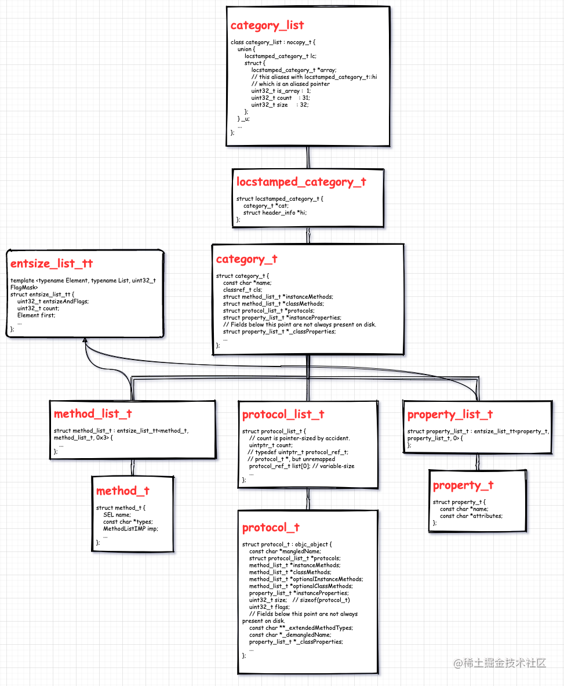

提到 `category` 不免要和 `extension` 进行比较，那先分析 `extension`。

## 1. extension 延展

`extension` 和 `category` 不同， `extension` 可以声明方法、属性、成员变量，但是一般是私有方法、私有属性、私有成员变量。

### 1.1 extension 存在形式

`category ` 拥有 `.h` 和 `.m` 文件，`extension` 则不然， `extension` 只存在一个 `.h` 文件，或者只能 ‘’寄生“ 在 `.m`  中(这也是最常见的方式)。

- ”寄生“ 形式

  比如，在 `BaseViewController.m` 文件中，可能会直接下一个 `extension` ：

  ```jsx
  @interface BaseViewController () {
  // 此处可定义私有成员变量
  // ...
  }
  
  // 此处可定义私有属性
  // ...
  // 此处可定义私有方法
  // ...
  @end
  ```

- 定义 `.h` 文件形式

  可以单独创建一个 `extension` 文件，`command` + `N` -> `Objective-C File`，`File Type` 选择 `Extension`，`Class` 输入要创建 `extension` 的类名，`File` 输入 `extension` 的名字，点击 `next` 后就会生成一个名字是 `类名+xxx.h` 的 `.h` 文件。

  下面示例是我们以 `.h` 文件的形式使用 `extension`。`CusObject+extension.h` 文件：

  ```jsx
  #import <Foundation/Foundation.h>
  #import "CusObject.h"
  
  NS_ASSUME_NONNULL_BEGIN
  
  @interface CusObject () {
      // 通过 extension 添加成员变量
      NSString *name;
  }
  
  // 通过 extension 添加属性和方法
  @property (nonatomic, copy) NSString *nameTwo;
  - (void)testMethod_Extension;
  
  @end
  
  NS_ASSUME_NONNULL_END
  ```

  在 `CusObject.m` 中引入 `#import "CusObject+extension.h"`：

  ```jsx
  #import "CusObject.h"
  #import "CusObject+extension.h"
  
  @implementation CusObject
  
  // 实现在 extension 中添加的方法，
  // 并能正常访问成员变量和属性
  -(void)testMethod_Extension {
      NSLog(@"%@", name);
      NSLog(@"%@", self.nameTwo);
  }
  
  - (void)dealloc {
      NSLog(@"🍀🍀🍀 CusObject deallocing");
  }
  
  @end
  ```

  如果把 `#import "CusObject+extension.h"` 引入放在 `CusObject.m` 中，则 `extension` 中的成员变量、属性、方法只能在类内部使用。

  > 注意：把 `#import "CusObject+extension.h"` 引入放在 `CusObject.h` 最上面，会直接报错，这里有一个定义先后的问题，此时 `CusObject+extension.h` 处于 `CusObject` 类定义前面，`CusObject` 定义还没完成，`extension` 必然无法找到 `CusObject`。

  可以把  `#import "CusObject+extension.h"` 放到下面，如下：

  ```jsx
  #import <Foundation/Foundation.h>
  
  NS_ASSUME_NONNULL_BEGIN
  
  @interface CusObject : NSObject
  
  @end
  
  NS_ASSUME_NONNULL_END
  
  #import "CusObject+extension.h"
  ```

  注意：

  - 在 `.m` 中引入 `extension` ，其中定义的成员变量、属性、方法只能在类内部使用。

  - 在 `.h` 中引入 `extension`， 属性和方法是公开的，成员变量默认是私有的，可以在前面添加 `@public` 可以变为公开，访问时要先用 `->`。(`.` 和 `->` 的使用在 `C/C++` 和 `OC` 中有一些区别，`OC` 是 `C` 的超集，但是并没有和 `C` 完全相同。)

  - 在 `.m` 中给类定义直接添加成员变量，在外部访问时会报错成员变量是 `protected`。 同样也可以添加 `@public` 公开。

    ```jsx
    object->array = @[@(1), @(2)]; ❌❌ // Instance variable 'array' is protected
    objc->name = @"chm"; ❌❌ // Instance variable 'name' is private
    ```

### 1.2 extension 和  category 的区别

- `extension` 可以添加成员变量，`category` 不能添加成员变量。运行时加载类到内存后，才会加载分类，这时类的内存布局已经确定，如果再去添加成员变量就会破坏类的内存布局。各个成员变量的访问地址是在编译时确定的，每个成员变量的地址偏移是固定的。
- `extension` 在编译期决议，`category` 在运行期决议。`extension` 在编译期和头文件里的 `@interface` 以及实现文件里的 `@implement` 一起形成一个完整的类，`extension` 伴随类的产生而产生，亦随着一起消亡。`category` 中的方法在运行期决议，没有实现也可以运行，而 `extension` 中的方法是在编译期检查的，没有实现会报错。
- `extension` 一般用来隐藏类的私有信息，无法直接为系统的类扩展，但是可以先创建系统类的子类再添加 `extension`。
- `category` 可以给系统类添加分类
- `extension` 和 `category` 都可以添加属性，但是 `category` 中的属性不能生成对应的成员变量以及 `setter` 和 `getter` 方法的实现。
- `extension` 不能像 `category` 那也拥有独立的实现部分(`@implementation`)，`extension` 所声明的方法必须依托对应类的实现部分完成。

## 2. category

`category` 可以在不改变或者不继承原类的情况下，动态的给类添加方法。除此之外还有一些应用场景。

- 可以把类的实现分开在不同的文件夹里。这要做有几点好处：
  - 可以减少单个文件的体积。
  - 可以把不同的功能组织到不同的 `category` 里。
  - 可以由多个开发者共同完成一个类。
  - 可以按需加载想要的 `category`。
  - 声明私有方法。
- 模拟多继承
- 把 `framework` 的私有方法公开。

### 2.1 category 特点

- `category` 只能给某个已有的类扩充方法，不能扩容成员变量。
- `category` 中也可以添加属性，只不过 `@property` 只会生成 `setter` 和 `getter` 的声明，不会生成其实现以及成员变量。
- 如果 `category` 中的方法和类中的方法同名，运行时会优先调用 `category` 中的方法，也就是说 `category` 中的方法会覆盖原有类中的方法。
- 如果多个  `category` 中存在同名的方法，运行时到底调用哪个，由编译器决定，最后一个参与编译的方法会被调用。可以在 `Compile Source` 拖动不同的分类顺序来测试。
- 调用优先级：`category` > 本类 > 父类。即先调用 `category` 中的方法，在调用本类方法，最后调用父类方法。

注意：

**`category` 是在运行时添加的，不能在编译时。**

注意：

- `category` 中的方法并没有 ”完全替换掉“ 原来类中已有的方法，也就是说如果 `category` 和原类中都有 `mehtodA`，那么 `category` 附加完成后，类的方法列表里就会有两个 `methodA`。
- `category` 中方法被放在新方法列表列表的前面，而原来类的方法会放到新方法列表的后面，这样也就是我们平常所说的 `category` 的方法会 “覆盖” 掉原来类的同名方法，这是因为运行时在查找方法的时候是顺着方法列表的顺序查找的，它只要一找到对应名字的方法，就会罢休，殊不知后面可能还有一样名字的方法。

### 2.2 为什么category 不能添加成员变量？

`Objective-C` 中类是由 `Class` 类型来表示的，它实际上是一个指向 `objc_class` 结构体的指针，如下:

```jsx
// objc_class

struct objc_class : objc_object {
// Class ISA;
Class superclass;
cache_t cache;             // formerly cache pointer and vtable
class_data_bits_t bits;    // class_rw_t * plus custom rr/alloc flags

class_rw_t *data() const {
    return bits.data();
}

...
};

// class_data_bits_t

struct class_data_bits_t {
    friend objc_class;

    // Values are the FAST_ flags above.
    uintptr_t bits;
    ...
public:

    class_rw_t* data() const {
        return (class_rw_t *)(bits & FAST_DATA_MASK);
    }
    ...

    // Get the class's ro data, even in the presence of concurrent realization.
    // fixme this isn't really safe without a compiler barrier at least
    // and probably a memory barrier when realizeClass changes the data field
    const class_ro_t *safe_ro() {
        class_rw_t *maybe_rw = data();
        if (maybe_rw->flags & RW_REALIZED) {
            // maybe_rw is rw
            return maybe_rw->ro();
        } else {
            // maybe_rw is actually ro
            return (class_ro_t *)maybe_rw;
        }
    }
    ...
};

// class_rw_t

struct class_rw_t {
    // Be warned that Symbolication knows the layout of this structure.
    uint32_t flags;
    uint16_t witness;
#if SUPPORT_INDEXED_ISA
    uint16_t index;
#endif

    explicit_atomic<uintptr_t> ro_or_rw_ext;

    Class firstSubclass;
    Class nextSiblingClass;
    ...

public:
    ...

    const method_array_t methods() const {
        auto v = get_ro_or_rwe();
        if (v.is<class_rw_ext_t *>()) {
            return v.get<class_rw_ext_t *>()->methods;
        } else {
            return method_array_t{v.get<const class_ro_t *>()->baseMethods()};
        }
    }

    const property_array_t properties() const {
        auto v = get_ro_or_rwe();
        if (v.is<class_rw_ext_t *>()) {
            return v.get<class_rw_ext_t *>()->properties;
        } else {
            return property_array_t{v.get<const class_ro_t *>()->baseProperties};
        }
    }

    const protocol_array_t protocols() const {
        auto v = get_ro_or_rwe();
        if (v.is<class_rw_ext_t *>()) {
            return v.get<class_rw_ext_t *>()->protocols;
        } else {
            return protocol_array_t{v.get<const class_ro_t *>()->baseProtocols};
        }
    }
};

// class_ro_t

struct class_ro_t {
    uint32_t flags;
    uint32_t instanceStart;
    uint32_t instanceSize;
#ifdef __LP64__
    uint32_t reserved;
#endif

    const uint8_t * ivarLayout;
    
    const char * name;
    method_list_t * baseMethodList;
    protocol_list_t * baseProtocols;
    const ivar_list_t * ivars;

    const uint8_t * weakIvarLayout;
    property_list_t *baseProperties;

    ...

    method_list_t *baseMethods() const {
        return baseMethodList;
    }
    ...
};
```

在上面一连串的数据结构定义中，`ivars` 是 `const ivar_list_t *`。在 `runtime` 中， `objc_class` 结构体大小是固定的，不可能往这个结构体中添加数据。且这里加了 `const` 修饰符，所以 `ivars` 指向一个固定的区域，不能修改成员变量值，也不能增加成员变量个数。

### 2.3 category 中能添加属性吗？

`category` 不能添加成员变量（`instance variables`），那到底能不能添加属性（`@property`）呢？
从 `category` 的结构体开始分析:  `category_t` 定义:

```jsx
// classref_t is unremapped class_t*
typedef struct classref * classref_t;
```

```jsx
struct category_t {
    const char *name;
    classref_t cls;
    struct method_list_t *instanceMethods;
    struct method_list_t *classMethods;
    struct protocol_list_t *protocols;
    struct property_list_t *instanceProperties;
    // Fields below this point are not always present on disk.
    struct property_list_t *_classProperties;

    method_list_t *methodsForMeta(bool isMeta) {
        if (isMeta) return classMethods;
        else return instanceMethods;
    }

    property_list_t *propertiesForMeta(bool isMeta, struct header_info *hi);
    
    protocol_list_t *protocolsForMeta(bool isMeta) {
        if (isMeta) return nullptr;
        else return protocols;
    }
};
```

从 `category` 定义中可以看出 `category` 可以添加实例方法、类方法甚至可以实现协议、添加属性，同时也看到不能添加成员变量。 那为什么说不能添加属性呢？实际上，`category` 允许添加属性，可以使用 `@property` 添加，但是能添加 `@property` 不代表可以添加 “完整版的” 属性，通常我们说的添加属性是指编译器为我们生成了对应的成员变量和对应的 `setter` 和 `getter` 方法来存取属性。在 `category` 中虽说可以书写 `@property`，但是不会生成 _成员变量，也不会生成所添加属性的 `getter` 和 `setter` 方法的实现，所以尽管添加了属性，也无法使用点语法调用 `setter` 和 `getter` 方法。（实际上，点语法可以写，只不过在运行时调用到这个方法时会报找不到方法的错误: `unrecognized selector sent to instance ....`）。我们此时可以通过 `associated object` 来为属性手动实现 `setter` 和 `getter` 存取方法。

### 2.4 从 clang 编译文件来验证上面两个问题

我们先用 `clang` 编译文件（这里建议大家在 `xcode` 和终端上自己试一下）。首先定义如下类 `CustomObject` 只声明一个属性:

```jsx
// CustomObject.h
#import <Foundation/Foundation.h>
NS_ASSUME_NONNULL_BEGIN
@interface CustomObject : NSObject

@property (nonatomic, copy) NSString *customProperty;

@end
NS_ASSUME_NONNULL_END

// CustomObject.m
#import "CustomObject.h"
@implementation CustomObject
@end
```

然后打开终端进入到 `CustomObject.m` 文件所在文件夹，执行 `clang -rewrite-objc CustomObject.m` 指令，然后生成 `CustomObject.cpp` 文件，查看它：
`struct CustomObject_IMPL` 定义：

```jsx
extern "C" unsigned long OBJC_IVAR_$_CustomObject$_customProperty;
struct CustomObject_IMPL {
    struct NSObject_IMPL NSObject_IVARS;
    NSString * _Nonnull _customProperty;
};

// @property (nonatomic, copy) NSString *customProperty;

/* @end */
```

看到为我们增加了 `_customProperty` 成员变量，`NSObject_IVARS` 是每个继承自 `NSObject` 都会有的成员变量。 `@implementation CustomObject` 部分：

```jsx
// @implementation CustomObject

static NSString * _Nonnull _I_CustomObject_customProperty(CustomObject * self, SEL _cmd) { return (*(NSString * _Nonnull *)((char *)self + OBJC_IVAR_$_CustomObject$_customProperty)); }
extern "C" __declspec(dllimport) void objc_setProperty (id, SEL, long, id, bool, bool);

static void _I_CustomObject_setCustomProperty_(CustomObject * self, SEL _cmd, NSString * _Nonnull customProperty) { objc_setProperty (self, _cmd, __OFFSETOFIVAR__(struct CustomObject, _customProperty), (id)customProperty, 0, 1); }
// @end
```

看到我们的 `customProperty` 的 `setter` 和 `getter` 方法，到这里可印证：**类中添加属性编译器自动生成了成员变量和对应的 setter 和 getter 方法。**（这里刚好可以和 `category` 中不会生成作对比）  接下来看 `getter` 函数的实现:

```jsx
return (*(NSString * _Nonnull *)((char *)self + OBJC_IVAR_$_CustomObject$_customProperty));
```

`self` 是我们的入参 `CustomObject * self`，然后它做了一个指针加法。这个 `OBJC_IVAR_$_CustomObject$_customProperty` 是 `_customProperty` 相对于 `self` 的指针偏移。

```jsx
// 1 定义，其实它是一个 unsigned long 
extern "C" unsigned long OBJC_IVAR_$_CustomObject$_customProperty;

// 2 _customProperty 成员变量位置相对 struct CustomObject 的偏移
#define __OFFSETOFIVAR__(TYPE, MEMBER) ((long long) &((TYPE *)0)->MEMBER)
extern "C" unsigned long int OBJC_IVAR_$_CustomObject$_customProperty __attribute__ ((used, section ("__DATA,__objc_ivar"))) =
__OFFSETOFIVAR__(struct CustomObject, _customProperty);

// 3 成员变量列表，看到只有我们的 _customProperty
static struct /*_ivar_list_t*/ {
    unsigned int entsize;  // sizeof(struct _prop_t)
    unsigned int count;
    struct _ivar_t ivar_list[1];
} _OBJC_$_INSTANCE_VARIABLES_CustomObject __attribute__ ((used, section ("__DATA,__objc_const"))) = {
    sizeof(_ivar_t),
    1,
    {{(unsigned long int *)&OBJC_IVAR_$_CustomObject$_customProperty, "_customProperty", "@\"NSString\"", 3, 8}}
};

// _ivar_t 定义
struct _ivar_t {
    // 指向 ivar 偏移位置的指针
    unsigned long int *offset;  // pointer to ivar offset location
    const char *name;
    const char *type;
    unsigned int alignment;
    unsigned int  size;
};
```

看到成员变量的访问是通过指针偏移来做的，而偏移距离都是结构体内存布局已经死死固定的。当 `category` 整合到它对应的类时，类的布局已固定，自然就不能再给它添加新的成员变量了。

下面我们 `clang` 编译 `category` 文件：`NSObject+customCategory.h` 文件：

```jsx
#import <Foundation/Foundation.h>
NS_ASSUME_NONNULL_BEGIN
@interface NSObject (customCategory)

@property (nonatomic, copy) NSString *categoryProperty_one;
@property (nonatomic, strong) NSMutableArray *categoryProperty_two;

- (void)customInstanceMethod_one;
- (void)customInstanceMethod_two;
+ (void)customClassMethod_one;
+ (void)customClassMethod_two;

@end
NS_ASSUME_NONNULL_END
```

`NSObject+customCategory.m` 文件：

```jsx
#import "NSObject+customCategory.h"
@implementation NSObject (customCategory)
- (void)customInstanceMethod_one {
    NSLog(@"🧑‍🍳 %@ invokeing", NSStringFromSelector(_cmd));
}
- (void)customInstanceMethod_two {
    NSLog(@"🧑‍🍳 %@ invokeing", NSStringFromSelector(_cmd));
}
+ (void)customClassMethod_one {
    NSLog(@"🧑‍🍳 %@ invokeing", NSStringFromSelector(_cmd));
}
+ (void)customClassMethod_two {
    NSLog(@"🧑‍🍳 %@ invokeing", NSStringFromSelector(_cmd));
}
@end
```

浏览摘录 `NSObject+customCategory.cpp` 文件:

```jsx
// @implementation NSObject (customCategory)
static void _I_NSObject_customCategory_customInstanceMethod_one(NSObject * self, SEL _cmd) {
    NSLog((NSString *)&__NSConstantStringImpl__var_folders_24_5w9yv8jx63bgfg69gvgclmm40000gn_T_NSObject_customCategory_740f85_mi_0, NSStringFromSelector(_cmd));
}
static void _I_NSObject_customCategory_customInstanceMethod_two(NSObject * self, SEL _cmd) {
    NSLog((NSString *)&__NSConstantStringImpl__var_folders_24_5w9yv8jx63bgfg69gvgclmm40000gn_T_NSObject_customCategory_740f85_mi_1, NSStringFromSelector(_cmd));
}
static void _C_NSObject_customCategory_customClassMethod_one(Class self, SEL _cmd) {
    NSLog((NSString *)&__NSConstantStringImpl__var_folders_24_5w9yv8jx63bgfg69gvgclmm40000gn_T_NSObject_customCategory_740f85_mi_2, NSStringFromSelector(_cmd));
}
static void _C_NSObject_customCategory_customClassMethod_two(Class self, SEL _cmd) {
    NSLog((NSString *)&__NSConstantStringImpl__var_folders_24_5w9yv8jx63bgfg69gvgclmm40000gn_T_NSObject_customCategory_740f85_mi_3, NSStringFromSelector(_cmd));
}
// @end
```

看到只有我们的两个实例方法和两个类方法，没有添加成员变量也没有任何属性的 `setter` 和 `getter`方法。这里即可印证：**category 不能添加属性。**

```jsx
// 两个实例方法
static struct /*_method_list_t*/ {
    unsigned int entsize;  // sizeof(struct _objc_method)
    unsigned int method_count;
    struct _objc_method method_list[2];
} _OBJC_$_CATEGORY_INSTANCE_METHODS_NSObject_$_customCategory __attribute__ ((used, section ("__DATA,__objc_const"))) = {
    sizeof(_objc_method),
    2,
    {{(struct objc_selector *)"customInstanceMethod_one", "v16@0:8", (void *)_I_NSObject_customCategory_customInstanceMethod_one},
    {(struct objc_selector *)"customInstanceMethod_two", "v16@0:8", (void *)_I_NSObject_customCategory_customInstanceMethod_two}}
};

// 两个类方法
static struct /*_method_list_t*/ {
    unsigned int entsize;  // sizeof(struct _objc_method)
    unsigned int method_count;
    struct _objc_method method_list[2];
} _OBJC_$_CATEGORY_CLASS_METHODS_NSObject_$_customCategory __attribute__ ((used, section ("__DATA,__objc_const"))) = {
    sizeof(_objc_method),
    2,
    {{(struct objc_selector *)"customClassMethod_one", "v16@0:8", (void *)_C_NSObject_customCategory_customClassMethod_one},
    {(struct objc_selector *)"customClassMethod_two", "v16@0:8", (void *)_C_NSObject_customCategory_customClassMethod_two}}
};

// 两个属性
static struct /*_prop_list_t*/ {
    unsigned int entsize;  // sizeof(struct _prop_t)
    unsigned int count_of_properties;
    struct _prop_t prop_list[2];
} _OBJC_$_PROP_LIST_NSObject_$_customCategory __attribute__ ((used, section ("__DATA,__objc_const"))) = {
    sizeof(_prop_t),
    2,
    {{"categoryProperty_one","T@\"NSString\",C,N"},
    {"categoryProperty_two","T@\"NSMutableArray\",&,N"}}
};
```

看到类方法、实例方法和属性的结构体：

```
static struct _category_t _OBJC_$_CATEGORY_NSObject_$_customCategory __attribute__ ((used, section ("__DATA,__objc_const"))) = 
{
    "NSObject",
    0, // &OBJC_CLASS_$_NSObject,
    (const struct _method_list_t *)&_OBJC_$_CATEGORY_INSTANCE_METHODS_NSObject_$_customCategory,
    (const struct _method_list_t *)&_OBJC_$_CATEGORY_CLASS_METHODS_NSObject_$_customCategory,
    0,
    (const struct _prop_list_t *)&_OBJC_$_PROP_LIST_NSObject_$_customCategory,
};
```

以上三者构成 `_category_t` 结构体实例。

## 3. category 原理

> 即使我们不引入 `category` 的头文件，`category` 中的方法也会被添加进主类中，我们可以通 `performSelector:` 等方式对 `category` 中的方法进行调用:

- 将 `category` 和它的主类(或元类) 注册到哈希表中，形成映射关系。
- 如果主类(或元类)已实现，那么重建它的方法列表。

## 4. category 相关数据结构

到这里突然有些茫然，不知道从哪里入手，已知 `category` 是在 `runtime` 初始化时开始加载的，这里涉及到 `runtime` 的加载流程，暂且不说。我们还是先来一层一层剥开相关的数据结构。
可绘制这样一个关系图： 



### 4.1 category_t

