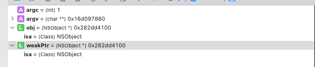

> `ARC`下我们想要获取`weak`变量指向的对象是通过：`objc_loadWeakRetained`和`objc_release`，`MRC`下通过: `objc_loadWeak`（虽然`weak`变量中有对象的地址）。这里要和通过指针直接找到对象内存读取内容的方式作出理解上的区别。
> ​

> 通过分析上述函数实现，可以发现只要一个对象被标记为`deallocating`，即使此时该对象的弱引用还是指向对象内存且对象没有被完全释放，只要通过该对象的弱引用访问该对象都会得到`nil`。

## 1. 示例代码
在`main.m`中编写如下代码，在函数最后打断点，并打开汇编模式：
```jsx
int main(int argc, char * argv[]) {
    @autoreleasepool {
     
        id obj = [NSObject new];
        __weak id weakPtr = obj; // 调用 objc_initWeak 进行 weak 变量初始化
        printf("start tag\n");
        {
            NSLog(@"%@", weakPtr);
        }
        printf("end tag\n"); //  ⬅️ 断点打在这里
    }
    return 0;
}
```
## 2. 分析示例汇编代码
运行后，会进入断点，这里我们只关注`start tag`和`end tag`之间的部分，汇编反应如下：
`ARC`下：
```jsx
0x102e99ea0 <+76>:  bl     0x102e9a424               ; symbol stub for: printf
0x102e99ea4 <+80>:  add    x0, sp, #0x20             ; =0x20 
0x102e99ea8 <+84>:  bl     0x102e9a3d0               ; symbol stub for: objc_loadWeakRetained
0x102e99eac <+88>:  mov    x20, x0
0x102e99eb0 <+92>:  str    x20, [sp]
0x102e99eb4 <+96>:  adrp   x0, 3
0x102e99eb8 <+100>: add    x0, x0, #0x10             ; =0x10 
0x102e99ebc <+104>: bl     0x102e9a370               ; symbol stub for: NSLog
0x102e99ec0 <+108>: b      0x102e99ec4               ; <+112> at main.m:17:13
0x102e99ec4 <+112>: mov    x0, x20
0x102e99ec8 <+116>: bl     0x102e9a400               ; symbol stub for: objc_release
```
`MRC`下：
```jsx
0x102c31eb8 <+76>:  bl     0x102c32424               ; symbol stub for: printf
0x102c31ebc <+80>:  add    x0, sp, #0x20             ; =0x20 
0x102c31ec0 <+84>:  bl     0x102c323d0               ; symbol stub for: objc_loadWeak
0x102c31ec4 <+88>:  str    x0, [sp]
0x102c31ec8 <+92>:  adrp   x0, 3
0x102c31ecc <+96>:  add    x0, x0, #0x10             ; =0x10 
0x102c31ed0 <+100>: bl     0x102c32370               ; symbol stub for: NSLog
0x102c31ed4 <+104>: b      0x102c31ed8               ; <+108> at main.m:19:9
```
## 3. 获取被弱引用的对象
通过上面对象汇编代码可以做出如下总结并抛出一些结论，后面我们回一步一步的证明：

- 在`ARC`模式下，获取`weak`变量时，会调用`objc_loadWeakRetained`然后在要出作用域时调用了一次`objc_release`，之所以这样，是因为在`objc_loadWeakRetained`中会对`weak`指针指向的对象调用`objc_object::rootRatain`函数，使该对象的引用计数加`1`，为了抵消这一次加 `1`，会在即将出作用域之前调用`objc_release`函数(内部实现其实是：`objc_object::release`)使该对象的引用计数减`1`。这个加`1`减`1`的操作其实是为了保证通过`weak`变量读取其指向的对象时，防止对象中途销毁，毕竟`weak`变量不会强引用所指向的对象。


- 在`MRC`模式下，获取`weak`指针时，会调用`objc_loadWeak`函数，其内部实现其实是：`objc_autorelease(objc_loadWeakRetained(location))`，即通过`objc_autorelease`来抵消`weak`变量读取过程中的引用计数加`1`的操作，保证对象最后能正常释放。
## 4. objc_loadWeakRetained

下面分析`objc_loadWeakRetained`函数源码，分析之前可以先验证一下`location`参数的内容。还是前面的示例代码，这次断点打在`objc_loadWeakRetained`处，然后通过`LLDB`，可以看到如下你内容：

通过控制台可以看出，`weakPtr`指向通`obj`的对象地址。

```jsx
// 控制台右侧：
(lldb) p weakPtr // 打印 weakPtr 指向
(NSObject *) $0 = 0x000000010112f010

// objc_loadWeakRetained 函数参数 location
(lldb) p location
(id *) $1 = 0x00007ffeefbff558

// 打印 location 内存空间里的内容，正是我们的 obj 对象 
(lldb) p *location
(NSObject *) $2 = 0x000000010112f010

// 查看寄存器
(lldb) register read
General Purpose Registers:
       rax = 0x000000010112f010
       rbx = 0x00007ffeefbff558
       rcx = 0x0000000000000307
       rdx = 0x00007ffeefbff398
       
       rdi = 0x00007ffeefbff558 // rdi 放的 location 参数
       
       rsi = 0x0000000000000000
       rbp = 0x00007ffeefbff520
       rsp = 0x00007ffeefbff3f0
        r8 = 0x0000000000000001
        r9 = 0x0000000000000002
       r10 = 0x00007ffeefbff6e8
       r11 = 0x00000001003d3af0  libobjc.A.dylib`::objc_loadWeakRetained(id *) at NSObject.mm:464
       r12 = 0x0000000000000000
       r13 = 0x0000000000000000
       r14 = 0x0000000000000001
       r15 = 0x0000000000000000
       rip = 0x00000001003d3b02  libobjc.A.dylib`::objc_loadWeakRetained(id *) + 18 at NSObject.mm:473:12
    rflags = 0x0000000000000206
        cs = 0x000000000000002b
        fs = 0x0000000000000000
        gs = 0x0000000000000000

(lldb) memory read 0x00007ffeefbff558 // 读取 0x00007ffeefbff558 里面的内容
0x7ffeefbff558: 10 f0 12 01 01 00 00 00 00 00 00 00 00 00 00 00  ................
0x7ffeefbff568: 00 00 00 00 00 00 00 00 80 f5 bf ef fe 7f 00 00  ................
(lldb) 

// 从后往前读 0x7ffeefbff558 中的内容
0x010112f010 // 正是我们的 obj 对象
```

```jsx
/*
  Once upon a time we eagerly cleared *location if we saw the object 
  was deallocating. This confuses code like NSPointerFunctions which 
  tries to pre-flight the raw storage and assumes if the storage is 
  zero then the weak system is done interfering. That is false: the 
  weak system is still going to check and clear the storage later. 
  This can cause objc_weak_error complaints and crashes.
  So we now don't touch the storage until deallocation completes.
 ⚠️⚠️⚠️
   所以只要 deallocating 已被标记，不管对象有没有释放完成，weak 变量有没有被置为 nil,
   此时通过 weak 变量获取对象都会得到 nil。
*/

id
objc_loadWeakRetained(id *location)
{
    // *location指向的对象
    id obj;
    id result;
    Class cls;

    SideTable *table;
    
 retry:
    // fixme std::atomic this load
    // 取出location 内保存的对象地址赋值给 obj
    obj = *location;
    // 如果对象是TaggedPointer对象,直接返回
    if (obj->isTaggedPointerOrNil()) return obj;
    // 从全局 SideTables 取出obj所在的SideTable表
    table = &SideTables()[obj];
    
    // 加锁
    table->lock();
    // 此处*location 应该与 obj 保持一致,如果不同,说明在加锁之前*location 已被其他线程修改
    if (*location != obj) {
        // 解锁,跳转到 retry 处再重新执行函数
        table->unlock();
        goto retry;
    }
    // 把传入的对象赋值给result
    result = obj;
    
    // 取得对象所属的类
    cls = obj->ISA();
    
    // 在 objc-runtime-new.h 中 __LP64__ 环境下:
    // class or superclass has default retain/release/autorelease/retainCount/
    //   _tryRetain/_isDeallocating/retainWeakReference/allowsWeakReference
    // #define FAST_HAS_DEFAULT_RR     (1UL<<2)
        
    // hasCustomRR 表示重写了 cls 的:
    // 1. retain/release/autorelease
    // 2. retainCount/_tryRetain
    // 3. _isDeallocating
    // 4. retainWeakReference/allowsWeakReference
    // 一般不会重写此方法，因此此值一般是 false，取反则是 true
    
    if (! cls->hasCustomRR()) {
        // Fast case. We know +initialize is complete because
        // default-RR can never be set before then.
        // 我们知道 + initialize 已完成，因为在此之前永远无法设置 default-RR。
        
        // 如果未初始化化则执行断言
        ASSERT(cls->isInitialized());
        
        /*
         尝试对对 obj 做 retain 操作
         rootTryRetain的内部实现是: return rootRetain(true, RRVariant::Fast) ? true : false;
         
         如果 obj 正在析构 deallocating，即如果 obj 的 isa_t 位域：uintptr_t deallocating      : 1;
         为真的话则 obj->rootTryRetain() 会返回 false，即会执行 if 内部的 result = nil，则此时我们读取 weak 变量指向的对象时只能得到 nil，
         否则 obj->rootTryRetain() 返回 true，obj 正常进行了一次 retain，并在函数的结尾处返回 result。
         */
        if (! obj->rootTryRetain()) {
            result = nil;
        }
    }
    else {
        // Slow case. We must check for +initialize and call it outside
        // the lock if necessary in order to avoid deadlocks.
        // 我们必须检查 + initialize 并在必要时在 lock 解锁后调用它，以避免死锁。
        
        // Use lookUpImpOrForward so we can avoid the assert in
        // class_getInstanceMethod, since we intentionally make this
        // callout with the lock held.
        // 使用 lookUpImpOrForward 这样我们就可以避免 class_getInstanceMethod 中的断言，因为我们故意这样做持有锁的标注。
        
        // 判断 cls 是否已经初始化完成
        if (cls->isInitialized() || _thisThreadIsInitializingClass(cls)) {
            // 判断 cls 是否实现了 retainWeakReference 函数，如果未实现则返回 nil
            BOOL (*tryRetain)(id, SEL) = (BOOL(*)(id, SEL))
                lookUpImpOrForwardTryCache(obj, @selector(retainWeakReference), cls);
            if ((IMP)tryRetain == _objc_msgForward) {
                result = nil;
            }
            // 调用 retainWeakReference，retainWeakReference 在 NSObject.mm 中默认实现是 return [self _tryRetain]
            else if (! (*tryRetain)(obj, @selector(retainWeakReference))) {
                // 如果 retainWeakReference 函数返回 false，则返回 nil
                result = nil;
            }
        }
        else {
            // 解锁，执行初始化后，并从 retry 处重新执行
            table->unlock();
            class_initialize(cls, obj);
            goto retry;
        }
    }
    // 解锁
    table->unlock();
    // 返回 result
    return result;
}
```

通过上面的代码分析，可以把`objc_loadWeakRetained`函数的功能理解为：返回弱引用指向的对象，并把该对象的引用计数加 1，而减 1 的操作 `ARC`下则是在其后面由编译器插入一条`objc_release`函数，`MRC`下则是把返回的对象放进自动释放池内，两种方式最后都能保证读取的对象正常释放。

验证，在`main.m`中三条读取，下面可以看到：`ARC`环境下 3 对：`objc_loadWeakRetained`和`objc_release`一一对应。

```jsx
#import <Foundation/Foundation.h>
int main(int argc, const char * argv[]) {
    @autoreleasepool {
        // insert code here...
        id obj = [NSObject new];
        
        printf("Start tag");
        {
            __weak id weakPtr = obj;
            
            NSLog(@"%@", weakPtr);
            NSLog(@"%@", weakPtr);
            NSLog(@"%@", weakPtr);
        }
        printf("End tag"); // ⬅️ 这里打断点
    }
    return 0;
}
```

汇编如下：

```jsx
    0x100000d21 <+49>:  leaq   0x228(%rip), %rdi         ; "Start tag"
    ...
    0x100000d42 <+82>:  callq  0x100000e9c               ; symbol stub for: objc_loadWeakRetained // 1⃣️
    ...
    0x100000d56 <+102>: callq  0x100000e78               ; symbol stub for: NSLog
    ...
    0x100000d5d <+109>: movq   0x2a4(%rip), %rax         ; (void *)0x00007fff71cb7d20: objc_release // 1⃣️
    ...
    0x100000d6d <+125>: callq  0x100000e9c               ; symbol stub for: objc_loadWeakRetained // 2⃣️
    ...
    0x100000d81 <+145>: callq  0x100000e78               ; symbol stub for: NSLog
    ...
    0x100000d88 <+152>: movq   0x279(%rip), %rax         ; (void *)0x00007fff71cb7d20: objc_release // 2⃣️
    ...
    0x100000d98 <+168>: callq  0x100000e9c               ; symbol stub for: objc_loadWeakRetained // 3⃣️
    ...
    0x100000dac <+188>: callq  0x100000e78               ; symbol stub for: NSLog
    ...
    0x100000db6 <+198>: callq  *0x24c(%rip)              ; (void *)0x00007fff71cb7d20: objc_release // 3⃣️
    0x100000dbc <+204>: leaq   -0x20(%rbp), %rdi
    0x100000dc0 <+208>: callq  0x100000e90               ; symbol stub for: objc_destroyWeak
->  0x100000dc5 <+213>: leaq   0x18e(%rip), %rdi         ; "End tag"
    ...
```

`objc_loadWeak`函数源码：

```jsx

/** 
 * This loads the object referenced by a weak pointer and returns it, after
 * retaining and autoreleasing the object to ensure that it stays alive
 * long enough for the caller to use it. This function would be used
 * anywhere a __weak variable is used in an expression.
 *
 *  这将加载由弱指针引用的对象，并在保留并自动释放该对象以确保其保持足够长的生存期以供调用者使用后，
 * 将其返回。在表达式中使用 __weak 变量的任何地方都可以使用此函数。
 *
 * @param location The weak pointer address
 * 
 * @return The object pointed to by \e location, or \c nil if \e location is \c nil.
 */
id
objc_loadWeak(id *location)
{
    if (!*location) return nil;
    return objc_autorelease(objc_loadWeakRetained(location));
}
```

## 5. objc_copyWeak

在把一个 weak 变量赋值给另一个 weak 变量时会调用该函数，如下代码：

```jsx
#import <Foundation/Foundation.h>
int main(int argc, const char * argv[]) {
    @autoreleasepool {
        // insert code here...
        id obj = [NSObject new];
        
        printf("Start tag");
        {
            __weak id weakPtr = obj;
            __weak id weakPtr2 = weakPtr;
        }
        printf("End tag");
    }
    return 0;
}
```

汇编如下：

```jsx
...
0x100000e52 <+82>:  callq  0x100000eda               ; symbol stub for: objc_copyWeak ⬅️ callq 指令调用 objc_copyWeak 函数
...
```

`objc_copyWeak`函数源码：

```jsx
/** 
 * This function copies a weak pointer from one location to another,
 * when the destination doesn't already contain a weak pointer. It
 * would be used for code like:
 *
 *  __weak id src = ...;
 *  __weak id dst = src;
 * 
 * This function IS NOT thread-safe with respect to concurrent 
 * modifications to the destination variable. (Concurrent weak clear is safe.)
 *
 * @param dst The destination variable.
 * @param src The source variable.
 */
void
objc_copyWeak(id *dst, id *src)
{
    // 首先从 src weak 变量取得所指对象,并引用计数+1
    id obj = objc_loadWeakRetained(src);
    
    // 初始化 dst weak 变量
    objc_initWeak(dst, obj);
    // obj 引用计数-1, 与上面+1 对应,保证对象的正常释放
    objc_release(obj);
}
```

## 6. objc_moveWeak

源码如下：

```jsx
/** 
 * Move a weak pointer from one location to another.
 * 将弱指针从一个位置移动到另外一个
 *
 * Before the move, the destination must be uninitialized.
 * 在移动之前, destination 必须是没有初始化的
 *
 * After the move, the source is nil.
 *在移动之后, source 置为 nil
 *
 * This function IS NOT thread-safe with respect to concurrent 
 * modifications to either weak variable. (Concurrent weak clear is safe.)
 * 此函数不是线程安全的
 *
 */
/*
  void objc_moveWeak(id *dest, id *src);

  先决条件：src是一个有效的指针，要么包含空指针，要么已注册为__weak对象。dest是一个尚未注册为__weak对象的有效指针。

  dest初始化为等效于src，可能会在运行时注册。然后，src可能会保持原始状态，在这种情况下，此调用相当于objc_copyWeak，或者可能会留作空。

  在src调用objc_storeWeak时必须是原子的。
  */
void
objc_moveWeak(id *dst, id *src)
{
    // dst 目的指针
    // src 被移动的弱指针
    // src 指针对应的对象
    id obj;
    // 被移动指针所在的表
    SideTable *table;

retry:
    // 取出src 内保存的对象地址赋值给 obj
    obj = *src;
    // 如果 obj 不存在直接返回
    if (obj == nil) {
        *dst = nil;
        return;
    }
    // 从全局SideTables取出 obj 所在的 SideTable.
    table = &SideTables()[obj];
    // 加锁
    table->lock();
    // 此处*src 应该与 obj 保持一致,如果不同,说明在加锁之前*location 已被其他线程修改
    if (*src != obj) {
        // 解锁,跳转到 retry 处再重新执行函数
        table->unlock();
        goto retry;
    }
    // 从 weak_table 的 weak_entry_t 哈希表(或定长为 4 的内部数组）移除 src 的引用
    weak_unregister_no_lock(&table->weak_table, obj, src);
    // 把 dst 的弱引用注册到weak_table 的 weak_entry_t 哈希表(或定长为 4 的内部数组）中
    weak_register_no_lock(&table->weak_table, obj, dst, DontCheckDeallocating);
    // *dst赋值
    *dst = obj;
    *src = nil;
    // 解锁
    table->unlock();
}
```

至此，`weak`的原理可以做一个小完结了。

## 参考链接

- [详解获取weak对象的过程](https://link.juejin.cn/?target=https%3A%2F%2Fwww.jianshu.com%2Fp%2Fb22a446f8a8d)
- [ObjC Runtime 中 Weak 属性的实现 (上)](https://link.juejin.cn/?target=https%3A%2F%2Fwww.jianshu.com%2Fp%2Ffb6b15e8acfd)
- [weak指针的线程安全和自动置nil的深度探讨](https://link.juejin.cn/?target=https%3A%2F%2Fwww.jianshu.com%2Fp%2Fedbd1ec314aa)
- [ARC 和 MRC 下 weak 变量的访问过程](https://juejin.cn/post/6867465607072514062)

