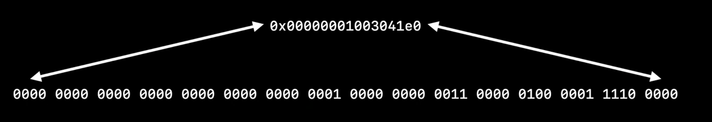
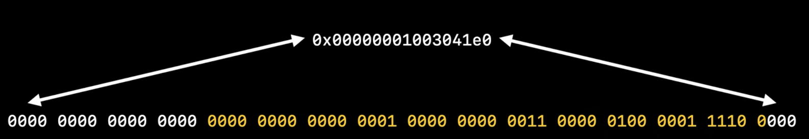
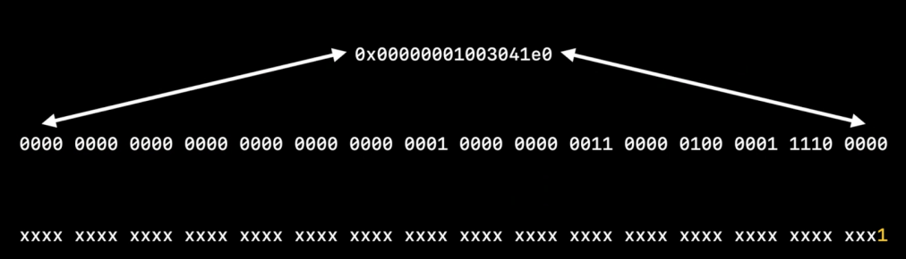
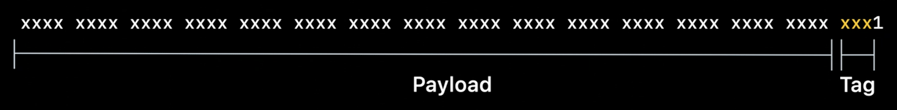
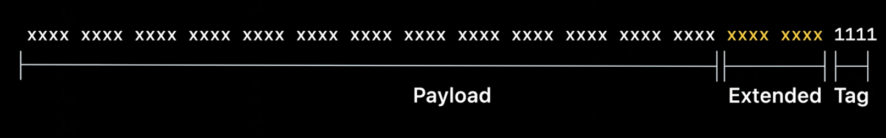
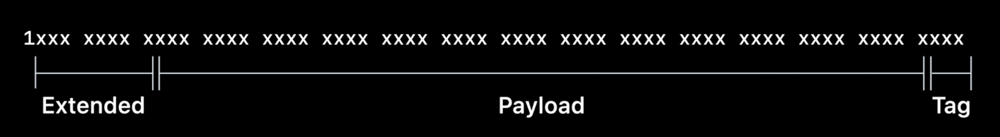
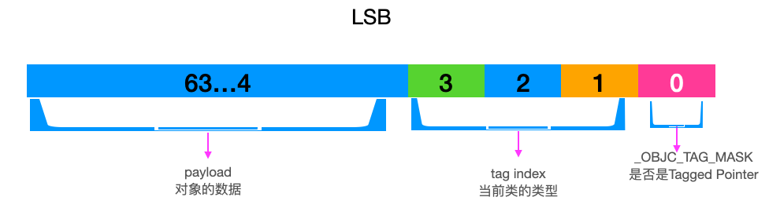
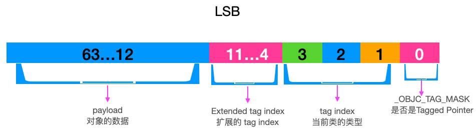
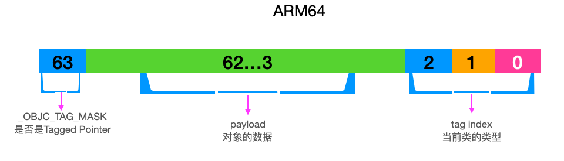
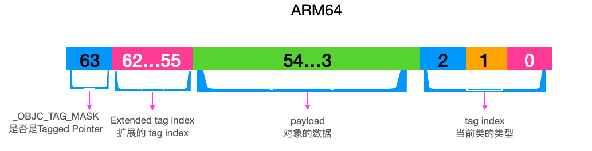

## 1. 背景

Tagged Pointer 是苹果为了在 64 位架构的处理器下节省内存占用和提高运行效率而提出的概念。它的本质是把一些占用内存较小的对象的数据直接放在指针的内存空间内，然后把这个指针直接作为对象使用，直接省去了为对象在堆区开辟空间的过程。
苹果2013 年首次在 iOS 平台推出了 64 位iPhone(5s)，为了节省内存和提高运行效率，提出了 `Tagged Pointer` 的概念。
## 2. Tagger Pointer 是什么

**Tagged Pointer：**一种特殊标记的对象，Tagged Pointer 通过在其最后一个 bit 位设置为特殊标记位，并且把数据直接保存在指针本身中。Tagged Pointer 是一个"伪"对象，使用 Tagged Pointer 有 3 倍的访问速度提升，100 倍的创建、销毁速度提升。

- Tagged Pointer 专门用来存储小的对象，例如：NSNumber、NSDate、NSString。
- Tagged Pointer指针的值不再是地址，而是真正的值。所以它严格意义上并不是一个对象了，只是一个披着对象外衣的普通变量。所以它的内存并不在堆中，也不需要 malloc、free。
## 3. Tagged Pointer 的内存占用
在 objc-runtime-new.h 中，要求所有的对象至少 分配 16 个字节。
```objectivec
inline size_t instanceSize(size_t extraBytes) const {
    if (fastpath(cache.hasFastInstanceSize(extraBytes))) {
        return cache.fastInstanceSize(extraBytes);
    }

    size_t size = alignedInstanceSize() + extraBytes;
    // CF requires all objects be at least 16 bytes.
    if (size < 16) size = 16;
    return size;
}
```
如果没有`Tagged Pointer`，在 64 位设备中，存储一个 NSInteger 类型的 NSNumber 实例对象的时候，需要系统在堆区分配 16 个字节来存储。对象的 isa 指针占用 8 个字节，存储的值占用 8 个字节。指针变量在栈区也要分配 8 个字节空间。而使用`Tagged Pointer`之后，NSNumber 对象在堆区分配 0 个字节，指针变量在栈区分配 8 个字节。
通过对比来看 `Tagged Pointer`减少了一半的内存占用。
通过代码来分析下，看看上面的结论是否正确：
```objectivec
#import <objc/runtime.h>
#include <malloc/malloc.h>

int main(int argc, char * argv[]) {
    NSObject *objc = [[NSObject alloc] init];
    NSNumber *number = [[[NSNumber alloc] initWithInt:1] copy];

    NSLog(@"objc pointer: %zu malloc: %zu CLASS: %@ ADDRESS: %p", sizeof(objc), malloc_size(CFBridgingRetain(objc)), object_getClass(objc), objc);
    NSLog(@"number pointer: %zu malloc: %zu CLASS: %@ ADDRESS: %p", sizeof(number), malloc_size(CFBridgingRetain(number)), object_getClass(number), number);
    printf("");
}

打印如下：
objc pointer: 8 malloc: 16 CLASS: NSObject ADDRESS: 0x28166c0b0
number pointer: 8 malloc: 0 CLASS: __NSCFNumber ADDRESS: 0x96c5516a7d1281f9
```
## 3. 分析 Tagged Pointer 用的源码版本
下面分析一下 `Tagged Pointer` 的有点并结合源码分析它的实现。
**源码基于 objc4-818.2。**
**源码基于 objc4-818.2。**
**源码基于 objc4-818.2。**
**源码基于 objc4-818.2。**
`Tagged Pointer`源码主要位于 `objc-internal.h`文件中，在文件中定义了 `OBJC_HAVE_TAGGED_POINTERS` 的宏，表示尽在 `__LP64__` 环境中支持 `Tagged Pointer`。
```jsx
#if __LP64__
#define OBJC_HAVE_TAGGED_POINTERS 1
#endif
```
> `__LP64__`: 表示 64 位的处理器

## 4. Tagged Pointer 格式
在查看对象指针时，`64` 位系统中，我们会看到一个 `16` 进制的地址如 `0x00000001003041e0`，把它转换成二进制表示如下图：

在 64 位系统中，我们用 64 位就可以表示一个对象指针，但是通常没有真正使用到所有的位。由于内存对齐要求的存在，低位始终是 0，高位也始终是 0，对象必须始终位于指针大小倍数的地址中。实际上只用到中间一部分的位：

因此，我们可以把最低位置设置为 1，表示这个对象是一个 Tagged Pointer 对象。设置为 0 则表示正常的对象。

在设置为 1 表示 Tagged Pointer 对象之后，在最低位之后的 3 位，赋予它类型的意义，由于只有 3 位，它可表示 7 种类型。
```objectivec
OBJC_TAG_NSAtom            = 0, 
OBJC_TAG_1                 = 1, 
OBJC_TAG_NSString          = 2, 
OBJC_TAG_NSNumber          = 3, 
OBJC_TAG_NSIndexPath       = 4, 
OBJC_TAG_NSManagedObjectID = 5, 
OBJC_TAG_NSDate            = 6,

OBJC_TAG_RESERVED_7        = 7, 
```
在剩余的字段中，我们可以赋予它所包含的数据。在 Intel 中，我们的 Tagged Pointer 对象的表示如下：

`OBJC_TAG_RESERVED_7` 类型的 `Tagged Pointer` 是个例外，它可以将接下来后 8 位作为它的扩展类型字段，基于此我们可以多支持 256 中类型的 `Tagged Pointer`，如 `UIColors` 或 `NSIndexSets` 之类的对象。

上文中，我们介绍的是在 Intel 中 Tagged Pointer 的表示，在 ARM64 中，我们情况有些变化。

在 ARM64中，最高位代表 Tagged Pointer 的标志位，最低位 3 位来标识 `Tagged Pointer` 的类型，剩余的位来表示包含的数据(可能包含扩展类型字段)。
为什么在 `ARM64` 上使用高位来标识 `Tagged Pointer`，而不用 Intel 一样使用低位来标识。
这里主要是对 `objc_msgSend` 的优化。苹果希望 `objc_msgSend`中最常用的路径尽可能快。最常用的路径表示普通对象指针。在使用中有 2 种不常见指针的情况：Tagged Pointer 指针 和 nil。当用最高位来做标志位时，可以通过一次比较来检查。与分别检查 `Tagged Pointer` 指针 和 nil相比，在 `objc_msgSend`节省了很多的条件分支开销。
### 4.1 参考资料
[wwdc20/10163期内参](https://developer.apple.com/wwdc20/10163)
[小专栏内参翻译](https://xiaozhuanlan.com/topic/1742865930#sectiontaggedpointer)​
## 5. 如何判断一个指针是否是 Tagged Pointer 类型
在`objc-object.h`文件中定义了一个 `isTaggedPointer` 函数，用来判断一个指针变量是否是`Tagged Pointer`。
```objectivec
inline bool 
objc_object::isTaggedPointer() 
{
    return _objc_isTaggedPointer(this);
}
```
### 5.1 _objc_isTaggedPointer
函数 `_objc_isTaggedPointer` 定义在`objc-internal.h`中，返回一个 `bool`。
```objectivec
static inline bool 
_objc_isTaggedPointer(const void * _Nullable ptr)
{
    return ((uintptr_t)ptr & _OBJC_TAG_MASK) == _OBJC_TAG_MASK;
}
```
可以看出，这里将对象的指针与 `_OBJC_TAG_MASK`掩码进行按位与运算来判断是否 `Tagged Pointer` 。
`_OBJC_TAG_MASK`的定义如下：
```objectivec
#if OBJC_SPLIT_TAGGED_POINTERS

#   define _OBJC_TAG_MASK (1UL<<63)
xxx
#elif OBJC_MSB_TAGGED_POINTERS

#   define _OBJC_TAG_MASK (1UL<<63)
...
#else
    
#   define _OBJC_TAG_MASK 1UL
...
    
#endif
省略其他和 _OBJC_TAG_MASK 无关的参数
```
`OBJC_SPLIT_TAGGED_POINTERS` 和 `OBJC_MSB_TAGGED_POINTERS` 的定义如下：
```objectivec
#if __arm64__
// ARM64 uses a new tagged pointer scheme where normal tags are in
// the low bits, extended tags are in the high bits, and half of the
// extended tag space is reserved for unobfuscated payloads.
#   define OBJC_SPLIT_TAGGED_POINTERS 1
#else
#   define OBJC_SPLIT_TAGGED_POINTERS 0
#endif

#if (TARGET_OS_OSX || TARGET_OS_MACCATALYST) && __x86_64__
    // 64-bit Mac - tag bit is LSB
#   define OBJC_MSB_TAGGED_POINTERS 0
#else
    // Everything else - tag bit is MSB
#   define OBJC_MSB_TAGGED_POINTERS 1
#endif
```
通过上面的定义可以发现，在 `ARM64` 位的设备上通过判断指针值的最高位是否为 `1`，来判断是否是 `Tagged Pointer` 类型。
### 5.2 存储结构
在 `objc-runtime-new.mm` 有一段 `Tagged pointer objects` 的注释如下:
```objectivec
/*
* Tagged pointer objects.
*
* Tagged pointer objects store the class and the object value in the object pointer; 
* the "pointer" does not actually point to anything.
*
* Tagged pointer 指针对象将 class 和对象数据存储在对象指针中，指针实际上不指向任何东西。
* Tagged pointer objects currently use this representation:
* Tagged pointer 当前使用此表示形式:
*
* (LSB)(字符串低位优先排序，64 位的 mac 下)
*  1 bit   set if tagged, clear if ordinary object pointer // 设置是否标记，如果普通对象指针则清除
*  3 bits  tag index // 标记类型
* 60 bits  payload // 负载数据容量，（存储对象数据）
*
* (MSB)(64 位 iPhone 下)
* The tag index defines the object's class. 
* The payload format is defined by the object's class.
* tag index 表示对象所属的 class。负载格式由对象的 class 定义。
*
* If the tag index is 0b111, the tagged pointer object uses an "extended" representation, 
* allowing more classes but with smaller payloads:
*
* 如果 tag index 是 0b111(7), tagged pointer 对象使用 “扩展” 表示形式,
* 允许更多类，但有效载荷更小: 
* (LSB)(字符串低位优先排序，64 位的 mac 下)
*  1 bit   set if tagged, clear if ordinary object pointer // 设置是否标记，如果普通对象指针则清除
*  3 bits  0b111 
*  8 bits  extended tag index // 扩展的 tag index
* 52 bits  payload // 负载数据容量，此时只有 52 位
* (MSB)
*
* Some architectures reverse the MSB and LSB in these representations.
* 在这些表示中，某些体系结构反转了 MSB 和 LSB。
*
* This representation is subject to change. Representation-agnostic SPI is:
* objc-internal.h for class implementers.
* objc-gdb.h for debuggers.
*/
```
在 LSB下，最低位存储是否是 `Tagged Pointer` 的标志位。然后跟着 3 位来存储 `tag index` 定义了当前对象的类型。余下的 `60` 位用来存储 `payload(对象的数据)`。

在 `LSB` 下，当 `tag index` 的值为 `0b111` 时即 `7` 时，`tag index` 的值不在指当前对象的类型，而是要额外占用 `8` 位的空间来存储 `tag index`。这时 `tag index` 可以表示更多的类，但是用来存储数据的空间变少了，减少了 `8` 位，最多占用 `52` 位。

这 `objc_internal.h`中定义了一些在操作 `Tagged Pointer`时，会用到的位移值的宏定义，有助于我们了解 `Tagged Pointer`存储结构。
只看 `ARM64`所用到的！！！
```objectivec
#if OBJC_SPLIT_TAGGED_POINTERS
#   define _OBJC_TAG_MASK (1UL<<63) 标志位在最高位
#   define _OBJC_TAG_INDEX_SHIFT 0  获取tag index时需要移动的位数 tag index在低位 占3位 和mask(111)做与运算
#   define _OBJC_TAG_SLOT_SHIFT 0   从taggeed pointer对象中获取Class时用到
#   define _OBJC_TAG_PAYLOAD_LSHIFT 1 负载左边的位数 左边只有一个最高位标志位
#   define _OBJC_TAG_PAYLOAD_RSHIFT 4  负载右边的位数 右边是tag 先左移后右移 就能取出实际的负载值
#   define _OBJC_TAG_EXT_MASK (_OBJC_TAG_MASK | 0x7UL)  64位和7(111) 做与运算
#   define _OBJC_TAG_NO_OBFUSCATION_MASK ((1UL<<62) | _OBJC_TAG_EXT_MASK)
#   define _OBJC_TAG_CONSTANT_POINTER_MASK \
        ~(_OBJC_TAG_EXT_MASK | ((uintptr_t)_OBJC_TAG_EXT_SLOT_MASK << _OBJC_TAG_EXT_SLOT_SHIFT))
#   define _OBJC_TAG_EXT_INDEX_SHIFT 55 获取扩展标记位时 左移动位数 55 然后与扩展标记下标掩码0xff做与运算
#   define _OBJC_TAG_EXT_SLOT_SHIFT 55  从taggeed pointer对象中获取Class时用到
#   define _OBJC_TAG_EXT_PAYLOAD_LSHIFT 9  有扩展时负载左边的位数
#   define _OBJC_TAG_EXT_PAYLOAD_RSHIFT 12  有扩展时负载右边的位数
#elif OBJC_MSB_TAGGED_POINTERS
其他
#else
mac && __x86_64__ 设备
#endif
```
在 `ARM64` 位下，无扩展标记时。

- 1 位 `Tagged Pointer`
- 60 位 `playload`：
- 3 位 `tag index`


在 `ARM64` 位下，有扩展标记时：

- 1 位 `Tagged Pointer`
- 8 位 扩展 `tag index`
- 52 位 `playload`：
- 3 位 `tag index`：最后 `3` 位是 `111`。这里根据源码可以得值，下面有分析。


##  6. Tagged Pointer 的编解码、获取 value、tag
代码示例和上面分析内存占用的一样，代码和打印如下：
```objectivec
#import <objc/runtime.h>
#include <malloc/malloc.h>

int main(int argc, char * argv[]) {
    NSString *str = [NSString stringWithFormat:@"L"];
    NSNumber *number = [[NSNumber alloc] initWithInt:1];

    NSLog(@"objc pointer: %zu malloc: %zu CLASS: %@ ADDRESS: %p", sizeof(str), malloc_size(CFBridgingRetain(str)), object_getClass(str), str);
    NSLog(@"number pointer: %zu malloc: %zu CLASS: %@ ADDRESS: %p", sizeof(number), malloc_size(CFBridgingRetain(number)), object_getClass(number), number);
}

打印如下：
objc pointer: 8 malloc: 0 CLASS: NSTaggedPointerString ADDRESS: 0x970911684761bbc1
number pointer: 8 malloc: 0 CLASS: __NSCFNumber ADDRESS: 0x9709116847619d5a
```
通过打印可以看出，它们都没有分配堆空间，只占用了 `8` 个字节。地址并不是之前看到的样子，之前的版本可以通过地址明显看出所存储的数据。这里是因为在 `iOS14`之后，系统对 `Tagged Pointer` 类型的对象做了数据混淆。
### 6.1 数据编码(混淆)原理
以下代码分析基于 `__arm64__`
各种标志值如下：
```objectivec
#if OBJC_SPLIT_TAGGED_POINTERS
#   define _OBJC_TAG_MASK (1UL<<63) 标志位在最高位
#   define _OBJC_TAG_INDEX_SHIFT 0  获取tag index时需要移动的位数 tag index在低位 占3位 和mask(111)做与运算
#   define _OBJC_TAG_SLOT_SHIFT 0   从taggeed pointer对象中获取Class时用到
#   define _OBJC_TAG_PAYLOAD_LSHIFT 1 负载左边的位数 左边只有一个最高位标志位
#   define _OBJC_TAG_PAYLOAD_RSHIFT 4  负载右边的位数 右边是tag 先左移后右移 就能取出实际的负载值
#   define _OBJC_TAG_EXT_MASK (_OBJC_TAG_MASK | 0x7UL)  64位和7(111) 做或运算
#   define _OBJC_TAG_NO_OBFUSCATION_MASK ((1UL<<62) | _OBJC_TAG_EXT_MASK)
#   define _OBJC_TAG_CONSTANT_POINTER_MASK \
        ~(_OBJC_TAG_EXT_MASK | ((uintptr_t)_OBJC_TAG_EXT_SLOT_MASK << _OBJC_TAG_EXT_SLOT_SHIFT))
#   define _OBJC_TAG_EXT_INDEX_SHIFT 55 获取扩展标记位时 左移动位数 55 然后与扩展标记下标掩码0xff做与运算
#   define _OBJC_TAG_EXT_SLOT_SHIFT 55  从taggeed pointer对象中获取Class时用到
#   define _OBJC_TAG_EXT_PAYLOAD_LSHIFT 9  有扩展时负载左边的位数
#   define _OBJC_TAG_EXT_PAYLOAD_RSHIFT 12  有扩展时负载右边的位数
#elif OBJC_MSB_TAGGED_POINTERS
其他
#else
mac && __x86_64__ 设备
#endif
```
#### 6.1.1 _objc_makeTaggedPointer
在 `objc-internal.h`文件中有以下代码，用于创建一个`Tagged Pointer` 对象。
```objectivec
// Create a tagged pointer object with the given tag and payload.
// Assumes the tag is valid.
// Assumes tagged pointers are enabled.
// The payload will be silently truncated to fit.
static inline void * _Nonnull
_objc_makeTaggedPointer(objc_tag_index_t tag, uintptr_t value)
{
    // PAYLOAD_LSHIFT and PAYLOAD_RSHIFT are the payload extraction shifts.
    // They are reversed here for payload insertion.

    // ASSERT(_objc_taggedPointersEnabled());
    if (tag <= OBJC_TAG_Last60BitPayload) {
        // ASSERT(((value << _OBJC_TAG_PAYLOAD_RSHIFT) >> _OBJC_TAG_PAYLOAD_LSHIFT) == value);
        uintptr_t result =
            (_OBJC_TAG_MASK | 
             ((uintptr_t)tag << _OBJC_TAG_INDEX_SHIFT) | 
             ((value << _OBJC_TAG_PAYLOAD_RSHIFT) >> _OBJC_TAG_PAYLOAD_LSHIFT));
        return _objc_encodeTaggedPointer(result);
    } else {
        // ASSERT(tag >= OBJC_TAG_First52BitPayload);
        // ASSERT(tag <= OBJC_TAG_Last52BitPayload);
        // ASSERT(((value << _OBJC_TAG_EXT_PAYLOAD_RSHIFT) >> _OBJC_TAG_EXT_PAYLOAD_LSHIFT) == value);
        uintptr_t result =
            (_OBJC_TAG_EXT_MASK |
             ((uintptr_t)(tag - OBJC_TAG_First52BitPayload) << _OBJC_TAG_EXT_INDEX_SHIFT) |
             ((value << _OBJC_TAG_EXT_PAYLOAD_RSHIFT) >> _OBJC_TAG_EXT_PAYLOAD_LSHIFT));
        return _objc_encodeTaggedPointer(result);
    }
}
```
当前函数根据给定的标签和有效的负载(对象内容)创建一个`Tagged Pointer`对象，其入参是一个 `tag`和一个 `value`。入参 tag 的类型是 `objc_tag_index_t`，就是 `Tagged Pointer` 的类型 `tag index`。入参的 `value` 就是 `TaggedPointer` 的 值。
根据上面的源码分析：
##### 6.1.1.1 判断 tag 的值是否 <= OBJC_TAG_Last60BitPayload
`OBJC_TAG_Last60BitPayload` 值的设定如下：
```objectivec
{
    // 60-bit payloads
    OBJC_TAG_NSAtom            = 0, 
    OBJC_TAG_1                 = 1, 
    OBJC_TAG_NSString          = 2, 
    OBJC_TAG_NSNumber          = 3, 
    OBJC_TAG_NSIndexPath       = 4, 
    OBJC_TAG_NSManagedObjectID = 5, 
    OBJC_TAG_NSDate            = 6,

    // 60-bit reserved
    OBJC_TAG_RESERVED_7        = 7, 

    // 52-bit payloads
    OBJC_TAG_Photos_1          = 8,
    OBJC_TAG_Photos_2          = 9,
    OBJC_TAG_Photos_3          = 10,
    OBJC_TAG_Photos_4          = 11,
    OBJC_TAG_XPC_1             = 12,
    OBJC_TAG_XPC_2             = 13,
    OBJC_TAG_XPC_3             = 14,
    OBJC_TAG_XPC_4             = 15,
    OBJC_TAG_NSColor           = 16,
    OBJC_TAG_UIColor           = 17,
    OBJC_TAG_CGColor           = 18,
    OBJC_TAG_NSIndexSet        = 19,
    OBJC_TAG_NSMethodSignature = 20,
    OBJC_TAG_UTTypeRecord      = 21,

    OBJC_TAG_FirstUnobfuscatedSplitTag = 136, // 128 + 8, first ext tag with high bit set

    OBJC_TAG_Constant_CFString = 136,

    OBJC_TAG_First60BitPayload = 0, 
    OBJC_TAG_Last60BitPayload  = 6, 
    OBJC_TAG_First52BitPayload = 8, 
    OBJC_TAG_Last52BitPayload  = 263,

    OBJC_TAG_RESERVED_264      = 264
};
```
从上面的定义可以看出 `OBJC_TAG_Last60BitPayload` 的值是 `6`，上面的代码也就是判断传入的 `tag <= 6`。根据源码注释可以发现，在 `ARM64`下，未扩展标记的 `Tagged Pointer` 类型只有 `7 `种。剩下的被认定为扩展类型。
从而可以看出源码这一步是来判断当前传入数据对应的 tag 是否是 未扩展的。
##### 6.1.1.2 先假定 tag <=  OBJC_TAG_Last60BitPayload
这种情况 `OBJC_TAG_Last60BitPayload` 的值一定小于等于 `6`。
当前判断的源码如下:
```objectivec
uintptr_t result =
    (_OBJC_TAG_MASK | 
     ((uintptr_t)tag << _OBJC_TAG_INDEX_SHIFT) | 
     ((value << _OBJC_TAG_PAYLOAD_RSHIFT) >> _OBJC_TAG_PAYLOAD_LSHIFT));
return _objc_encodeTaggedPointer(result);
```

1. `((uintptr_t)tag << _OBJC_TAG_INDEX_SHIFT)` ：将 `tag` 的值左移 `0` 位`（_OBJC_TAG_INDEX_SHIFT的值 0）`，这里相当于保留了 `tag` 的原始值。
1. `((value << _OBJC_TAG_PAYLOAD_RSHIFT) >> _OBJC_TAG_PAYLOAD_LSHIFT)`：先将`value` 的值左移`4` 位，再将结果右移 `1` 位。相当于把 `value` 的前`4` 位去掉，去掉左移 `4` 位添加的一个 `0`，获取最终的值。
3. 把第一步和第二步的值进行逻辑或运算，相当于把第一步的值放在了第二步值的最后 3 位上。
3. 第三步的结果值和`_OBJC_TAG_MASK`进行逻辑或运算。`_OBJC_TAG_MASK`的值相当于  `(1UL<<63)`，相当于 `1` 后面跟着 `63 个 0`。经过逻辑或运算之后。结果的第一位变成了 1。也就是高位变成了 1。
3. 将最终的结果赋值给变量 `result`，并当做参数传入 `_objc_encodeTaggedPointer`函数进行编码，并返回结果。

  6. 示例演示如下：
```objectivec
	假设 
	tag = 3 :0000 0000 0000 0000 0000 xxxx 0000 0000 0000 0011
	value : 1234 5234 1234 0000 0000 xxxx 0000 1234 1234 1234

	第一步     0000 0000 0000 0000 0000 xxxx 0000 0000 0000 0011
	左移 0 位
    结果值     0000 0000 0000 0000 0000 xxxx 0000 0000 0000 0011

	第二步     1234 5234 1234 0000 0000 xxxx 0000 1234 1234 1234
	左移 4 位
	结果值     5234 1234 0000 0000 0000 xxxx 1234 1234 1234 0000
    右移 1 位  
    结果值	  0523 4123 4000 0000 0000 0xxx x123 4123 4123 4000

    第三部：把第一步结果和第二步结果 逻辑或运算
    第一步结果  0000 0000 0000 0000 0000 xxxx 0000 0000 0000 0011
    第二步结果  0523 4123 4000 0000 0000 0xxx x123 4123 4123 4000
    结果值     0523 4123 4000 0000 0000 0xxx x123 4123 4123 4011

    第四部：第三部结果值逻辑或_OBJC_TAG_MASK，_OBJC_TAG_MASK记作参数一
    参数一      1000 0000 0000 0000 0000 xxxx 0000 0000 0000 0000
    第三部结果值 0523 4123 4000 0000 0000 0xxx x123 4123 4123 4011
    结果值      1523 4123 4000 0000 0000 0xxx x123 4123 4123 4011

    与之前的结论相符：
    - 第一位代表是否是 tagged pointer
    - 最后3位，表示该对象的类型
```
##### 6.1.1.3 假定 tag >  OBJC_TAG_Last60BitPayload
这种情况 `OBJC_TAG_Last60BitPayload` 的值一定大于 `6`，从源码来看 `7` 为保留字段，此处的`OBJC_TAG_Last60BitPayload` 值一定大于 `7`。
当前判断的源码如下:
```objectivec
uintptr_t result =
    (_OBJC_TAG_EXT_MASK |
     ((uintptr_t)(tag - OBJC_TAG_First52BitPayload) << _OBJC_TAG_EXT_INDEX_SHIFT) |
     ((value << _OBJC_TAG_EXT_PAYLOAD_RSHIFT) >> _OBJC_TAG_EXT_PAYLOAD_LSHIFT));
return _objc_encodeTaggedPointer(result);
```

1. `((uintptr_t)(tag - OBJC_TAG_First52BitPayload) << _OBJC_TAG_EXT_INDEX_SHIFT)`：先将 `tag` 的值 减去 `8（OBJC_TAG_First52BitPayload = 8）`，在将结果左移 `55` 位。也就是保留了原来的 `9` 位值，把减去 `8` 的结果值移动到了前 `9` 位(高位)。
2. `((value << _OBJC_TAG_EXT_PAYLOAD_RSHIFT) >> _OBJC_TAG_EXT_PAYLOAD_LSHIFT)`：先将 `value` 左移 `12` 位，再将结果右移 `9` 位。去掉`value` 的 前 `12` 位，在把末尾添加的 `12 个 0`，去掉 `9` 个，保留 `3 个 0`
2. 第一步和第二步的值进行逻辑或。相当于把第一步的 9 位填到了第二步的前 9 位。
2. 把第三部的结果值和 `_OBJC_TAG_EXT_MASK`进行逻辑或。`_OBJC_TAG_EXT_MASK`相当于 以 `1` 开头，以 `111` 结尾的 `64` 位数据，这一步相当于把第三部的结果第一位变成 1，后 3 位变成 1.
2. 将最终的结果赋值给变量 result，并当做参数传入 `_objc_encodeTaggedPointer`函数进行编码，并返回结果。
2. 示例演示如下：
```objectivec
假设 
	tag = 10 :0000 0000 0000 0000 0000 xxxx 0000 0000 0000 1010
	value : 1234 5234 1234 6234 0000 xxxx 0004 1234 1234 1234

	第一步     0000 0000 0000 0000 0000 xxxx 0000 0000 0000 1010
	减去八：0100
	结果值     0000 0000 0000 0000 0000 xxxx 0000 0000 0000 0010 
	左移 55 位
    结果值     0000 0001 0000 0000 0000 xxxx 0000 0000 0000 0000

	第二步     1234 5234 1234 6234 0000 xxxx 0004 1234 1234 1234
	左移 12 位
	结果值     6234 0000 xxxx 0004 1234 1234 1234 0000 0000 0000
    右移 9 位  
    结果值	  0000 0000 0623 4000 0xxx x000 4123 4123 4123 4000

    第三部：把第一步结果和第二步结果 逻辑或运算
    第一步结果  0000 0001 0000 0000 0000 xxxx 0000 0000 0000 0000
    第二步结果  0000 0000 0623 4000 0xxx x000 4123 4123 4123 4000
    结果值     0000 0001 0623 4000 0xxx x000 4123 4123 4123 4000

    第四部：第三部结果值逻辑或_OBJC_TAG_EXT_MASK，_OBJC_TAG_EXT_MASK记作参数一
    参数一      1000 0000 0000 0000 0000 xxxx 0000 0000 0000 0111
    第三部结果值 0000 0001 0623 4000 0xxx x000 4123 4123 4123 4000
    结果值      1000 0001 0623 4000 0xxx x000 4123 4123 4123 4111

    与之前的结论相符：
    - 第一位代表是否是 tagged pointer
    - 跟着第一位之后的 8 位会扩展 tag index
    - 最后 3 位 1 为添加的 tag index 标记
```
有一个有趣的问题：最后 3 位是 1：`tag index = 7`
#### 6.1.2 _objc_encodeTaggedPointer 编码
源码如下：
```objectivec
static inline void * _Nonnull
_objc_encodeTaggedPointer(uintptr_t ptr)
{
    // 先将objc_debug_taggedpointer_obfuscator与上一步的 result 进行异或运算，得到新的值 val
    uintptr_t value = (objc_debug_taggedpointer_obfuscator ^ ptr);
    // 如果是 ARM64 平台
#if OBJC_SPLIT_TAGGED_POINTERS
    /// 如果value 不需要混淆，就返回原来的指针。
    // 可以通过配置参数来打印未混淆的指针
    if ((value & _OBJC_TAG_NO_OBFUSCATION_MASK) == _OBJC_TAG_NO_OBFUSCATION_MASK)
        return (void *)ptr;
    /// 获取基础的 tag index，7 以内
    uintptr_t basicTag = (value >> _OBJC_TAG_INDEX_SHIFT) & _OBJC_TAG_INDEX_MASK;
    /// 取出 index
    uintptr_t permutedTag = _objc_basicTagToObfuscatedTag(basicTag);
    // 将 value 存储 tag index 的位置抹零
    value &= ~(_OBJC_TAG_INDEX_MASK << _OBJC_TAG_INDEX_SHIFT);
    /// 将混淆后的 tag index 存储到 value
    value |= permutedTag << _OBJC_TAG_INDEX_SHIFT;
#endif
    return (void *)value;
}
```
首先来看下参数 `objc_debug_taggedpointer_obfuscator`。
##### 6.1.2.1 objc_debug_taggedpointer_obfuscator
`objc_debug_taggedpointer_obfuscator` 是被定义成一个常量，在 `objc-runtime-new.mm` 有关于相关描述。
```objectivec
/***********************************************************************
* initializeTaggedPointerObfuscator
* Initialize objc_debug_taggedpointer_obfuscator with randomness.
*
* The tagged pointer obfuscator is intended to make it more difficult
* for an attacker to construct a particular object as a tagged pointer,
* in the presence of a buffer overflow or other write control over some
* memory. The obfuscator is XORed with the tagged pointers when setting
* or retrieving payload values. They are filled with randomness on first
* use.
**********************************************************************/
```
该混淆值旨在使攻击者在存在缓冲区溢出或对某些内存的其他写入控制的情况下更难将特定对象构造为标记指针。其实就是为了安全考虑，防止破坏。混淆值与tagged pointer 进行异或。
`initializeTaggedPointerObfuscator`函数用来初始化混淆值。
```objectivec
static void
initializeTaggedPointerObfuscator(void)
{
/*    if (!DisableTaggedPointerObfuscation && dyld_program_sdk_at_least(dyld_fall_2018_os_versions)) {
        // Pull random data into the variable, then shift away all non-payload bits.
        生成一个随机数
        arc4random_buf(&objc_debug_taggedpointer_obfuscator,
                       sizeof(objc_debug_taggedpointer_obfuscator));
        生成的随机数与 _OBJC_TAG_MASK 做按位与运算
        _OBJC_TAG_MASK = 
        objc_debug_taggedpointer_obfuscator &= ~_OBJC_TAG_MASK;

#if OBJC_SPLIT_TAGGED_POINTERS
        // The obfuscator doesn't apply to any of the extended tag mask or the no-obfuscation bit.
        将响应的位置为 0
        objc_debug_taggedpointer_obfuscator &= ~(_OBJC_TAG_EXT_MASK | _OBJC_TAG_NO_OBFUSCATION_MASK);
		
        // Shuffle the first seven entries of the tag permutator.
        /// 交换 tag index 的位置，进一步混淆
        int max = 7;
        for (int i = max - 1; i >= 0; i--) {
            int target = arc4random_uniform(i + 1);
            swap(objc_debug_tag60_permutations[i],
                 objc_debug_tag60_permutations[target]);
        }
#endif
    } else {
        // Set the obfuscator to zero for apps linked against older SDKs,
        // in case they're relying on the tagged pointer representation.
        objc_debug_taggedpointer_obfuscator = 0;
    }
 */
}
```
新版本应该是 iOS 14([wwdc20/10163期内参](https://developer.apple.com/wwdc20/10163) 中提到对 `Tagged Pointer` ) 之后的版本：
`bjc_debug_taggedpointer_obfuscator` 的值
```objectivec
arc4random_buf(&objc_debug_taggedpointer_obfuscator,
               sizeof(objc_debug_taggedpointer_obfuscator));

objc_debug_taggedpointer_obfuscator &= ~_OBJC_TAG_MASK;

objc_debug_taggedpointer_obfuscator &= ~(_OBJC_TAG_EXT_MASK | _OBJC_TAG_NO_OBFUSCATION_MASK);
```
在 `iOS14` 之前的版本:
```objectivec
objc_debug_taggedpointer_obfuscator = 0
```
#### 6.1.3 编码流程

- 一个对象通过调用`_objc_makeTaggedPointer`函数创建一个 `Tagged Pointer`
- `_objc_makeTaggedPointer` 函数内部调用了`_objc_encodeTaggedPointer`函数进行编码。
- `_objc_encodeTaggedPointer`函数的本质是把 `ptr` 和 `objc_debug_taggedpointer_obfuscator` 进行了异或操
- 更新上一步结果的 `tag index`
### 6.2 数据解码(反混淆)原理
源码如下：
```objectivec
static inline uintptr_t
_objc_decodeTaggedPointer_noPermute(const void * _Nullable ptr)
{
    uintptr_t value = (uintptr_t)ptr;
#if OBJC_SPLIT_TAGGED_POINTERS
    if ((value & _OBJC_TAG_NO_OBFUSCATION_MASK) == _OBJC_TAG_NO_OBFUSCATION_MASK)
        return value;
#endif
    return value ^ objc_debug_taggedpointer_obfuscator;
}
```
这里主要是与混淆前 `objc_debug_taggedpointer_obfuscator `进行异或操作，获取解码数据。
如果是 `ARM64` 并且开启不需要混淆，会直接打印原值。
```objectivec
static inline uintptr_t
_objc_decodeTaggedPointer(const void * _Nullable ptr)
{
    // 获取
    uintptr_t value = _objc_decodeTaggedPointer_noPermute(ptr);
    // ARM64平台下
#if OBJC_SPLIT_TAGGED_POINTERS
    // 通过解码后的 value 获取原始的 tag index
    uintptr_t basicTag = (value >> _OBJC_TAG_INDEX_SHIFT) & _OBJC_TAG_INDEX_MASK;
	// 将 value 存储 tag index 的位置抹零
    value &= ~(_OBJC_TAG_INDEX_MASK << _OBJC_TAG_INDEX_SHIFT);
    // 将tag index 存储到 value
    value |= _objc_obfuscatedTagToBasicTag(basicTag) << _OBJC_TAG_INDEX_SHIFT;
#endif
    return value;
}
```
结果值就是解码后的结果。
#### 6.2.1 解码流程

-  `ptr 和 objc_debug_taggedpointer_obfuscator` 进行了异或操
- 从上一步结果中获取 `tag index`
- 结果中 `tagindex` 位置清零
- 把 `tag index` 混淆，并把值存储到结果中
### 6.3 根据 tagged pointer 获取 value
```objectivec
// 无扩展,获取 value
static inline uintptr_t
_objc_getTaggedPointerValue(const void * _Nullable ptr) 
{
    // ASSERT(_objc_isTaggedPointer(ptr));
    // 先将 tagged pointer 解码
    uintptr_t value = _objc_decodeTaggedPointer_noPermute(ptr);
    // value 右移 0 (_OBJC_TAG_INDEX_SHIFT = 0),在与上 0111(_OBJC_TAG_INDEX_MASK = 7)
    // 这一步是获取 tag index 的值
    uintptr_t basicTag = (value >> _OBJC_TAG_INDEX_SHIFT) & _OBJC_TAG_INDEX_MASK;
    // 如果 tag index == 7,因为这里是无扩展的,tag index 一定小余 7
    if (basicTag == _OBJC_TAG_INDEX_MASK) {
        // value 左移 9 位,在右移 12 位, 获取数据的结果
        return (value << _OBJC_TAG_EXT_PAYLOAD_LSHIFT) >> _OBJC_TAG_EXT_PAYLOAD_RSHIFT;
    } else {
        // 无扩展会走这里 
        // value 左移 1 位,在右移 4 位, 获取数据的结果
        return (value << _OBJC_TAG_PAYLOAD_LSHIFT) >> _OBJC_TAG_PAYLOAD_RSHIFT;
    }
}

// 有扩展,获取 value
static inline intptr_t
_objc_getTaggedPointerSignedValue(const void * _Nullable ptr) 
{
    // ASSERT(_objc_isTaggedPointer(ptr));
    // 先将 tagged pointer 解码
    uintptr_t value = _objc_decodeTaggedPointer_noPermute(ptr);
    // value 右移 0 (_OBJC_TAG_INDEX_SHIFT = 0),在与上 0111(_OBJC_TAG_INDEX_MASK = 7)
    // 这一步是获取 tag index 的值
    uintptr_t basicTag = (value >> _OBJC_TAG_INDEX_SHIFT) & _OBJC_TAG_INDEX_MASK;
    // 如果 tag index == 7,因为这里是无扩展的,tag index 一定小余 7
    if (basicTag == _OBJC_TAG_INDEX_MASK) {
        // 有扩展走这里
        // value 左移 9 位,在右移 12 位, 获取数据的结果
        return ((intptr_t)value << _OBJC_TAG_EXT_PAYLOAD_LSHIFT) >> _OBJC_TAG_EXT_PAYLOAD_RSHIFT;
    } else {
        /// value 左移 1 位,在右移 4 位, 获取数据的结果
        return ((intptr_t)value << _OBJC_TAG_PAYLOAD_LSHIFT) >> _OBJC_TAG_PAYLOAD_RSHIFT;
    }
}
```
这里解码后的结果根据tag index 进行y移位操作，获取结果
`basicTag == _OBJC_TAG_INDEX_MASK` 这里主要是处理当前 `value` 是否有扩展，因为有扩展的 `tag index` 是 `0111`，也就是 `7`，无扩展的 `tag index` 小于 `7`。
#### 6.3 流程

- 将传入的 `ptr` 解码
- 获取`basicTag` 值，也就是`0-4` 位。
- 如果`basicTag == 7`，则认为 `ptr` 是有扩展的 `Tagged Pointer`，获取 value 中 `52` 位的值
- 如果 `basicTag  != 7`，则认为 `ptr` 是没有扩展的 `Tagged Pointer`，获取 value 中 `60`  位的值
### 6.4 根据 tagged pointer 获取 tag
```objectivec
/// 获取 tag
static inline objc_tag_index_t 
_objc_getTaggedPointerTag(const void * _Nullable ptr) 
{
    // ASSERT(_objc_isTaggedPointer(ptr));
    // 先将 tagged pointer 解码
    uintptr_t value = _objc_decodeTaggedPointer(ptr);
    // value 右移 0 (_OBJC_TAG_INDEX_SHIFT = 0),在与上 0111(_OBJC_TAG_INDEX_MASK = 7)
    // 这一步是获取 tag index 的值
    uintptr_t basicTag = (value >> _OBJC_TAG_INDEX_SHIFT) & _OBJC_TAG_INDEX_MASK;
    // value 右移 55 (_OBJC_TAG_INDEX_SHIFT = 0),在与上 0xff(_OBJC_TAG_EXT_INDEX_MASK = 0xff)
    // 获取扩展的 tag index
    uintptr_t extTag =   (value >> _OBJC_TAG_EXT_INDEX_SHIFT) & _OBJC_TAG_EXT_INDEX_MASK;
    // 如果tag index == 7,就说明是有扩展
    if (basicTag == _OBJC_TAG_INDEX_MASK) {
        // 还原扩展 tag index 的最初值
        return (objc_tag_index_t)(extTag + OBJC_TAG_First52BitPayload);
    } else {
        // 无扩展的 tag index
        return (objc_tag_index_t)basicTag;
    }
}
```
### 6.5 根据 tag 获取 Class 指针
获取 `class` 指针的源码在`objc-runtime-new.mm`文件中
```objectivec
// Returns a pointer to the class's storage in the tagged class arrays.
// Assumes the tag is a valid basic tag.
// 返回一个指向类在tagged pointer 数组中的存储的指针。
static Class *
classSlotForBasicTagIndex(objc_tag_index_t tag)
{
    // ARM64 平台下
#if OBJC_SPLIT_TAGGED_POINTERS
    /// 获取混淆后的 tag index
    uintptr_t obfuscatedTag = _objc_basicTagToObfuscatedTag(tag);
    // 从数组objc_tag_classes 获取 class 指针
    return &objc_tag_classes[obfuscatedTag];
#else
    uintptr_t tagObfuscator = ((objc_debug_taggedpointer_obfuscator
                                >> _OBJC_TAG_INDEX_SHIFT)
                               & _OBJC_TAG_INDEX_MASK);
    uintptr_t obfuscatedTag = tag ^ tagObfuscator;

    // Array index in objc_tag_classes includes the tagged bit itself
#   if SUPPORT_MSB_TAGGED_POINTERS
    return &objc_tag_classes[0x8 | obfuscatedTag];
#   else
    return &objc_tag_classes[(obfuscatedTag << 1) | 1];
#   endif
#endif
}


// Returns a pointer to the class's storage in the tagged class arrays, 
// or nil if the tag is out of range.
// 返回一个指向类在tagged pointer 数组中的存储的指针。如果 tag 超出 tag index 就返回 nil
static Class *  
classSlotForTagIndex(objc_tag_index_t tag)
{
    // 如果 tag  index >=0 <= 6,也就是 tag index 是没有扩展的
    if (tag >= OBJC_TAG_First60BitPayload && tag <= OBJC_TAG_Last60BitPayload) {
        // 调用 classSlotForBasicTagIndex
        return classSlotForBasicTagIndex(tag);
    }
    /// tag 非保留至,也就是 tag >=8 <=263, 有扩展为
    if (tag >= OBJC_TAG_First52BitPayload && tag <= OBJC_TAG_Last52BitPayload) {
        // tag index - 8,获取扩展为存储的 tag idnex
        int index = tag - OBJC_TAG_First52BitPayload;
        // ARM64 平台下
#if OBJC_SPLIT_TAGGED_POINTERS
        /// 混淆分割标记,如果 tag >= 136不对 tag 进行
        if (tag >= OBJC_TAG_FirstUnobfuscatedSplitTag)
            //  从数组objc_tag_ext_classes获取 class
            return &objc_tag_ext_classes[index];
#endif
        // 获取tag 的混淆参数
        uintptr_t tagObfuscator = ((objc_debug_taggedpointer_obfuscator
                                    >> _OBJC_TAG_EXT_INDEX_SHIFT)
                                   & _OBJC_TAG_EXT_INDEX_MASK);
        // 扩展 tag 异或混淆参数之后,//  从数组objc_tag_ext_classes获取 class
        return &objc_tag_ext_classes[index ^ tagObfuscator];
    }

    return nil;
}
```
## 7. 其他函数
### 7.1 _objc_taggedPointersEnabled
```objectivec
static inline bool
_objc_taggedPointersEnabled(void)
{
    extern uintptr_t objc_debug_taggedpointer_mask;
    return (objc_debug_taggedpointer_mask != 0);
}
```

- 如果启用了标记指针，则返回 true。
- 如果标记指针被禁用，则不能调用下面的其他函数。
## 8. 验证
可以通过 `OBJC_DISABLE_TAGGED_POINTERS`  环境变量来关闭函数编码
### 8.1 value 验证
示例：
```objectivec
#import <UIKit/UIKit.h>
#import "objc-internal.h"

int main(int argc, char * argv[]) {
   
    NSString *str1 = [NSString stringWithFormat:@"a"];
    NSString *str2 = [NSString stringWithFormat:@"ab"];
    NSString *str3 = [NSString stringWithFormat:@"abc"];
    NSString *str4 = [NSString stringWithFormat:@"abccddf"];
    uintptr_t value1 = _objc_getTaggedPointerValue((__bridge void *)str1);
    uintptr_t value2 = _objc_getTaggedPointerValue((__bridge void *)str2);
    uintptr_t value3 = _objc_getTaggedPointerValue((__bridge void *)str3);
    uintptr_t value4 = _objc_getTaggedPointerValue((__bridge void *)str4);
    NSLog(@"value1: %lx", value1);
    NSLog(@"value2: %lx", value2);
    NSLog(@"value3: %lx", value3);
    NSLog(@"value4: %lx", value4);
    printf("");
}

打印
2022-01-13 13:44:38.102275+0800 test_objc[82880:7051268] value1: 611
2022-01-13 13:44:38.102275+0800 test_objc[82880:7051268] value2: 62612
2022-01-13 13:44:38.102275+0800 test_objc[82880:7051268] value3: 6362613
2022-01-13 13:44:38.102275+0800 test_objc[82880:7051268] value4: 666464636362617
```
对于字符串类型的 `Tagged Pointer` 而言，最后一位代表字符串的长度，前面每两位代表一个字符。`0x61`、`0x62`、`0x63`、`0x64`、0x66` 分别对应 `a`、`b`、`c`、`d`、f的 `ASCII` 码。
示例 2:
```objectivec
#import <UIKit/UIKit.h>
#import "objc-internal.h"

int main(int argc, char * argv[]) {
  
    NSNumber *number1 = [NSNumber numberWithInteger:1];
    NSNumber *number2 = [NSNumber numberWithInteger:23];
    NSNumber *number3 = [NSNumber numberWithInteger:33];
    
    uintptr_t value1 = _objc_getTaggedPointerValue((__bridge void *)number1);
    uintptr_t value2 = _objc_getTaggedPointerValue((__bridge void *)number2);
    uintptr_t value3 = _objc_getTaggedPointerValue((__bridge void *)number3);
    NSLog(@"value1: %lx", value1);
    NSLog(@"value2: %lx", value2);
    NSLog(@"value3: %lx", value3);
}

打印
2022-01-13 13:44:49.208313+0800 test_objc[82880:7051268] value1: 13
2022-01-13 13:44:49.208556+0800 test_objc[82880:7051268] value2: 173
2022-01-13 13:44:49.208649+0800 test_objc[82880:7051268] value3: 213
```
在 `NSNumber` 的打印中，`1`、`17`、`21` 分别对应`1` 、`23`、`33` 的 `ASCII` 码。后面的`3` 可能代表其类型，因为源码中 `tag index = 3`对应的是 `OBJC_TAG_NSNumber = 3`。
### 8.2 结构验证
示例：
```objectivec
#import <UIKit/UIKit.h>
#import "objc-internal.h"

#define NSLOG_NUMBER(x) printTaggedPointerNumber(x, @#x)

void printTaggedPointerNumber(NSNumber *number, NSString *desc) {
    intptr_t maybeTagged = (intptr_t)number;
    if (maybeTagged >= 0LL) {
        NSLog(@"desc: %@ --not tagged pointer",desc);
        return;
    }
    intptr_t decoded = _objc_decodeTaggedPointer((__bridge const void * _Nullable)(number));
    NSLog(@"-- %@ - 0x%016lx", desc, decoded);
    //0x%016lx 打印16 进制
}
int main(int argc, char * argv[]) {
    
    NSLOG_NUMBER([NSNumber numberWithChar:1]);
    NSLOG_NUMBER([NSNumber numberWithUnsignedChar:1]);
    NSLOG_NUMBER([NSNumber numberWithShort:1]);
    NSLOG_NUMBER([NSNumber numberWithUnsignedShort:1]);
    NSLOG_NUMBER([NSNumber numberWithInt:1]);
    NSLOG_NUMBER([NSNumber numberWithUnsignedInt:1]);
    NSLOG_NUMBER([NSNumber numberWithInteger:1]);
    NSLOG_NUMBER([NSNumber numberWithUnsignedInteger:1]);
    NSLOG_NUMBER([NSNumber numberWithLong:1]);
    NSLOG_NUMBER([NSNumber numberWithUnsignedLong:1]);
    NSLOG_NUMBER([NSNumber numberWithLongLong:1]);
    NSLOG_NUMBER([NSNumber numberWithUnsignedLongLong:1]);
    NSLOG_NUMBER([NSNumber numberWithFloat:1]);
    NSLOG_NUMBER([NSNumber numberWithDouble:1]);
    
    printf("");
}
```
打印结果：
```objectivec
[NSNumber numberWithChar:1] - 0x8000000000000083
[NSNumber numberWithUnsignedChar:1] - 0x800000000000008b
[NSNumber numberWithShort:1] - 0x800000000000008b
[NSNumber numberWithUnsignedShort:1] - 0x8000000000000093
[NSNumber numberWithInt:1] - 0x8000000000000093
[NSNumber numberWithUnsignedInt:1] - 0x800000000000009b
[NSNumber numberWithInteger:1] - 0x800000000000009b
[NSNumber numberWithUnsignedInteger:1] - 0x800000000000009b
[NSNumber numberWithLong:1] - 0x800000000000009b
[NSNumber numberWithUnsignedLong:1] - 0x800000000000009b
[NSNumber numberWithLongLong:1] - 0x800000000000009b
[NSNumber numberWithUnsignedLongLong:1] - 0x800000000000009b
[NSNumber numberWithFloat:1] - 0x80000000000000a3
[NSNumber numberWithDouble:1] - 0x80000000000000ab
```
对应的二进制如下：
```objectivec
Char
1000 0000 0000 0000 0000 0000 0000 0000 0000 0000 0000 0000 0000 0000 1000 0011

UnsignedChar Short
1000 0000 0000 0000 0000 0000 0000 0000 0000 0000 0000 0000 0000 0000 1000 1011

UnsignedShort Int
1000 0000 0000 0000 0000 0000 0000 0000 0000 0000 0000 0000 0000 0000 1001 0011

UnsignedInt Integer UnsignedInteger 
Long UnsignedLong LongLong UnsignedLongLong
1000 0000 0000 0000 0000 0000 0000 0000 0000 0000 0000 0000 0000 0000 1001 1011

Float
1000 0000 0000 0000 0000 0000 0000 0000 0000 0000 0000 0000 0000 0000 1010 0011    
Double
1000 0000 0000 0000 0000 0000 0000 0000 0000 0000 0000 0000 0000 0000 1010 1011   
```
通过`[NSNumber numberWithChar:1] 0x8000000000000083` 为例，其二进制打印可以看出：

- 高 `4` 位 `0x8` 转成二进制也就是 `1000`，最高位 `1`，代表 `Tagged Pointer` 标志位。意味着该指针是 `Tagged Pointer`
- 低 `3` 位 `0x3` 转成十进制也是 `3`，代表 `tag index`。这里的 `tag index` 没有与 `NSNumber` 对应上的原因是 `iOS14` 系统以上，苹果对 `tag index` 的映射关系做了混淆，并不是静态的，每次启动都可能会发生转变。
- 低 `4-7` 位换乘十进制是 `0`，代表 `type_index`，刚好和 char 的类型的索引对上。
- 从低位 `8` 开始剩下的数字就代表 `payload`，十六进制代表 `0x1`，也就是 `1`，和代码中的数字也对的上。
## 9 Tagged Pointer 的最大值
[Tagged Pointer对象安全气垫为何会失效](https://juejin.cn/post/6975765788355461133#heading-10)
​

[iOS 从源码解析Runtime (一)：Tagged Pointer知识点解读](https://juejin.cn/post/6872655753174810631#heading-20)​
## 参考资料
[iOS 从源码解析Runtime (一)：Tagged Pointer知识点解读](https://juejin.cn/post/6872655753174810631#heading-0)
