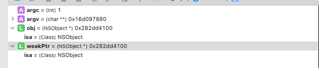

> `ARC`下我们想要获取`weak`变量指向的对象是通过：`objc_loadWeakRetained`和`objc_release`，`MRC`下通过: `objc_loadWeak`（虽然`weak`变量中有对象的地址）。这里要和通过指针直接找到对象内存读取内容的方式作出理解上的区别。
> ​

> 通过分析上述函数实现，可以发现只要一个对象被标记为`deallocating`，即使此时该对象的弱引用还是指向对象内存且对象没有被完全释放，只要通过该对象的弱引用访问该对象都会得到`nil`。

## 1. 示例代码
在`main.m`中编写如下代码，在函数最后打断点，并打开汇编模式：
```jsx
int main(int argc, char * argv[]) {
    @autoreleasepool {
     
        id obj = [NSObject new];
        __weak id weakPtr = obj; // 调用 objc_initWeak 进行 weak 变量初始化
        printf("start tag\n");
        {
            NSLog(@"%@", weakPtr);
        }
        printf("end tag\n"); //  ⬅️ 断点打在这里
    }
    return 0;
}
```
## 2. 分析示例汇编代码
运行后，会进入断点，这里我们只关注`start tag`和`end tag`之间的部分，汇编反应如下：
`ARC`下：
```jsx
0x102e99ea0 <+76>:  bl     0x102e9a424               ; symbol stub for: printf
0x102e99ea4 <+80>:  add    x0, sp, #0x20             ; =0x20 
0x102e99ea8 <+84>:  bl     0x102e9a3d0               ; symbol stub for: objc_loadWeakRetained
0x102e99eac <+88>:  mov    x20, x0
0x102e99eb0 <+92>:  str    x20, [sp]
0x102e99eb4 <+96>:  adrp   x0, 3
0x102e99eb8 <+100>: add    x0, x0, #0x10             ; =0x10 
0x102e99ebc <+104>: bl     0x102e9a370               ; symbol stub for: NSLog
0x102e99ec0 <+108>: b      0x102e99ec4               ; <+112> at main.m:17:13
0x102e99ec4 <+112>: mov    x0, x20
0x102e99ec8 <+116>: bl     0x102e9a400               ; symbol stub for: objc_release
```
`MRC`下：
```jsx
0x102c31eb8 <+76>:  bl     0x102c32424               ; symbol stub for: printf
0x102c31ebc <+80>:  add    x0, sp, #0x20             ; =0x20 
0x102c31ec0 <+84>:  bl     0x102c323d0               ; symbol stub for: objc_loadWeak
0x102c31ec4 <+88>:  str    x0, [sp]
0x102c31ec8 <+92>:  adrp   x0, 3
0x102c31ecc <+96>:  add    x0, x0, #0x10             ; =0x10 
0x102c31ed0 <+100>: bl     0x102c32370               ; symbol stub for: NSLog
0x102c31ed4 <+104>: b      0x102c31ed8               ; <+108> at main.m:19:9
```
## 3. 获取被弱引用的对象
通过上面对象汇编代码可以做出如下总结并抛出一些结论，后面我们回一步一步的证明：

- 在`ARC`模式下，获取`weak`变量时，会调用`objc_loadWeakRetained`然后在要出作用域时调用了一次`objc_release`，之所以这样，是因为在`objc_loadWeakRetained`中会对`weak`指针指向的对象调用`objc_object::rootRatain`函数，使该对象的引用计数加`1`，为了抵消这一次加 `1`，会在即将出作用域之前调用`objc_release`函数(内部实现其实是：`objc_object::release`)使该对象的引用计数减`1`。这个加`1`减`1`的操作其实是为了保证通过`weak`变量读取其指向的对象时，防止对象中途销毁，毕竟`weak`变量不会强引用所指向的对象。


- 在`MRC`模式下，获取`weak`指针时，会调用`objc_loadWeak`函数，其内部实现其实是：`objc_autorelease(objc_loadWeakRetained(location))`，即通过`objc_autorelease`来抵消`weak`变量读取过程中的引用计数加`1`的操作，保证对象最后能正常释放。
## 4. objc_loadWeakRetained
下面分析`objc_loadWeakRetained`函数源码，分析之前可以先验证一下`location`参数的内容。还是前面的示例代码，这次断点打在`objc_loadWeakRetained`处，然后通过`LLDB`，可以看到如下你内容：

通过控制台可以看出，`weakPtr`指向通`obj`的对象地址。
​

​

