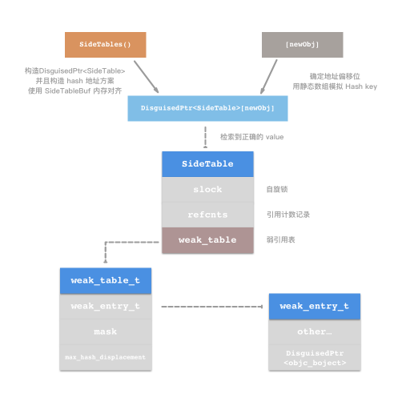

## 1. `@property` 后面可以有哪些修饰符？
属性分成以下四类：

- 原子性：`atomic`(default)、`nonatomic`。原子性只能保证多线程安全访问，但是不足以保证属性的线程安全。
- 读写权限：`readwrite`(default)、`readonly`。
- 内存管理语义：`assign`、`strong`、`weak`、`unsafe_unretained`、`copy`。
   - `assign`：对应值类型，简单赋值操作。
   - `strong`：强引用持有。
   - `weak`：弱引用持有。
   - `unsafe_unretained`：对象类型的值引用，不持有，但指向对象释放时自身也不会释放。
   - `copy`：`setter` 方法调用的时候，将目标对象的通常用在持有 `mutable` 的对象上。
- 属性读写：`getter` 和 `setter` 方法设置：弱不使用自动生成的 `getter` 和 `setter` 方法，则使用下列语法绑定 `getter` 和 `setter`。
@property (nonatomic, getter=isOn) BOOL on;
- _Nullability_ 特性（WWDC 2015 新加入）：`nonnull`、`null_resettable`、`nullable`。兼容 Swift 中的 Optional 特性，`null_resettable` 的意思是初值可为 `nil`，在第一次调用的时候将初始化成非 `nil` 的对象。效果等同于 Swift 中 `!` 表达。


## 2. `@property (copy) NSMutableArray *array;` 这种写法会出现什么问题？

- `NSMutableArray` 的 `copy` 方法是复制一个 `NSArray` 对象，当调用其增删改的方法时，会 crash。
- 默认使用 `atomic`，会有性能损耗，相比于 `nonatomic` 没有优势。
## 3. 如何让自己的类用 `copy` 修饰符？如何重写带 `copy` 关键字的 `setter`？
有两种关于 Copy 的协议，`NSCopying` 和 `NSMutableCopying`。这与使用的对象有关。该协议只有一个方法
```objectivec
- (id)copyWithZone:(NSZone *)zone;
```
当自己的类使用了 copy 修饰符，不仅要 override `copy` 方法，也要实现 `compyWithZone` 方法。
```jsx
// .h
#import <Foundation/Foundation.h>

@interface DGObject : NSObject<NSCopying>

@property (nonatomic, copy, nonnull) NSString *name;
@property (nonatomic, assign) NSUInteger age;

- (instancetype _Nullable )initWithName: (NSString *_Nullable)name age:(NSUInteger)age;
+ (instancetype _Nullable )dgoWithName:(NSString *_Nullable)name age:(NSUInteger)age;

@end
/**************************************/
// .m
#import "DGObject.h"
@implementation DGObject

+ (instancetype) dgoWithName:(NSString *)name age:(NSUInteger)age {
    return [DGObject.alloc initWithName:name age:age];
}

- (instancetype) initWithName:(NSString *)name age:(NSUInteger)age {
    self = [super init];
    if (self) {
        self.name = name;
        self.age = age;
    }
    return self;
}

- (nonnull id)copyWithZone:(nullable NSZone *)zone {
    DGObject *copy = [[self.class allocWithZone:zone] initWithName:self.name age:self.age];
    return copy;
}
@end
```
如果你需要深拷贝操作，可能需要增加一个深拷贝的方法。
至于 **如何重写带 copy 关键字的 setter这个问题?** 
```jsx
- (void)setName:(NSString *)name {
   if (_name != name) {
       //[_name release];//MRC
       _name = [name copy];
   }
}
```
如果初始化方法(initializer)中赋值，可以以下方式：
```jsx
- (instancetype)initWithName:(NSString *)name 
   						 age:(NSUInteger)age 
   						 sex:(CYLSex)sex {
	if(self = [super init]) {
		_name = [name copy];
        _age = age;
        _sex = sex;
        _friends = [[NSMutableSet alloc] init];
	}
	return self;
 }
```
在转成 cpp 源码可以发现，系统不会帮忙添加 copy
## `4. @prope``rty 的本质是什么？ivar、getter、setter 是如何生成并添加到这个类中的`
**`@property` 是 `ivar`、`getter`、`setter` 的集中体现，其实就是 `ivar` 实例以及 `getter` 和 `setter` 方法。他的作用在于封装对象中的数据**。ObjC 对象通常吧所需要的数据保存为各种实例变量，实例变量一般通过 `getter` 和 `setter` 方法读取变量。这个概念与 Java 中的属性相同，在正规的 ObjC 的编码风格中，`setter` 和 `getter` 方法有着明确严格的命名规范，所以 Objective-C 才能自动创建 `getter` 和 `setter` 方法。
当代码的 `@interface` 作用域中存在以下的内容:
```jsx
@interface DGObject: NSObject

@property (nonatomic, copy) NSString *firstName;

@end
```
则在编译后与下列情况等效：
```jsx
@interface DGObject: NSObject

/// getter
- (NSString *)firstName;

/// setter
- (void)setFirstName: (NSStirng *)firstName;

@end
```
**`ivar`、`getter`和 `setter` 添加过程**
在定义之后，编译器会自动编写这些属性需要的方法，这就是 _autosynthesis_ 过程。这个过程是在编译期完成的，编辑器中无法发现 Sythesized Method 的实现。除了 `getter` 和 `setter`，编译器还会自动向类中添加适当的实例变量，并且在属性名前添加下划线，作为实例变量的名字。**在 ObjC 1.0 时，是需要自行使用 `@synthesize` 来指定成员名**：
```jsx
@implementation DGObject

@sythesize firstName = _firstName;

@end
```
在 Runtime 源码中的逆向思考，在每次添加属性的时候，系统都会在 `prop_list` 中添加属性，在 `ivar_list` 中添加成员变量描述，在 `method_list` 中增加 `getter` 和 `setter` 方法描述，通过 `hardcode` (硬编码) 来存储变量的 offset。这个 offset 的变量名一般是 `OBJC_IVAR_$Class name$Property Name`。
## 5. `@protocol` 和 Category 中如何使用 `@property`

- 在 `protocol` 中使用 `@property` 之会生成 `setter` 和 `getter` 的方法声明，让 Class 遵循这个 `Protocol` 并实现其属性即可。
- Category 中无法添加 `@propery`，需要使用 Runtime 的两个方法来添加 `@property` 并实现其 `getter` 和 `setter` 方法。`objc_setAssociatedObject` 和 `objc_getAssociatedObject`。
- 对于 Swift 来说，`protocol` 中可以声明成员，并且在 `protocol` 的 `extension` 中可以指定其 `getter` 和 `setter` 方法。
- 在 Swift 中 Category 即为 `extension`，同样的需要使用 Runtime 来进行设置。导入 `import ObjectiveC` 保持和 ObjC 相同的实现即可。
## 6. Runtime 中实现 weak 属性的原理
冬瓜在博客中做过分析：[链接](http://www.desgard.com/weak/)。
`__weak` 关键字引起 `obje_initWeak(&p, 指针)` 的调用，然后进行**更新散列过程**。通过指针先构造出 `weak_entry_t`，其中会持有一个 `DisguisedPtr`，这个指针使用了泛型，通过对于 SideTable 的构造，将其拓展成了一个 **弱引用散列表**。以下是 `weak_entry_t` 的数据结构：
```jsx
typedef objc_object ** weak_referrer_t;
struct weak_entry_t {
    DisguisedPtr<objc_object> referent;
    union {
        struct {
            weak_referrer_t *referrers;
            uintptr_t        out_of_line : 1;
            uintptr_t        num_refs : PTR_MINUS_1;
            uintptr_t        mask;
            uintptr_t        max_hash_displacement;
        };
        struct {
            // out_of_line=0 is LSB of one of these (don't care which)
            weak_referrer_t  inline_referrers[WEAK_INLINE_COUNT];
        };
 }
```
其中各个成员的定义如下：

- **out_of_line**：最低有效位，也是标志位。当标志位 0 时，增加引用表指针纬度。
- **num_refs**：引用数值。这里记录弱引用表中引用有效数字，因为弱引用表使用的是静态 hash 结构，所以需要使用变量来记录数目。
- **mask**：计数辅助量。
- **max_hash_displacement**：hash 元素上限阈值。

总结一下 `StripedMap<SideTable>[]` ： `StripedMap` 是一个模板类，在这个类中有一个 array 成员，用来存储 PaddedT 对象，并且其中对于 `[]` 符的重载定义中，会返回这个 `PaddedT` 的 value 成员，这个 value 就是我们传入的 T 泛型成员，也就是 SideTable 对象。在 array 的下标中，这里使用了 `indexForPointer` 方法通过位运算计算下标，实现了静态的 Hash Table。而在 `weak_table` 中，其成员 `weak_entry` 会将传入对象的地址加以封装起来，并且其中也有访问全局弱引用表的入口。

**重点记录**

1. `storeWeak` 方法的实现的几个步骤：重新构造 SideTables() -> `lockTwo` 加锁操作 -> `weak_unregister` 接触旧对象和引用的 hash 关联 -> 新的 weak 引用注册。
2. SideTable 数据结构：自旋锁 `slock`，引用计数 hash 表 `refcnts`，全局弱引用表 `weak_table`。
## 7. weak 属性需要在 `dealloc` 中置 `nil` 么？
不需要。在 ARC 模式下模式下，`strong` 和 `weak` 类型均由 ARC 自动处理。而在 MRC 模式下，`weak` 属性在自身作用域之后会直接释放，所以也不需要手动处理。
## 8. `@synthesize` 和 `@dynamic` 的作用。

- `@property` 中有两个对应的关键字 `@synthesize` 和 `@dynamic`。如果没有手动显示写出，那么默认就是：
```jsx
@synthesize var = _var
```

- `@synthesize` 的意思就是**如果你没有手动实现 `getter` 和 `setter`，编译器会自动添加这个方法**。
- `@dynamic` 的语义是告诉编译器，**我会显式申明 `getter` 和 `setter` 方法，不需要自动生成**。对于 `readonly` 属性自己仅仅需要实现 `getter` 即可。如果显式写出 `@dynamic`，缺没有手动实现 `getter` 和 `setter`，编译可通过，在调用对应方法的时候会造成 crash。**其实这一组关键字也反映了 ObjC 的动态绑定性质。**
## 9. ARC 模式下，修饰属性对应的 default 值有哪些？
`atomic` 控制原子操作，`readwrite` 控制可读可写。当类型为常用数据类型的时候，`assign` 作为数据读取策略，当时自定义 Class 时，使用 `strong`
[Objective-C ARC: strong vs retain and weak vs assign](https://stackoverflow.com/questions/8927727/objective-c-arc-strong-vs-retain-and-weak-vs-assign/15541801#15541801)
## 10. 用 `@property` 来声明 `NSString` 或（`NSArray`、`NSDictionary`）使用 `copy` 关键字的原因？如果使用 `strong` 会怎么样？

冬瓜曾经写过一篇文章：[从经典问题来看 Copy 方法](http://www.desgard.com/copy/)。
具体原因就是深复制、浅复制的原因

## 11. 讲讲你对 atomic 和 nonatomic 的理解

