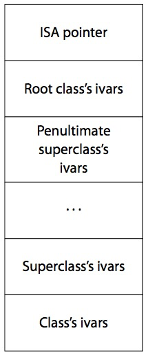
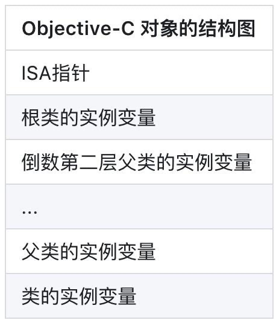
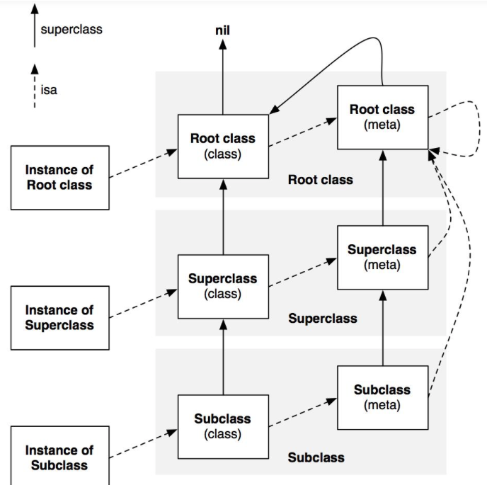

## 11. `objc` 中向一个 `nil` 对象发送消息将会发生什么？
在 `Objective-C`  中向 `ni`  发送消息是完全有效的——只是在运行时不会有任何作用:
如果一个方法返回值是一个对象，那么发送给 `nil` 的消息将返回 `0(nil)` 。例如：
```jsx
Person * motherInlaw = [[aPerson spouse] mother];
```
如果 `spouse`  对象为 `nil` ，那么发送给 `nil`  的消息 `mother`  也将返回 `nil` 。 2. 如果方法返回值为指针类型，其指针大小为小于或者等于 `sizeof(void*)` ， `float` ， `double` ， `long double`  或者 `long long` 的整型标量，发送给 `nil` 的消息将返回 `0` 。 2. 如果方法返回值为结构体,发送给 nil 的消息将返回0。结构体中各个字段的值将都是0。 2. 如果方法的返回值不是上述提到的几种情况，那么发送给 nil 的消息的返回值将是未定义的。
具体原因如下：
> objc是动态语言，每个方法在运行时会被动态转为消息发送，即：objc_msgSend(receiver, selector)。

那么，为了方便理解这个内容，还是贴一个objc的源代码：
```jsx
// runtime.h（类在runtime中的定义）
// http://weibo.com/luohanchenyilong/
// https://github.com/ChenYilong

struct objc_class {
  Class isa OBJC_ISA_AVAILABILITY; //isa指针指向Meta Class，因为Objc的类的本身也是一个Object，为了处理这个关系，runtime就创造了Meta Class，当给类发送[NSObject alloc]这样消息时，实际上是把这个消息发给了Class Object
  #if !__OBJC2__
  Class super_class OBJC2_UNAVAILABLE; // 父类
  const char *name OBJC2_UNAVAILABLE; // 类名
  long version OBJC2_UNAVAILABLE; // 类的版本信息，默认为0
  long info OBJC2_UNAVAILABLE; // 类信息，供运行期使用的一些位标识
  long instance_size OBJC2_UNAVAILABLE; // 该类的实例变量大小
  struct objc_ivar_list *ivars OBJC2_UNAVAILABLE; // 该类的成员变量链表
  struct objc_method_list **methodLists OBJC2_UNAVAILABLE; // 方法定义的链表
  struct objc_cache *cache OBJC2_UNAVAILABLE; // 方法缓存，对象接到一个消息会根据isa指针查找消息对象，这时会在method Lists中遍历，如果cache了，常用的方法调用时就能够提高调用的效率。
  struct objc_protocol_list *protocols OBJC2_UNAVAILABLE; // 协议链表
  #endif
 } OBJC2_UNAVAILABLE;
```
objc在向一个对象发送消息时，runtime库会根据对象的isa指针找到该对象实际所属的类，然后在该类中的方法列表以及其父类方法列表中寻找方法运行，然后在发送消息的时候，objc_msgSend方法不会返回值，所谓的返回内容都是具体调用时执行的。 那么，回到本题，如果向一个nil对象发送消息，首先在寻找对象的isa指针时就是0地址返回了，所以不会出现任何错误。
## 12. ObjC 中向一个对象发送消息 `[obj foo]` 和 `objc_msgSend()` 方法有什么关系？
所谓发送消息 `[obj foo]` 在编译后其实就是 `objc_msgSend()` 函数调用。
```jsx
id retureValue = [DGObject foo];

// 等效于
id retureValue = objc_msgSend(DGObject, @selector(test));
```
`objc_msgSend` 方法原型：
```jsx
void objc_msgSend(id self, SEL cmd, ...)
```
传入 `self` 指针和 `SEL` 选择子即可。
## 13. 一个objc对象如何进行内存布局？（考虑有父类的情况）

- 所有父类的成员变量和自己的成员变量都会存放在该对象所对应的存储空间中.
- 每一个对象内部都有一个isa指针,指向他的类对象,类对象中存放着本对象的
   - 对象方法列表（对象能够接收的消息列表，保存在它所对应的类对象中）
   - 成员变量的列表
   - 属性列表

它内部也有一个isa指针指向元对象(meta class),元对象内部存放的是类方法列表,类对象内部还有一个 `superclass `的指针,指向他的父类对象。
每个 Objective-C 对象都有相同的结构，如下图所示：


翻译过来就是：


- 根对象就是NSObject，它的superclass指针指向nil
- 类对象既然称为对象，那它也是一个实例。类对象中也有一个isa指针指向它的元类(meta class)，即类对象是元类的实例。元类内部存放的是类方法列表，根元类的isa指针指向自己，superclass指针指向NSObject类。

  
## 14. C++类中的ObjC对象什么时候dealloc
参考：[https://everettjf.github.io/2020/04/17/how-cpp-delete-dealloc-objc-object/](https://everettjf.github.io/2020/04/17/how-cpp-delete-dealloc-objc-object/)
## 15. 一个objc对象的isa的指针指向什么？有什么作用？
指向他的类对象,从而可以找到对象上的方法
## 16. runtime如何通过selector找到对应的IMP地址？（分别考虑类方法和实例方法）
每一个类对象中都一个方法列表,方法列表中记录着方法的名称,方法实现,以及参数类型,其实selector本质就是方法名称,通过这个方法名称就可以在方法列表中找到对应的方法实现。
## 17. `touchBegan` 和 `hitTest` 的执行顺序
`touchBegan` 的执行顺序是
子视图 - 》父视图 - 》 viewController
`hitTest` 的执行顺序与 `touchbegan` 的顺序相反

- iOS 中事件的产生和传递
   - 发生触摸事件后，系统会将该事件加入到一个由UIApplication管理的事件队列中,为什么是队列而不是栈？因为队列的特点是FIFO，即先进先出，先产生的事件先处理才符合常理，所以把事件添加到队列。
   - UIApplication会从事件队列中取出最前面的事件，并将事件分发下去以便处理，通常，先发送事件给应用程序的主窗口（keyWindow）
   - 主窗口会在视图层次结构中找到一个最合适的视图来处理触摸事件，这也是整个事件处理过程的第一步。
 找到合适的视图控件后，就会调用视图控件的touches方法来作具体的事件处理。
- 事件传递
   - 触摸事件的传递是从父控件传递到子控件
   - 也就是UIApplication->window->寻找处理事件最合适的view
- 应用如何找到最合适的控件来处理事件？
   - 首先判断主窗口（keyWindow）自己是否能接受触摸事件
   - 判断触摸点是否在自己身上
   - 子控件数组中从后往前遍历子控件，重复前面的两个步骤（所谓从后往前遍历子控件，就是首先查找子控件数组中最后一个元素，然后执行1、2步骤）
   - view，比如叫做fitView，那么会把这个事件交给这个fitView，再遍历这个fitView的子控件，直至没有更合适的view为止。
   - 如果没有符合条件的子控件，那么就认为自己最合适处理这个事件，也就是自己是最合适的view。
- UIView不能接收触摸事件的三种情况：
   - **不允许交互**：userInteractionEnabled = NO
   - **隐藏**：如果把父控件隐藏，那么子控件也会隐藏，隐藏的控件不能接受事件
   - **透明度**：如果设置一个控件的透明度<0.01，会直接影响子控件的透明度。alpha：0.0~0.01为透明。
## 18. App的启动过程（app启动时候，发生了什么事情？）

- 解析 `nfo.plist`
- 加载相关信息，例如如闪屏
- 沙箱建立、权限检查
- `Mach-O` 加载
- 如果是胖二进制文件，寻找合适当前 `CPU` 类别的部分
- 加载所有依赖的 `Mach-O` 文件（递归调用 `Mach-O` 加载的方法）
- 定位内部、外部指针引用，例如字符串、函数等
- 执行声明为 `__attribute__((constructor))` 的C函数
- 加载类扩展（Category）中的方法
- C++静态对象加载、调用ObjC的 +load 函数
- 程序执行
- 调用 `main()`
- 调用 `UIApplicationMain()`
- 调用 `applicationWillFinishLaunching`
## 19. `bicode` 是什么？
bitcode是被编译程序的一种中间形式的代码。包含bitcode配置的程序将会在App store上被编译和链接。bitcode允许苹果在后期重新优化我们程序的二进制文件，而不需要我们重新提交一个新的版本到App store上。
## 20. `scrollView` 的 `bounds` 和 `contentOffeset` 的关系？

- 改变 `contentOffset` 其实质是改变自身的 `bounds.origin` 。
- 这样的话，为什么还需要 `contentOffset` 这个属性呢？因为调用 `setContentOffset:` 会触发滑动的行为，因此也会调用 `scrollViewDidScrollView:` 的代理方法；而直接设置 `bounds.origin`  就不会。

参考文章

- [理解 Scroll Views](https://www.objccn.io/issue-3-2/)
- [Understanding UIScrollView](https://oleb.net/blog/2014/04/understanding-uiscrollview/)
## 
