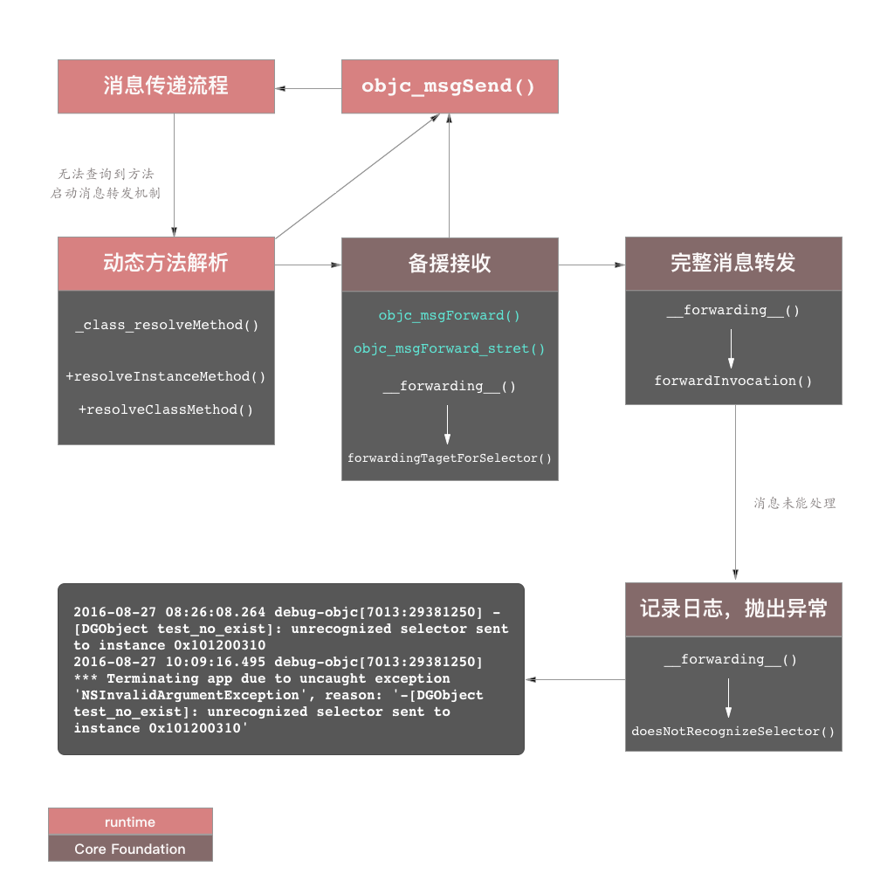
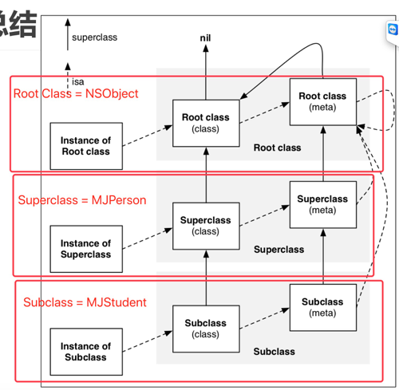

### 1. class_getInstanceSize、malloc_size、sizeof 的区别

- `sizeof` ：不是一个函数，是运算符，在编译期检查类型指针所占的大小，这里计算的是其类型的长度

- `class_getInstanceSize`：在运行时返回对象实际占用的内存大小，按照 8 字节对齐

- `malloc_size`：会返回系统为对象分配的内存大小，在 iOS 和 macOS 系统中，系统最小为对象分配 16 字节的内存

  

### 2. @synthesize 合成实例变量的规则是什么？例如@property 存在一个名为 foo 的属性，在声明一个@property 名为_foo，会导致什么后果？

- 如果显示写明了`@synthesize` 规则，且`@sythesize foot = **`，其中`**` 不是 `_foo`  那么可以同时存在。
- 如果未显示写明了`@synthesize` 规则，属性则自动与`_+属性_` 关联成员变量，此时 `xcode` 会报出 `warnning`，且不会自动合成心变量。

### 3. unrecognized selector 异常出现在什么情况下？

调用该对象某个方法但是缺少方法实现的时候会出现该异常。
消息转发可以查看个人博客[《objc_msgSend消息传递学习笔记 - 消息转发》](https://www.desgard.com/objc_msgSend2/)。

**1. 动态方法解析过程**

当 `objc_msgSend` 无法在 *Fast Map* 中根据选择子查询到对应名称的方法时，进入 `resolveInstanceMethon` 过程。在 `resolveInstanceMethod` 过程中，进入入口方法 `_class_resolveMethod`，先根据 isa 的指向来判断是类方法还是成员方法，从而调用 `resolveInstanceMethod` 或者 `resolveClassMethod`。主体流程中，执行 `lookUpImpOrNil` 方法在方法列表中来搜索 `IMP` 指针。若仍未命中，继续进入 **备援接受阶段**。

**2. Forwarding 备援接收**

如果选择子未命中，则继续将其传递给其他接受者来处理。这一块代码调用的主要方法为 `forwardingTargetForSelector: (SEL)selector`。在 Core Foundation 中这一方法的实现被隐藏，暴露出来的 `__forwarding__` 的核心方法 `objc_msgSend_stret` 也被隐藏。

**3. Message Dispatch System 消息派发**

在 Forwarding 步骤中最后会创建一个 `NSInvocation` 对象，其中包括了对应的选择子、target 主要参数。倘若自下而上始终没有发现可处理改消息的方式，则调用 `doesNotRecognizeSelector` 从而抛出异常。



### 4. oc 对象的 isa 指针指向什么? 有什么作用？

**isa 指针指向**

- 普通实例对象的 isa 指向类对象

- 类对象的 isa 指向 meta-class

- meta-class 的 isa 指向基类(可以理解为 NSObject)的 meta-class

  

**superclass 指针指向**

- 类对象的 superclass 指向父类类对象，如果父类不存在，superclass 指向 nil
- meta-class 的 superclass 指向父类的 meta-class，基类的 meta-class 的 superclass 指向基类的类对象。



### 5. self 和 super 的区别

- `self`：是类的一个隐藏参数，每个方法实现的第一个参数就是 `self`，`[self class]`，相当于当前所处的方法调用 `class`，就是类调用 `class`，如果是对象方法，就是对象调用 `class`。

- `super`：不是一个隐藏参数，是一个编译器标识符，它告诉编译器，当前调用方法时，去父类寻找该方法，而不是去本类。在调用`[super class]` 的时候，`runtime` 回去调用 `objc_msgSendSuper` 方法，``objc_msgSendSuper` 的工作原理大约是：去父类中寻找调用方法，找到方法后以 `objc-receiver` 去调用方法，调用者是 `objc-receiver`，是当前类，而不是 `super_class`。

  ```jsx
  ENTRY _objc_msgSendSuper
  UNWIND _objc_msgSendSuper, NoFrame
  /// 真正的调用者是object
  ldp	p0, p16, [x0]		// p0 = real receiver, p16 = class
  CacheLookup NORMAL		// calls imp or objc_msgSend_uncached
  
  END_ENTRY _objc_msgSendSuper
  ```

### 6. _objc_msgForward 函数是做什么的，直接调用它将会发生什么

消息转发可以参看博客[《](https://www.desgard.com/objc_msgSend2/)`objc_msgSend`[ 消息传递学习笔记 - 消息转发》](https://www.desgard.com/objc_msgSend2/)

`_objc_msgForward` 消息转发过程会涉及到以下方法：

- `resolveInstanceMethod`、`resolveClassMehtod`：允许用户在此时为类动态添加方法实现。如果有实现，则调用并返回 `YES`，重新开始 `objc_msgSend` 流程。如果没有实现，继续下面的操作。
- `forwardingTargetForSelector`：尝试找到一个能响应该消息的对象。如果能获取到，就直接把消息转发给它，返回非 `nil` 对象。否则返回 `nil`，继续下面的操作。注意这里不能返回 `self`，会造成死循环。
- `methodSignatureForSelector`：调用该方法，尝试获取一个方法签名，如果获取不到，就直接调用 `doesNotRecognizeSelector `抛出异常。如果能获取到，返回非 `nil`：创建一个 `NSInvocation` 并传给 `forwardInvocatiuon`:。
- `forwardInvocation:`：将上一步获取到的签名包装成 `Invocation` 传入，如果处理就在这里了，并返回非 `nil`。
- `doesNotRecognizeSelector`：默认实现是抛出异常。如果第三步没有获取到一个方法签名。


### 7. runloop 和线程的关系

runloop 依托于线程存在，每个线程，包括主线程都有对应的 runloop。除了主线程外，其他线程的 runloop 都需要手动调用 run 方法来开启，当线程结束后，runloop 有线程自行释放。

### 8. 一个 NSObject 对象占用多少内存

系统分配 16 个字节给 NSObject 对象，可以通过 malloc_size 函数获取。但是 NSObject 对象内部只使用了 8 个字节的空间，可以通过 objc_getInstanceSize 函数获取。

### 9. KVO

- iOS 用什么方式实现对一个对象进行 KVO 操作？(KVO的本质)

  ```jsx
  1. 利用 runtimeAPI 动态生成一个子类NSKVONotifying_xxx，并且让 instance 对象的 isa 指向这个全新的子类
  2. 当修改 isntance 对象的属性时，会调用 Foundation 的 _NSSetXXXVlueAndNotify 函数
  	2.1 willChangeValueForKey:
  	2.2 父类原来的 setter
  	2.3 didChangeValueForKey：
  		2.3.1 内部会触发监听器（oberser）的监听方法:observeValueForKeyPath:ofObject:change:cntext:
  ```

- 手动触发 KVO

  ```jsx
  手动调用 willChangeValueForKey: 和 didChangeValueForKey:
  ```

- 直接修改成员变量不会触发 `KVO`

### 10. 讲一下 OC 的消息机制

- `OC` 中的方法调用其实都是转成 `objc_msgSend` 函数的调用，给 `receiver` 发送一条消息。
- `objc_msgSend` 底层有三个阶段：`消息发送`(当前类、父类中查找)、`动态方法解析`、`消息转发`

### 11. 消息转发流程

首先需要实现 `forwardingTargetForSelector:` 方法，返回一个对象，交给这个对象去处理，如果返回为空，需要你实现`methodSignatureForSelector:` 方法，要求返回方法的签名，如果返回空，就会报非常经典的错误 `unrecognzied selector sent to instance`，如果返回不是空，会调用 `forwardInvocation:`，在此方法中进行最后一次处理.

### 12. 什么是Runtime？平时项目中有用过么？

- `OC` 是一门动态性比较强的编程语言，允许很多操作推迟到程序运行时再进行
- `OC` 的动态性就是由 `Runtime` 来支撑和实现的，`Runtime` 是一套 `C` 语言的 `API`，封装了很多动态性相关的函数
- 平时编写的 `OC` 代码，底层都是转换成了 `Runtime API` 进行调用
- 具体应用
  - 利用关联对象（`AssociatedObject`）给分类添加属性
  - 遍历类的所有成员变量（修改 `textfield` 的占位文字颜色、字典转模型、自动归档解档）
  - 交换方法实现（交换系统的方法）
  - 利用消息转发机制解决方法找不到的异常问题

### 13. runtime如何通过selector找到对应的IMP地址？

每个类对象都有一个对象方法列表(对象方法缓存)

- 类方法列表存放在类对象 isa 指针指向的元类对象中。
- 方法列表中每个方法结构体中记录了方法的名称、方法实现、以及参数类型。其实 `selector`  的本质就是方法名称，通过这个方法名称就可以在方法列表中找到对应的方法实现。
- 当我们发送一条消息给一个对象时，这条消息会在对象的类方法列表中查找、
- 当我们发送一条消息给一个类时，这条消息会在类的 meta-class 对象的方法列表中查找。

### 14. load 和 initialize 的区别

两者都会自动调用父类，不需要 `[super xx]`  操作，且仅会调用一次(外部显示调用不算)。

#### 14.1 load 方法

**调用时机**

当程序启动时，参与了编译的类、分类都会被加载进内存，`load` 方法在类、分类加载的时候调用，这个过程与这个类是否被使用无关，也就是说如果一个类即使在整个运行过程都没有被使用，甚至没有文件去引用，这个类的 `load`  方法依然会被调用。等所有的类、分类加载进内存后，才会调用程序的 `main` 函数，所以 `load` 在 `main` 函数加载之前调用。每个类、分类的 `load` 方法只会被调用一次。

**调用顺序**

在程序中，如果类、分类都实现了 `load` 方法，那么所有的 `load` 方法都会被调用，执行顺序如下：

- 先执行类的 `load` ，在执行分类的 `load` 
- 执行类的 `load`  方法时，是按照参与编译的顺序，先编译的类先执行。如果存在继承关系，先执行父类的 `load` 方法，在执行自己的 `load` 方法
- 执行分类的 `load` 方法时，是按照参与编译的顺序，先编译的分类先执行。

#### 14.2 initialize

**调用时机**

`initialize` 方法是在类或者它的分类收到第一条消息时被调用，所以所有类的 `initialize`调用是在 `main`  函数之后调用。而且一个类只会调用一次 `initialize`方法。如果一个类在程序运行过程中一直没有被使用，那么这个类的 `initialize`方法也不会被调用，这一点和 `load`  有区别。

**调用方式**

`initialize`的调用和普通方法一样，也是走的 `objc_msgSend` 流程。所以如果一个类和其分类都实现了 `initialize` 方法，那最终调用的是分类中的方法。
如果子类和父类都实现了 `initialize` 方法，那么会先调用父类的方法，然后在调用子类的方法(子类不需要写 `[super initialize]` 来调用父类的方法，通过查看源码可以看出是主调调用了父类的 `initialize`方法，

### 15. 为什么Block用copy关键字

`Block` 在没有使用外部变量时，内存存在全局区，然而，当 `Block` 在使用外部变量的时候，内存是存在于栈区，当 `Block copy` 之后，是存在堆区的。存在于栈区的特点是对象随时有可能被销毁，一旦销毁在调用的时候，就会造成系统的崩溃。所以 `Block` 要用 `copy` 关键字。

### 16. 如何治理 OOM

OOM（Out Of Memory）指的是应用内存占用过高被系统强制杀死的情况，通常还会再分为 FOOM （前台 OOM） 和 BOOM （后台 OOM）两种。其中 FOOM 现象跟常规 Crash 一样，对用户体验影响比较大。

OOM 产生的原因是应用内存占用过高，治理方法就是降低内存占用，这可以分两部分进行：

- 现存代码：问题检测，查找内存占用较大的情况进行治理。
- 未来代码：防裂化，对内存使用进行合理的规范。

#### 16.1  防劣化

防劣化即防止出现 `OOM` 的一些手段，可以从以下方面入手：

- 内存泄漏
- `autoreleasepool`：在循环里产生大量临时对象，内存峰值会猛涨，甚至出现 `OOM`。适当的添加 `autoreleasepool` 能及时释放内存，降低峰值。

- 大图压缩：可以降低图片采样率。
- 前后台切换：后台更容易发生 `OOM`，因为后台可利用的内存更小，我们可以在进入后台时考虑释放一些内存。

### 17. KVC 的工作原理

`key-value-conding` (键值编码) 是由 `NSKeyValueConding` 非正式协议启用的一种机制，对象采用这种机制来提供对其属性/成员变量的间接访问。当一个对象符合键值编码时，它所有的属性/成员变量可以通过一个简洁、统一的消息传递接口(`setValue:forKey:`)通过字符串参数寻址。这种间接访问机制补充了实例变量及其相关访问器方法(`getter` 方法)提供的直接访问。

**setValue:forKey: 的默认实现，给定的 key 和 value 参数作为输入，尝试将 key 的属性设置为 value，内部调用如下：**

- 按此顺序查找名为 `set<Key>:` 或者`_set<Key>: ` 的第一个访问器。如果找到了，则使用 `value` 调用它并完成。
- 如果找不到简单点的访问器，并且类方法 `accessInstanceVariablesDirectly` 返回 `YES`，按该顺序查找名称类似于``_<Key>、_is<Key>`、`<key>` 或 `is<Key>` 的实例变量。如果找到，则直接使用 value（或根据需要解包 value 的值）设置实例变量并完成操作。
- 在找不到访问器或实例变量时，调用 `setValue:forUndefinedKey:`。这在默认情况下会引发 NSUndefinedKeyException 异常，但 NSObject 的子类可能会提供键特定的行为。（由子类重写 `setValue:forUndefinedKey:`）

**get(取值)Object 的流程：**

- 1. 在实例中搜索第一个名为 `get<Key>`、`<key>`、`is<Key>` 或 `\_<key>` 的访问器方法。如果找到了，则调用它并继续执行步骤 5 并返回结果。否则继续下一步。（如果想简单描述的话可以把步骤 2 和 3 省略，2 和 3 针对是一对多关系的搜索过程，如 NSArray 和 NSSet 类型属性的搜索过程）
- 2. 如果找不到简单的访问器方法，在实例中搜索名称与 `countOf<Key>`、`objectIn<Key>AtIndex:`（对应于 NSArray 类定义的原始方法） 和 `<key>AtIndexes:`（对应于 NSArray 的 `objectsAtIndexes:` 方法）模式匹配的方法。 如果找到其中的第一个以及其他两个中的至少一个，则创建一个响应所有 NSArray 方法的集合代理对象（collection proxy object），并返回该对象。否则，请继续执行步骤 3。 代理对象随后将接收到的任何 NSArray 消息转换为 `countOf<Key>`、`objectIn<Key>AtIndex:` 和 `<Key>AtIndexes:` 消息的组合，并将其转换为创建它的键值编码兼容对象。如果原始对象还实现了一个名为 `get<Key>:range:` 之类的可选方法，则代理对象也将在适当时使用该方法。实际上，代理对象与键值编码兼容的对象一起工作，允许底层属性的行为就像 NSArray 一样，即使它不是。
- 3.  如果找不到简单的访问器方法或数组访问方法组，请查找名为 `countOf<Key>`、`enumeratorOf<Key>` 和 `memberOf<Key>` 的三重方法。（对应于 NSSet 类定义的原始方法） 如果找到所有三个方法，请创建一个响应所有 NSSet 方法的集合代理对象，并返回该对象。否则，继续执行步骤 4。 代理对象随后将接收到的任何 NSSet 消息转换为 `countOf<Key>`、`enumeratorOf<Key>` 和 `memberOf<Key>` 消息的某种组合，以创建它的对象。实际上，代理对象与键值编码兼容对象一起工作，使得基础属性的行为就像 NSSet 一样，即使它不是 NSSet。
- 4. 如果找不到简单的访问器方法或集合访问方法组，并且如果 receiver 的类方法 `accessInstanceVariablesDirectly` 返回 YES，则按该顺序搜索名为 `\_<key>`、`\_is<Key>`、`<key>` 或 `is<Key>` 的实例变量。如果找到，则直接获取实例变量的值并继续执行步骤 5。否则，继续进行步骤 6。
- 5. 如果检索到的属性值是对象指针，则只需返回结果。 如果该值是 NSNumber 支持的标量类型，则将其存储在 NSNumber 实例中并返回它。 如果结果是 NSNumber 不支持的标量类型，则转换为 NSValue 对象并返回该对象。
- 6. 如果所有方法均失败，则调用 `valueForUndefinedKey:`。默认情况下，这会引发一个 NSUndefinedKeyException 异常，但是 NSObject 的子类可以提供特定于键的行为（子类重写 `valueForUndefinedKey:` 函数，那进一步我们自行添加一个 NSObject 分类重写 `valueForUndefinedKey:` 方法呢？）。

> 键值编码是高效的，尤其是当你依靠默认实现来完成大部分工作时，但是它确实添加了一个间接级别，该级别比直接的方法调用稍慢。只有当你可以从它提供的灵活性中获益或者允许你的对象参与依赖于它的 Cocoa 技术时，才使用键值编码


### 18. KVO 的工作原理。（追问 KVO 动态生成的新类重写了属性的 Setter 函数后，那原始手动实现的 Setter 函数会被覆盖吗？对对象的某个属性添加观察者后那对象的 isa 指向和 class 函数会发生什么变化？移除观察者后呢？）

Key-Value-Observing（键值观察）是一种机制，它允许将其他对象的指定属性的更改，通知给对象。

> KVO 是通过 isa-swizzling 实现的。基本的流程就是编译器自动为被观察者对象创建一个派生类(此派生类的父类是被观察者对象所属的类)，并将被观察者对象的 isa 指向这个派生类，派生类的类名为 NSKVONotifying_xxx。如果用户注册了对此目标对象的某一个属性的观察，那么此派生类会重写这个属性的 setter 方法，并在其中添加进行通知的代码。
>
> Objective-C 在发送消息的时候，会通过 isa 指针找到当前对象所属的类对象。而类对象中保存着当前对象可调用的实例方法，因此在向此对象发送消息的时候，实际上发送到了派生类对象的方法。由于编译器对派生类的方法进行了重写，并添加了通知代码，因此会向注册的观察者对象发送通知。注意派生类只重写注册了观察者的属性方法。

```jsx
-(void)setValue:(id)obj {
    [self willChangeValueForKey:@"keyPath"];
    
    // 这里内部使用 super 调用，由于当前派生类的 super 正是指向原类，所以不影响原类中自己手动实现的 setter 函数调用（去 58 面试时遇到了这个问题） 
    [super setValue:obj];
    
    [self didChangeValueForKey:@"keyPath"];
}
```

如下示例代码中定义的 Student 类，当对其 name 属性注册了观察者后，打印其 class 和 isa 如下：

```jsx
@interface Student : NSObject
@property (nonatomic, copy) NSString *name;
@end

// 对 self.student 添加观察者后 class 函数返回的依然是 Student
NSLog(@"🤍🤍 %@", [self.student class]);

// object_getClass 方法返回 isa 指向却是 NSKVONotifying_Student
NSLog(@"🤍🤍 %@", object_getClass(self.student));

// 控制台打印:
🤍🤍 Student
🤍🤍 NSKVONotifying_Student
 
// 然后移除 self.student 的观察者后，object_getClass(self.student) 返回的则是 Student。

```

> 简而言之，Apple 使用了一种 isa 交换的技术，当 student 被观察后，student 对象的 isa 指针被指向了一个新建的 Student 的自雷 NSKVONotifying_Student，且这个子类重写了被观察属性的 setter 方法、class 方法、和_isKVO 方法，然后使student 对象的 isa 指向这个新建的类，事实上 student 变成了 NSKVONotifying_Student 的实例对象，执行方法要从这个类的方法列表中中。
> dealloc 方法：观察者被移除后使 class 变回去 Student(通过 isa 指向)，`_isKVO` 方法判断被观察者自己是否同时也观察了其他对象。(同时苹果警告我们，通过 isa 获取类的类型是不可靠的，通过 class 方法才能获取到正确的类。)
>
> [用代码探讨 KVC/KVO 的实现原理](https://juejin.cn/post/6844903587898753037)

- 验证观察者提前释放了，且被观察者没有主动移除该观察者，那被观察者的 isa 会不会回归原类？不会回归原类，还是 NSKVONotifying_xxx 类，且此时再向观察者发送通知(observeValueForKeyPath:ofObject:change:content)会发生野指针访问。
- 验证 KVO 中编译器派生的新类的父类是不是原类？是元类，例如印`class_getSuperclass(object_getClass(self.vcTestObjc))` 时可看到 NSKVONotifying_TestObjc 的父类是 TestObjc。

### 19. iOS 中方法缓存、快速查找、慢速查找流程

