寄存器、常用指令、栈
## 1、寄存器
### 1.1 通用寄存器
ARM64有 31 个通用寄存器，每个寄存器存取一个 64 位的数据。当使用 X0 - X30 时，它就是一个 64 位的数。当使用 W0 - W30 时，实际上访问的是这些寄存器的低 32 位，写入时会将高 32 位清零。在指令编码中，0b11111（31）用来表示 ZR（零寄存器），64 位 XZR，32 位 WZR。
除 X0 - X30 寄存器外，还有一个 SP 寄存器。下面介绍一些出现频率高的寄存器：

- X0 - X7：用来传递函数的参数，如果有更多的参数则使用栈来传递；X0 也用来存函数的返回值。
- SP （Stack Pointer）：栈指针寄存器。指向栈的顶部，可以通过 WSP 寄存器访问栈指针的最低有效 32 位。其实就是 x31。
- FP（Frame Pointer）：即 X29，帧指针寄存器。指向栈的底部。
- LR（Link Register）：即 X30，链接寄存器。存储着函数调用完成时的返回地址，用来做函数调用栈跟踪，程序在崩溃时能够将函数调用栈打印出来就是借助 LR 寄存器来实现的，如下图：
- PC（Program Counter）程序计数器 ：保存的是将要执行的下一条指令的内存地址。通常在调试状态下看到的 PC 值都是当前断点处的地址，所以很多人认为 PC 值就是当前正在执行的指令的内存地址，其实是错误的。可以在 Xcode 中对任意一个地址设置断点，然后观察一下，如下图：

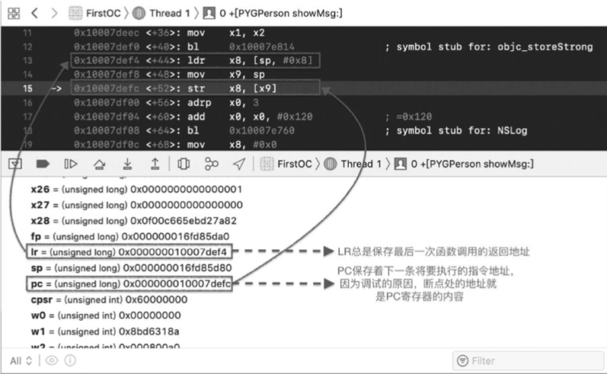
### 1.2. 浮点和向量寄存器
因为浮点数的存储及运算的特殊性，所以 CPU 中专门提供了 浮点数寄存器来处理浮点数。ARM64 有 32 个寄存器，向量和浮点共用：V0 - V31，每个寄存器大小都是 128 位。开发者可以通过 Bn(Byte)、Hn(Half Word)、Sn(Single Word)、Dn(Double Word)、Qn(Quad Word) 来访问不同的位数。
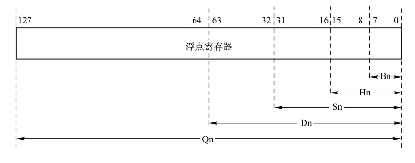
### 1.3. 状态寄存器CPSR
状态寄存器用来保存指令运行结果的一些信息，比如相加的结果是否溢出、是否为 0 以及是否为负数等。CPU 的某些指令会根据运行的结果来设置状态寄存器的标志位，而某些指令则根据这些状态寄存器中的值来进行处理。ARM64 的CPU 提供了一个 32 位的 CPSR（Current Program Status Register）寄存器来作为状态寄存器，低8位(包括 M[0:4]、T、F 和 I )称为控制位。程序无法修改，第 28 ~ 31 位的 V、C、Z 和 N 均为条件代码标志位，他们的内容可以被运算或者逻辑运算的结果改变。并可以决定某条指令是否被执行，意义重大。
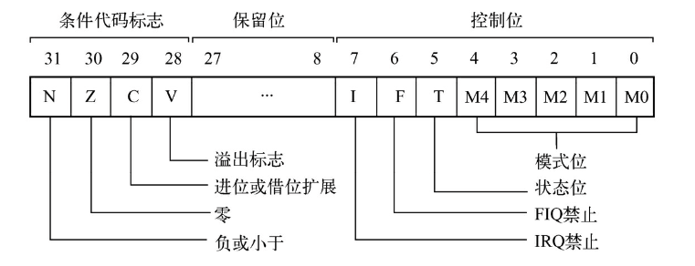
下面介绍 4 个条件代码标志位及其含义：

- N：Negative 标志

CPSR 的第 31位是 N，符号标志位。它记录相关指令执行后，其结果是否为负数。N=1 表示结果为负数，
N=0 表示运行结果为正数或零。
**影响该标志的指令有 add、sub、or 等，它们大多都是运算指令。**
**​**


- Z：Zero 标志。CPSR的第 30 位是 Z标志。它记录相关指令执行后，其结果是否为 0。Z=1 表示运算结果为零; Z=0 表示运算结果为非零。

​


- C: Carry 标志。CPSR的第 29 位是 C，进位标志位。一般情况下,进行无符号数的运算。
   - 加法运算：当运算结果产生了进位时（无符号数溢出），C=1，否则 C=0。
   - 减法运算（包括CMP）：当运算时产生了借位时（无符号数溢出），C=0，否则 C=1。
   - 对于其他的非加/减 运算指令，C 的值同城不改变。

对于位数为 N 的无符号数来说，其对应的二进制信息的最高位，即第 N - 1 位，就是它的最高有效
位，而假想存在的第N位，就是相对于最高有效位的更高位。如下图所示：
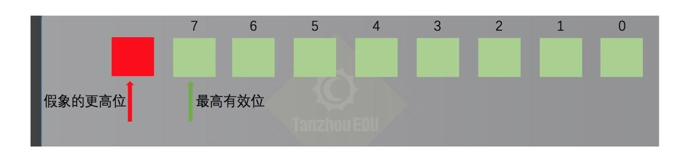​

- V：OVerflow 溢出标志。CPSR的第28位是V，溢出标志位。在进行有符号数运算的时候，如果超过了机器所能标识的范围，称为溢出。运算规则如下：
   - 正数 + 正数 为负数 溢出
   - 负数 + 负数 为正数 溢出
   - 正数 + 负数 不可能溢出
   - 对于其他的非加/减 运算指令，V 的值同城不改变。
#### 1.3.1. 相关概念介绍
##### 1.3.1.1 进位
我们知道，当两个数据相加的时候，有可能产生从最高有效位想更高位的进位。比如两个32位数据：0xaaaaaaaa + 0xaaaaaaaa 将产生进位。由于这个进位值在 32 位中无法保存，我们就只是简单的说这个进位值丢失了。其实 CPU 在运算的时候，并不丢弃这个进位制，而是记录在一个特殊的寄存器的某一位上。ARM 下就用 C 位来记录这个进位值。比如，下面的指令：
```jsx
mov w0,#0xaaaaaaaa；0xa 的二进制是 1010 => 1010 1010 1010 .... 1010 1010

adds w0,w0,w0； 执行后 相当于 1010 << 1 进位1（无符号溢出） 所以C标记 为 1

adds w0,w0,w0； 执行后 相当于 0101 << 1 进位0（无符号没溢出） 所以C标记 为 0

adds w0,w0,w0； 重复上面操作\nadds w0,w0,w0
```
> **注：adds subs 等后面加s代表其运算会影响标记寄存器**

##### 1.3.1.2 借位
当两个数据做减法的时候，有可能向更高位借位。再比如，两个32位数据：0x100000000  - 0x000000ff 将产生借位，借位后，相当于计算 0x100000000 - 0x000000ff。得到 0xffffff01 这个值。由于借了一位，所以C位 用来标记借位。C = 0.比如下面指令：
```jsx
mov w0,#0x0

subs w0,w0,#0xff ;

subs w0,w0,#0xff

subs w0,w0,#0xff
```
#### 1.3.2 真机实践
代码如下：
```jsx
void cpsrFunc(void) {
    int a = 1;
    int b = 2;
    if (a == b) {
        printf("a == b\n");
        return;
    }
    printf("a != b\n");
}
int main(int argc, char * argv[]) {
    cpsrFunc();
    xxx
}
```
正常打印，这里应该会打印 a != b。
下面设置断点并修改 cpsr 寄存器的值：
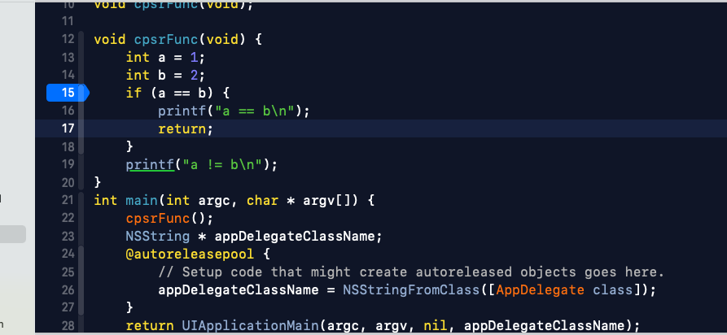
汇编显示图如下：
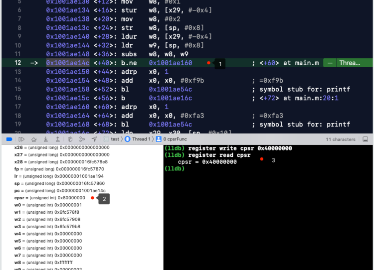
标记点说明：

- 1. 这里在进行 a == b 的判断，这里修改状态寄存器的值，就修改了判断结果。
- 2. 这里是 16 进制，8 对应的 1000，NZCV 四位。
   - N 位 1，表示运行结果为负数，所以正确打印结果是 a != b.
- 3. 这里修改 CPSR 的值，改变其打印结果。


继续运行程序，打印结果如下：
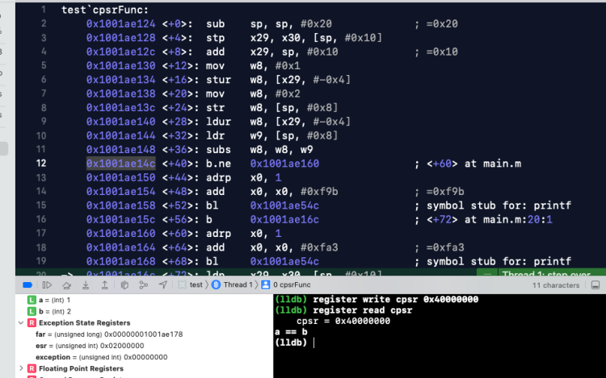
##### 1.3.2.1 N 标志实例
代码如下：
```jsx
void cpsrFunc(void) {
    asm(
        
        "mov w0,#0xffffffff\n"
        
        "adds w0,w0,#0x0\n"
        
        );
}
int main(int argc, char * argv[]) {
    cpsrFunc();
    xxxx
}
```
断点，一步步打印如下：
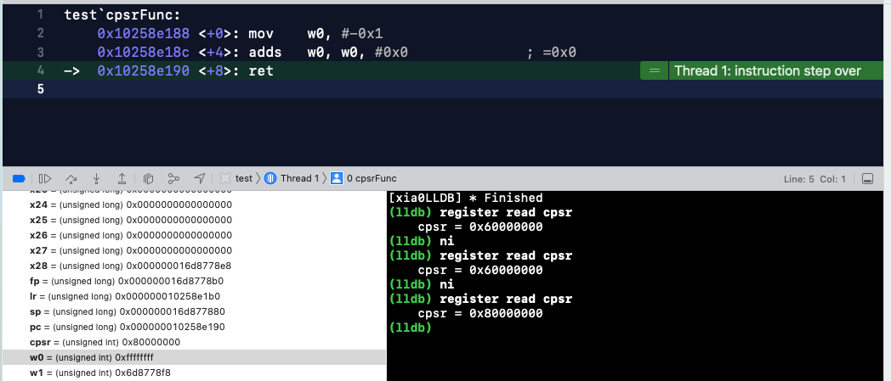
当 w0 与 0 相加后结果为 0xffffffff，按照有符号位来说，0xffffffff 为负数。
CPSR 对应的结果是0x80000000，最高位 8 对应的二进制是 1000，N 位为 1，代表结果为负数。与上面的说法相同。
根据上面，0xffffffff计算符号时结果为负数，那改成0x0fffffff，查看结果是否为正数。修改代码如下：
```jsx
void cpsrFunc(void) {
    asm(
        "mov w0,#0x0fffffff\n"
        "adds w0,w0,#0x0\n"
        );
}
int main(int argc, char * argv[]) {
    cpsrFunc();
    xxxx
}
```
断点，一步步打印如下
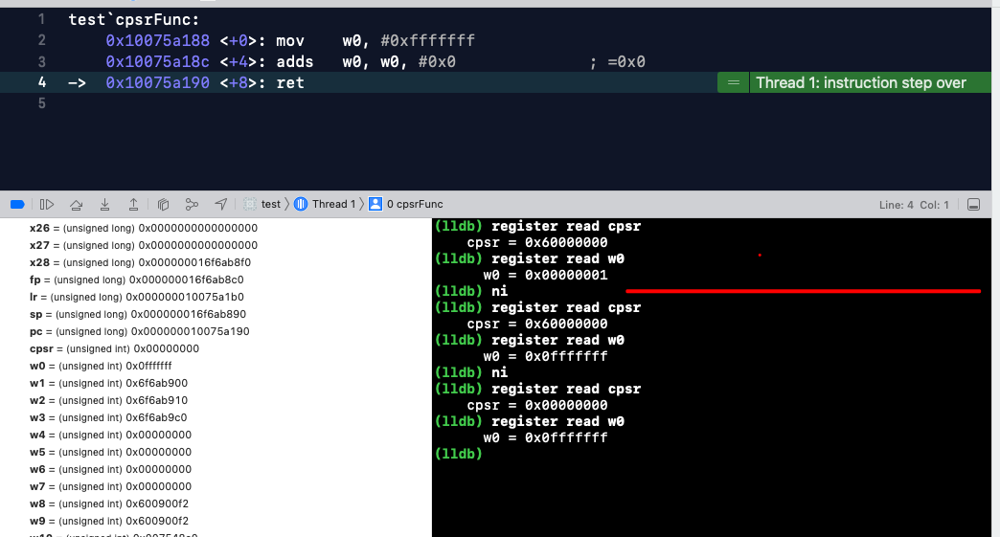
根据打印可以看出，为操作数据时，CPSR 对应的是 0x60000000，NZCV 对应的是 6，二进制 0110。当 w0 与 0 相加后结果为 0x0fffffff，按照有符号位来说，0x0fffffff 为正数。
CPSR 对应的结果是 0x00000000，最高位 0 对应的二进制是 0000，代表结果为正数。与上面的说法相同。
##### 1.3.2.2 Z 标志实例
代码如下：
```jsx
void cpsrFunc(void) {
    asm(
        "mov w0,#0x0\n"
        "adds w0,w0,#0x0\n"
        );
}
int main(int argc, char * argv[]) {
    cpsrFunc();
    xxxx
}
```
断点，一步步打印如下：
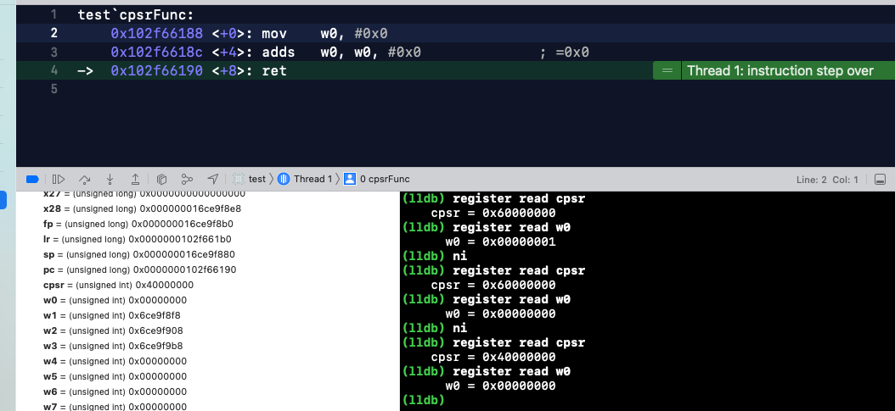
最终结果打印 w0 = 0x000000,  cpsr = 0x40000000，NZCV 对应的是 4，二进制 0100，Z=1 表示运算结果为零。
​

现在将相加值修改为 `#0x1`，打印如下：
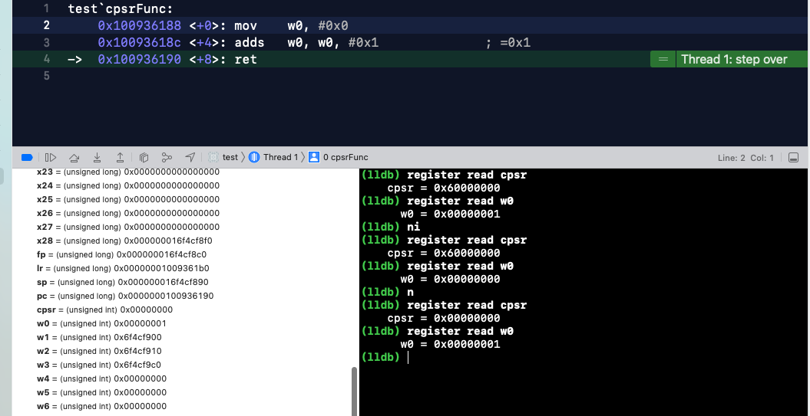
最终结果打印 w0 = 0x000001,  cpsr = 0x00000000，NZCV 对应的是 0，二进制 0000，Z=0 表示运算结果非 0。
##### 1.3.2.3 C 标志实例
代码如下：
```jsx
void cpsrFunc(void) {
    asm(
        "mov w0,#0xaaaaaaaa\n"
        "adds w0,w0,w0\n"
        "adds w0,w0,w0\n"
        "adds w0,w0,w0\n"
        "adds w0,w0,w0\n"
        );
}
int main(int argc, char * argv[]) {
    cpsrFunc();
    xxxx
}
```
断点，一步步打印如下：
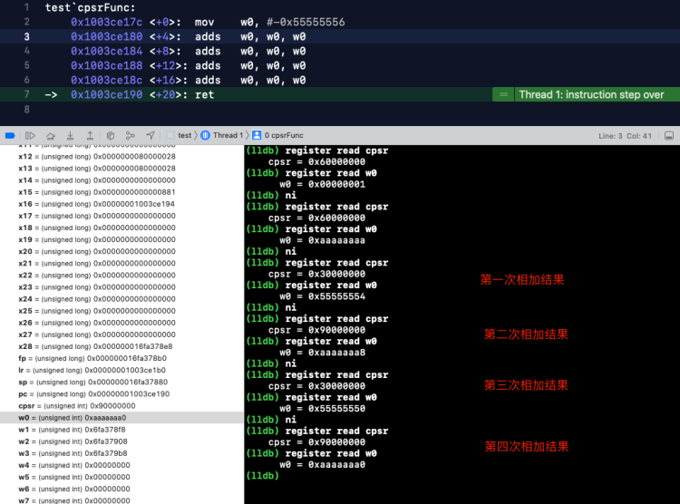
二进制模拟：
```jsx
adds   w0, w0, w0
借位  ----------------  64位 ----------------
0000 1010 1010 1010 ..... 1010 1010 1010 1010 
0000 1010 1010 1010 ..... 1010 1010 1010 1010 
---------------------------------------------
0001 0101 0101 0101 ..... 0101 0101 0101 0100 

adds   w0, w0, w0
借位  ----------------  64位 ----------------
0001 0101 0101 0101 ..... 0101 0101 0101 0100 
0001 0101 0101 0101 ..... 0101 0101 0101 0100 
---------------------------------------------
0000 1010 1010 1010 ..... 1010 1010 1010 1000 

adds   w0, w0, w0
借位  ----------------  64位 ----------------
0000 1010 1010 1010 ..... 1010 1010 1010 1000 
0000 1010 1010 1010 ..... 1010 1010 1010 1000 
---------------------------------------------
0001 0101 0101 0101 ..... 0101 0101 0101 0000 

adds   w0, w0, w0
借位  ----------------  64位 ----------------
0001 0101 0101 0101 ..... 0101 0101 0101 0000 
0001 0101 0101 0101 ..... 0101 0101 0101 0000 
---------------------------------------------
0000 1010 1010 1010 ..... 1010 1010 1010 0000 
```

- 第一次相加结果，CPSR 对应的NZCV 0011，C = 1，相加进位
- 第二次相加结果，CPSR 对应的 NZCV 1001，C = 0，相加没有进位
- 第三次相加结果，CPSR 对应的NZCV 0011，C = 1，相加进位
- 第四次相加结果，CPSR 对应的 NZCV 1001，C = 0，相加没有进位

第四次相加结果 N = 1，表示运算结果是负数。
##### 1.3.2.3 V 标志实例
在进行有符号数运算的时候，如果超过了机器所能标识的范围，称为溢出。运算规则如下

- 正数 + 正数 为负数 溢出
- 负数 + 负数 为正数 溢出
- 正数 + 负数 不可能溢出

代码如下：
```jsx
void cpsrFunc(void) {
    asm(
        "mov w0,#0x7fffffff\n"
        "adds w0,w0,#0x2\n"
        "mov w0,#0x80000000\n"
        "subs w0,w0,#0x2\n"
    );
}
int main(int argc, char * argv[]) {
    cpsrFunc();
    xxxx
}
```
断点，一步步打印如下：
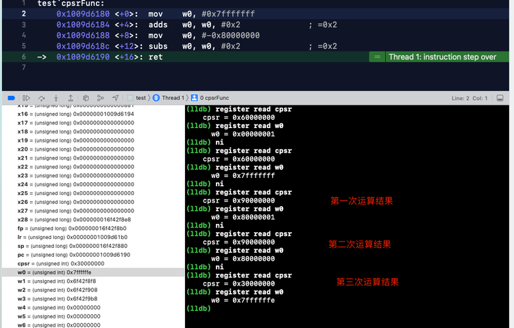

- 第一次运算，CPSR 对应的NZCV 1001，V = 1，符号位溢出。因为首位为符号位，所以相加结果由原来的正数 0，变成负数 1。满足正正得负的条件。
```jsx
第一次运算 w0
adds   w0, w0, #0x2
0000 0111 1111 1111 1111 1111 1111 1111 1111 
0000 0000 0000 0000 0000 0000 0000 0000 0010
--------------------------------------------
0000 1000 0000 0000 0000 0000 0000 0000 0001
```

- 第二次运算，CPSR 对应的NZCV 0011，V = 1，符号位溢出。负数减去一个数相当于两个负数相加，0111 首位为 0 正数。满足负负得正的条件。
```jsx
第一次运算 w0
w0, w0, #0x2 
0000 1000 0000 0000 0000 0000 0000 0000 0000
0000 0000 0000 0000 0000 0000 0000 0000 0010
--------------------------------------------
0000 0111 1111 1111 1111 1111 1111 1111 1110
```