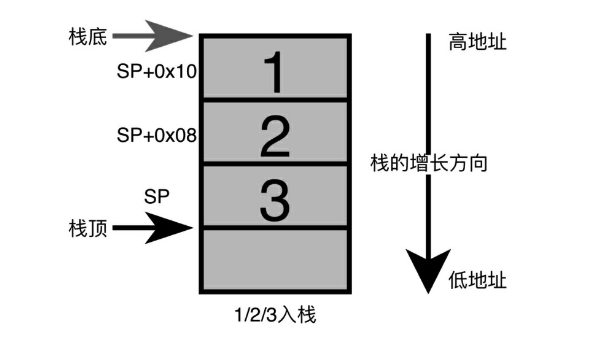

## 3. 栈及传参规则
### 3.1 栈的特性
栈就是指令执行时存放函数参数、局部参数的内存空间。栈的特性是”先进后出“。栈只有一个入口，先进去的就到最底下，后进来的就在最上面，取数据时，就是从入口端取，所以说栈是先进后出、后进先出。iOS 是小端模式，所以栈的增长方向是从高地址到低地址的，栈底是高地址，栈顶是低地址。特性图如下：

### 3.2 传参规则
下面通过编写实例来研究一下函数调用时的参数是如何传递的。
#### 3.2.1 参数小于 8 个时的传参
先创建一个 iOS 工程，添加一个函数并调用，代码如下。
```jsx
int mul (int a, int b) {
    return a * b;
}
int main(int argc, char * argv[]) {
    printf("%d\n",mul(10, 20));
    return 0;
}
```
在调用处添加断线，xcode 设置显示汇编，或者 `xcrun --sdk iphoneos clang -S -arch arm64 main.m 获取 arm64` 汇编代码，断点命中，汇编如下：
```jsx
    0x102bd622c <+0>:  sub    sp, sp, #0x30             ; =0x30  
    开辟 0x30(48个字节) 大小的栈空间。这里 sp - 48，就是把 sp 指针往低地址移动 48 个字
    节，sp 指针指向栈顶。因为这里是一级函数，不在调用其他函数，lr/fp 还没有入栈。
    0x102bd6230 <+4>:  stp    x29, x30, [sp, #0x20]              
    x29 fp 寄存器，x30 lr 寄存器。从 sp 指针指向地址往高地址偏移 32 个字节地址开始
    （改地址暂时记作 lrfp 地址），用 16 个字节保存 fp 和 lr 寄存器。
	- fp 存入 lrfp 地址：从 lrfp 地址到 lrfp+8 地址之间存 fp
	- lr 存入 lrfp 地址 + 8 个字节：从 lrfp+8 地址到 lrfp+16 地址之间存 lr。
    0x102bd6234 <+8>:  add    x29, sp, #0x20            ; =0x20  
    把 fp 寄存器移动到从 sp 指针指向地址往高地址偏移 32 个字节处。也就是上一条标记处的
    lrfp 地址，移动到到区间的
    0x102bd6238 <+12>: mov    w8, #0x0                           
    把 0 存入到寄存器 w8
    0x102bd623c <+16>: str    w8, [sp, #0xc]                     
    把 w8 (立即数 0)存入到 sp + 12 处。SP 指针指向地址往高地址偏移 12 个字节处
    0x102bd6240 <+20>: stur   wzr, [x29, #-0x4]                  
    x29 寄存器指向地址 - 4 个字节为基地址开始的 4 个字节内的数据用 wzr(0 寄存器)内数据填充
    0x102bd6244 <+24>: stur   w0, [x29, #-0x8]                   
    把 w0 写入到 x29 -8 的内存地址处
    0x102bd6248 <+28>: str    x1, [sp, #0x10]                    
    把 x1 存入到 sp + 16 内存地址处。
    0x102bd624c <+32>: mov    w0, #0xa                           
    把 10(立即数) 存入到 w8
    0x102bd6250 <+36>: mov    w1, #0x14                          
    把 20(立即数) 存入到 w1
->  0x102bd6254 <+40>: bl     0x102bd620c               ; mul at main.m:21 
    跳转到0x102bd620c，调用函数 mul，
    0x102bd6258 <+44>: mov    x10, x0                            
    把 0x102bd620c调用函数的返回值存入到 x10
    0x102bd625c <+48>: adrp   x0, 1                              
    获取 1 所在页的基地址存入到 x0
    0x102bd6260 <+52>: add    x0, x0, #0xf9f            ; =0xf9f 
    通过 x0 + 0xf9f 获取新的地址存入到 x0。通过打印可以看出这里获取的地址指向 %d。
    0x102bd6264 <+56>: mov    x9, sp                             
    把 sp 指针存入到 x9.    
    0x102bd6268 <+60>: mov    x8, x10                            
    把 mul 函数的返回值存入到 x8
    0x102bd626c <+64>: str    x8, [x9]                           
    把 x8 存到[x9] 指向的内存，共 printf 调用。
    0x102bd6270 <+68>: bl     0x102bd6580               ; symbol stub for: printf  
    调用 printf
    0x102bd6274 <+72>: ldr    w0, [sp, #0xc]              
    从 sp + 12 处读取 8/4个字节内容存入到 w0，作为当前函数的返回值，其实就是把 0 赋值给 w0。
    0x102bd6278 <+76>: ldp    x29, x30, [sp, #0x20]       
    从 sp + 36 字节处读取数据存入到 fp(x29)、lr(x30)。其实就是还原寄存器 fp 和 lr。
    0x102bd627c <+80>: add    sp, sp, #0x30             ; =0x30  
    把 sp 指针指向 sp + 48 字节处，其实就是释放函数开辟的空间。释放当前栈的空间。
    0x102bd6280 <+84>: ret 


    test`mul:
->  0x10424a20c <+0>:  sub    sp, sp, #0x10             ; =0x10 
    开辟 16 字节的空间。这里是从把 SP 指针往低地址移动 16 个字节，sp 指向栈顶。
    0x10424a210 <+4>:  str    w0, [sp, #0xc]            
    把 w0 写入到 sp + 12 处。其实就是把 10 写入到地址处
    0x10424a214 <+8>:  str    w1, [sp, #0x8]            
    把 w1 写入到 sp + 8 处。其实就是把 20 写入到地址处
    0x10424a218 <+12>: ldr    w8, [sp, #0xc]            
    从 sp + 12 处读取 8/4 个字节内容到 w8 处。其实就是把 10 存入到 w8。
    0x10424a21c <+16>: ldr    w9, [sp, #0x8]            
    从 sp + 8 处读取 8/4 个字节内容到 w9 处。其实就是把 10 存入到 w9。
    0x10424a220 <+20>: mul    w0, w8, w9                
    乘法运算，w0 = w8 * w9.  此时 w0 作为函数的返回值。 w0 = 10 * 20。             
    0x10424a224 <+24>: add    sp, sp, #0x10             ; =0x10 
    把 sp 指针还原到当前函数处理位置，释放当前函数的栈空间。
    0x10424a228 <+28>: ret     返回 w0 的值
```
#### 3.2.2 参数多于 8 个时的传参
代码如下：
```jsx
int func(int a, int b, int c, int d, int e, int f, int g, int h, int i, int j) {
    return a + b + c + d +e + f + g + h +i + j;
}
int main(int argc, char * argv[]) {
//    printf("%d",mul(10, 20));
    int ret = func(1, 2, 3, 4, 5, 6, 7, 8, 9, 10);
    printf("%d",ret);
//    cpsrFunc();
    return 0;
}
```
汇编如下：
```jsx
test`main:
    0x100b8e1f8 <+0>:   sub    sp, sp, #0x30             ; =0x30  
    sp 指针指向sp - 48 字节。申请开辟 48 个字节的占空间
    0x100b8e1fc <+4>:   stp    x29, x30, [sp, #0x20]              
    fp 和 lr 寄存器存到 sp + 36 个字节地址处。fp 存入到区间[sp + 32, sp +  40]。
    0x100b8e200 <+8>:   add    x29, sp, #0x20            ; =0x20 
    把 fp 寄存器 移动到 sp + 32 字节处
    0x100b8e204 <+12>:  mov    w8, #0x0                           
    把 0 赋值给 w8。
    0x100b8e208 <+16>:  str    w8, [sp, #0x8]
    把 w9 存入到 sp + 8 字节处。其实就是把 0 存入到 sp + 8 的栈空间出。
    0x100b8e20c <+20>:  stur   wzr, [x29, #-0x4]
    从 x29 - 4 个字节处开始的 4 个字节栈空间清零
    0x100b8e210 <+24>:  stur   w0, [x29, #-0x8]
    把 w0 写入到 x29 - 8 处
    0x100b8e214 <+28>:  str    x1, [sp, #0x10]
    把 x1 写入到 sp + 16 处
    0x100b8e218 <+32>:  mov    w0, #0x1
    把 1 赋值给 w0
    0x100b8e21c <+36>:  mov    w1, #0x2
    把 2 赋值给 w1
    0x100b8e220 <+40>:  mov    w2, #0x3
    把 3 赋值给 w2
    0x100b8e224 <+44>:  mov    w3, #0x4
    把 4 赋值给 w3
    0x100b8e228 <+48>:  mov    w4, #0x5
    把 5 赋值给 w4
    0x100b8e22c <+52>:  mov    w5, #0x6
    把 6 赋值给 w5
    0x100b8e230 <+56>:  mov    w6, #0x7
    把 7 赋值给 w6
    0x100b8e234 <+60>:  mov    w7, #0x8
    把 8 赋值给 w7
->  0x100b8e238 <+64>:  mov    x9, sp
    把 sp 指向地址赋值给 x9，其实就是 x9 指向 sp 指向
    0x100b8e23c <+68>:  mov    w8, #0x9
    把 9 赋值给 w8
    0x100b8e240 <+72>:  str    w8, [x9]
    把 w8 写入到 [x9] 处。其实就是把 10 的值存储到 [x9] 处。
    0x100b8e244 <+76>:  mov    w8, #0xa
    把 10 赋值给 w8
    0x100b8e248 <+80>:  str    w8, [x9, #0x4]
    把 w8 写入到 [x9, #0x4]处，其实就是把 10 的值存储到 [x9, #0x4] 处。
    0x100b8e24c <+84>:  bl     0x100b8e170               ; func at main.m:31
    调用 func 函数。
    0x100b8e250 <+88>:  str    w0, [sp, #0xc] 
    此时的 x0 是上个函数的返回值，这里是把返回值 w0 存到 sp + 0xc 处
    0x100b8e254 <+92>:  ldr    w9, [sp, #0xc] 
    从 sp + 0xc 处取出数据存入到 w9，其实就是把函数返回值放入到 w9
    0x100b8e258 <+96>:  mov    x8, x9         
    把 x9 的值存入到 x8，其实就是把返回值 55 存入到 x8
    0x100b8e25c <+100>: adrp   x0, 1
    获取 1 所在页的基地址存入到 x0
    0x100b8e260 <+104>: add    x0, x0, #0xf9b            ; =0xf9b 
    通过 x0 + 0xf9f 获取新的地址存入到 x0。通过打印可以看出这里获取的地址指向 %d。
    0x100b8e264 <+108>: mov    x9, sp
    把 sp 指针存入到 x9.    
    0x100b8e268 <+112>: str    x8, [x9]
    把 x8 存到[x9] 指向的内存，共 printf 调用。
    0x100b8e26c <+116>: bl     0x100b8e57c               ; symbol stub for: printf
    调用 prinft
    0x100b8e270 <+120>: ldr    w0, [sp, #0x8]
    从 sp + 0x8 取出数据存入到 w0，其实就是把之前存入的 0 取出来，存入到 w0，作为 main 函数的返回值
    0x100b8e274 <+124>: ldp    x29, x30, [sp, #0x20]
    从 sp + 36 字节处读取数据存入到 fp(x29)、lr(x30)。其实就是还原寄存器 fp 和 lr。
    0x100b8e278 <+128>: add    sp, sp, #0x30             ; =0x30 
    把 sp 指针指向 sp + 48 字节处，其实就是释放函数开辟的空间。释放当前栈的空间。
    0x100b8e27c <+132>: ret 


    test`func:
    0x100b8e170 <+0>:   sub    sp, sp, #0x30             ; =0x30 
    开辟 48 字节的栈空间
    0x100b8e174 <+4>:   ldr    w9, [sp, #0x30]
    从 sp + 48 读取内容存到 w9，其实就是读取 9 存入到 w9
    0x100b8e178 <+8>:   ldr    w8, [sp, #0x34]
    从 sp + 52 读取内容存到 w 8 ，其实就是读取 10 存入到 w9
    0x100b8e17c <+12>:  str    w0, [sp, #0x2c]
    把 w0 存入到 sp + 0x2c 处。其实就是把 1 存入到 sp + 0x2c 
    0x100b8e180 <+16>:  str    w1, [sp, #0x28]
    把 w1 存入到 sp + 0x2c 处。其实就是把 2 存入到 sp + 0x28 
    0x100b8e184 <+20>:  str    w2, [sp, #0x24]
    把 w2 存入到 sp + 0x2c 处。其实就是把 3 存入到 sp + 0x24
    0x100b8e188 <+24>:  str    w3, [sp, #0x20]
    把 w3 存入到 sp + 0x2c 处。其实就是把 4 存入到 sp + 0x20 
    0x100b8e18c <+28>:  str    w4, [sp, #0x1c]
    把 w4 存入到 sp + 0x2c 处。其实就是把 5 存入到 sp + 0x1c 
    0x100b8e190 <+32>:  str    w5, [sp, #0x18]
    把 w5 存入到 sp + 0x2c 处。其实就是把 6 存入到 sp + 0x18 
    0x100b8e194 <+36>:  str    w6, [sp, #0x14]
    把 w6 存入到 sp + 0x2c 处。其实就是把 7 存入到 sp + 0x14 
    0x100b8e198 <+40>:  str    w7, [sp, #0x10]
    把 w7 存入到 sp + 0x2c 处。其实就是把 8 存入到 sp + 0x10
    0x100b8e19c <+44>:  str    w9, [sp, #0xc]
    把 w9 存入到 sp + 0xc 处。其实就是把 9 存入到 sp + 0xc
    0x100b8e1a0 <+48>:  str    w8, [sp, #0x8]
    把 w8 存入到 sp + 0x8 处。其实就是把 10 存入到 sp + 0x8
->  0x100b8e1a4 <+52>:  ldr    w8, [sp, #0x2c]
    从 sp + 0x2c 处读取内容存入到 w8，其实就是把 1 存入 w8
    0x100b8e1a8 <+56>:  ldr    w9, [sp, #0x28]
    从 sp + 0x28 处读取内容存入到 w9，其实就是把 2 存入 w9
    0x100b8e1ac <+60>:  add    w8, w8, w9
    w8 = w 9 + w8，w8 = 1 + 2
    0x100b8e1b0 <+64>:  ldr    w9, [sp, #0x24]
    从 sp + 0x24 处读取内容存入到 w9，其实就是把 3 存入 w9
    0x100b8e1b4 <+68>:  add    w8, w8, w9
    w8 = w 9 + w8，w8 = 3 + 3
    0x100b8e1b8 <+72>:  ldr    w9, [sp, #0x20]
    从 sp + 0x20 处读取内容存入到 w9，其实就是把 4 存入 w9
    0x100b8e1bc <+76>:  add    w8, w8, w9
    w8 = w 9 + w8，w8 = 6 + 4
    0x100b8e1c0 <+80>:  ldr    w9, [sp, #0x1c]
    sp + 0x1c 处读取内容存入到 w9，其实就是把 5 存入 w9
    0x100b8e1c4 <+84>:  add    w8, w8, w9
    w8 = w 9 + w8，w8 = 10 + 5
    0x100b8e1c8 <+88>:  ldr    w9, [sp, #0x18]
    sp + 0x1c 处读取内容存入到 w9，其实就是把 6 存入 w9
    0x100b8e1cc <+92>:  add    w8, w8, w9
    w8 = w 9 + w8，w8 = 15 + 6
    0x100b8e1d0 <+96>:  ldr    w9, [sp, #0x14]
    sp + 0x1c 处读取内容存入到 w9，其实就是把 7 存入 w9
    0x100b8e1d4 <+100>: add    w8, w8, w9
    w8 = w 9 + w8，w8 = 21 + 7
    0x100b8e1d8 <+104>: ldr    w9, [sp, #0x10]
    sp + 0x1c 处读取内容存入到 w9，其实就是把 8 存入 w9
    0x100b8e1dc <+108>: add    w8, w8, w9
    w8 = w 9 + w8，w8 = 28 + 8
    0x100b8e1e0 <+112>: ldr    w9, [sp, #0xc]
    sp + 0x1c 处读取内容存入到 w9，其实就是把 9 存入 w9
    0x100b8e1e4 <+116>: add    w8, w8, w9
    w8 = w 9 + w8，w8 = 36 + 9
    0x100b8e1e8 <+120>: ldr    w9, [sp, #0x8]
    sp + 0x1c 处读取内容存入到 w9，其实就是把 10 存入 w9
    0x100b8e1ec <+124>: add    w0, w8, w9
     w0 = w 9 + w0 = 45 + 10,此时 w0 作为函数返回值
    0x100b8e1f0 <+128>: add    sp, sp, #0x30             ; =0x30 
    把 sp 指针还原到当前函数处理位置，释放当前函数的栈空间。
    0x100b8e1f4 <+132>: ret    
```
### 3.3 额外说明
在代码中，一开始做了保存现场的操作。首先说为什么保存 fp 寄存器的值。因为 fp 寄存器可能正被之前一个函数用着，如果不保存，对调用本函数的函数  其调用栈就乱了，因为要知道 sp 与 fp 之间的空间就是函数的栈空间，所以必须保存来保证栈的正确性。
其次，为什么需要保存 lr 寄存器的值，因为 lr 寄存器保存着函数返回地址，有了它，函数才能知道结束后应该跳转到哪里，假设不保存会有说明后果，当执行 bl xxx 这条指令的时候，bl 指令会将 bl 下一条指令的地址保存到 lr 寄存器中，所以在这个例子里，bl 执行后会来到 lr 保存的地址继续执行，如果没有做恢复操作，在执行 ret 指令后，会有来到 xxx 这个位置一直死循环。所以只有之前保存过 lr 寄存器的值，然后再后面恢复数据给 lr 寄存器，ret 指令才能正确跳转。
### 3.4 子函数概念

- 叶子函数：函数内部不在调用其他函数的函数。
- 非叶子函数：函数内部还在调用其他函数的函数