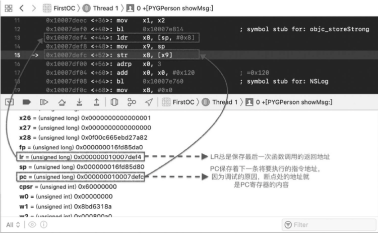
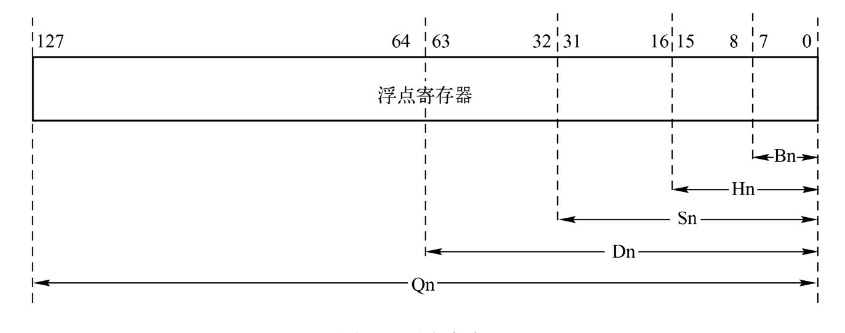
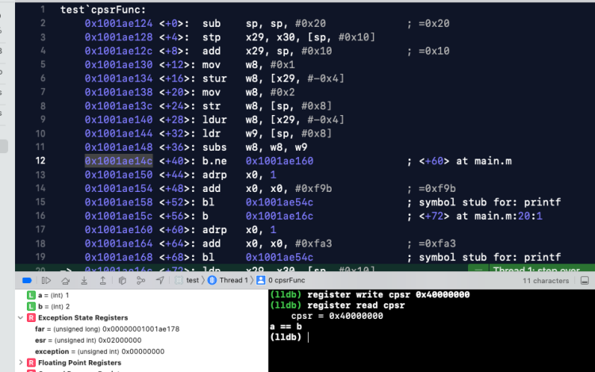
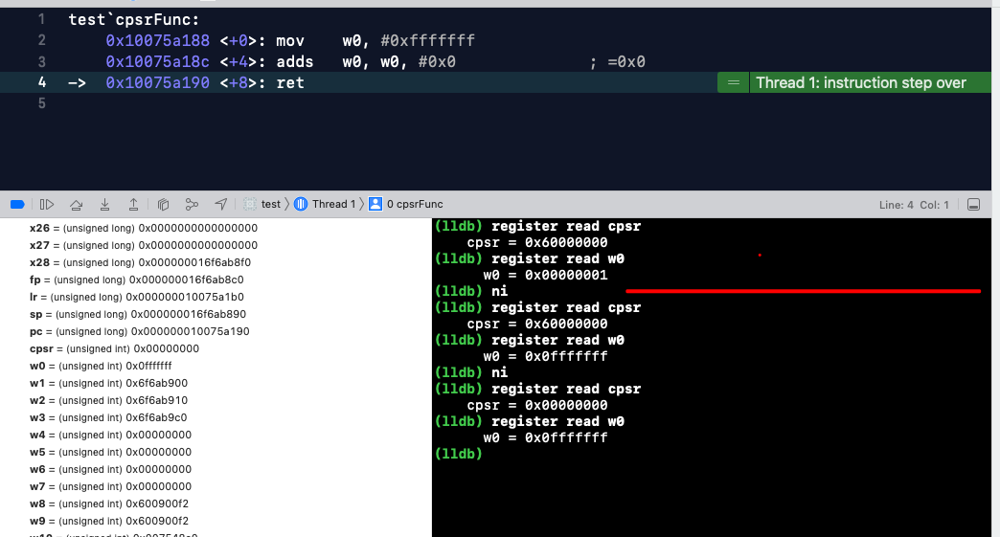
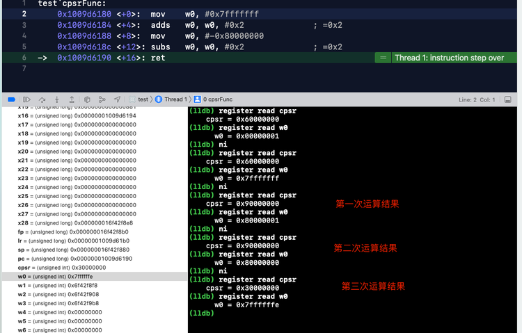

寄存器、常用指令、栈
## 1、寄存器
### 1.1 通用寄存器
ARM64有 31 个通用寄存器，每个寄存器存取一个 64 位的数据。当使用 X0 - X30 时，它就是一个 64 位的数。当使用 W0 - W30 时，实际上访问的是这些寄存器的低 32 位，写入时会将高 32 位清零。在指令编码中，0b11111（31）用来表示 ZR（零寄存器），64 位 XZR，32 位 WZR。
除 X0 - X30 寄存器外，还有一个 SP 寄存器。下面介绍一些出现频率高的寄存器：

- X0 - X7：用来传递函数的参数，如果有更多的参数则使用栈来传递；X0 也用来存函数的返回值。
- SP （Stack Pointer）：栈指针寄存器。指向栈的顶部，可以通过 WSP 寄存器访问栈指针的最低有效 32 位。其实就是 x31。
- FP（Frame Pointer）：即 X29，帧指针寄存器。指向栈的底部。
- LR（Link Register）：即 X30，链接寄存器。存储着函数调用完成时的返回地址，用来做函数调用栈跟踪，程序在崩溃时能够将函数调用栈打印出来就是借助 LR 寄存器来实现的，如下图：
- PC（Program Counter）程序计数器 ：保存的是将要执行的下一条指令的内存地址。通常在调试状态下看到的 PC 值都是当前断点处的地址，所以很多人认为 PC 值就是当前正在执行的指令的内存地址，其实是错误的。可以在 Xcode 中对任意一个地址设置断点，然后观察一下，如下图：


### 1.2. 浮点和向量寄存器
因为浮点数的存储及运算的特殊性，所以 CPU 中专门提供了 浮点数寄存器来处理浮点数。ARM64 有 32 个寄存器，向量和浮点共用：V0 - V31，每个寄存器大小都是 128 位。开发者可以通过 Bn(Byte)、Hn(Half Word)、Sn(Single Word)、Dn(Double Word)、Qn(Quad Word) 来访问不同的位数。

### 1.3. 状态寄存器CPSR
状态寄存器用来保存指令运行结果的一些信息，比如相加的结果是否溢出、是否为 0 以及是否为负数等。CPU 的某些指令会根据运行的结果来设置状态寄存器的标志位，而某些指令则根据这些状态寄存器中的值来进行处理。ARM64 的CPU 提供了一个 32 位的 CPSR（Current Program Status Register）寄存器来作为状态寄存器，低8位(包括 M[0:4]、T、F 和 I )称为控制位。程序无法修改，第 28 ~ 31 位的 V、C、Z 和 N 均为条件代码标志位，他们的内容可以被运算或者逻辑运算的结果改变。并可以决定某条指令是否被执行，意义重大。

下面介绍 4 个条件代码标志位及其含义：

- N：Negative 标志

CPSR 的第 31位是 N，符号标志位。它记录相关指令执行后，其结果是否为负数。N=1 表示结果为负数，
N=0 表示运行结果为正数或零。
**影响该标志的指令有 add、sub、or 等，它们大多都是运算指令。**
**​**


- Z：Zero 标志。CPSR的第 30 位是 Z标志。它记录相关指令执行后，其结果是否为 0。Z=1 表示运算结果为零; Z=0 表示运算结果为非零。

​


- C: Carry 标志。CPSR的第 29 位是 C，进位标志位。一般情况下,进行无符号数的运算。
   - 加法运算：当运算结果产生了进位时（无符号数溢出），C=1，否则 C=0。
   - 减法运算（包括CMP）：当运算时产生了借位时（无符号数溢出），C=0，否则 C=1。
   - 对于其他的非加/减 运算指令，C 的值同城不改变。

对于位数为 N 的无符号数来说，其对应的二进制信息的最高位，即第 N - 1 位，就是它的最高有效
位，而假想存在的第N位，就是相对于最高有效位的更高位。如下图所示：
​

- V：OVerflow 溢出标志。CPSR的第28位是V，溢出标志位。在进行有符号数运算的时候，如果超过了机器所能标识的范围，称为溢出。运算规则如下：
   - 正数 + 正数 为负数 溢出
   - 负数 + 负数 为正数 溢出
   - 正数 + 负数 不可能溢出
   - 对于其他的非加/减 运算指令，V 的值同城不改变。
#### 1.3.1. 相关概念介绍
##### 1.3.1.1 进位
我们知道，当两个数据相加的时候，有可能产生从最高有效位想更高位的进位。比如两个32位数据：0xaaaaaaaa + 0xaaaaaaaa 将产生进位。由于这个进位值在 32 位中无法保存，我们就只是简单的说这个进位值丢失了。其实 CPU 在运算的时候，并不丢弃这个进位制，而是记录在一个特殊的寄存器的某一位上。ARM 下就用 C 位来记录这个进位值。比如，下面的指令：
```jsx
mov w0,#0xaaaaaaaa；0xa 的二进制是 1010 => 1010 1010 1010 .... 1010 1010

adds w0,w0,w0； 执行后 相当于 1010 << 1 进位1（无符号溢出） 所以C标记 为 1

adds w0,w0,w0； 执行后 相当于 0101 << 1 进位0（无符号没溢出） 所以C标记 为 0

adds w0,w0,w0； 重复上面操作\nadds w0,w0,w0
```
> **注：adds subs 等后面加s代表其运算会影响标记寄存器**

##### 1.3.1.2 借位
当两个数据做减法的时候，有可能向更高位借位。再比如，两个32位数据：0x100000000  - 0x000000ff 将产生借位，借位后，相当于计算 0x100000000 - 0x000000ff。得到 0xffffff01 这个值。由于借了一位，所以C位 用来标记借位。C = 0.比如下面指令：
```jsx
mov w0,#0x0

subs w0,w0,#0xff ;

subs w0,w0,#0xff

subs w0,w0,#0xff
```
#### 1.3.2 真机实践
代码如下：
```jsx
void cpsrFunc(void) {
    int a = 1;
    int b = 2;
    if (a == b) {
        printf("a == b\n");
        return;
    }
    printf("a != b\n");
}
int main(int argc, char * argv[]) {
    cpsrFunc();
    xxx
}
```
正常打印，这里应该会打印 a != b。
下面设置断点并修改 cpsr 寄存器的值：

汇编显示图如下：

标记点说明：

- 1. 这里在进行 a == b 的判断，这里修改状态寄存器的值，就修改了判断结果。
- 2. 这里是 16 进制，8 对应的 1000，NZCV 四位。
   - N 位 1，表示运行结果为负数，所以正确打印结果是 a != b.
- 3. 这里修改 CPSR 的值，改变其打印结果。


继续运行程序，打印结果如下：

##### 1.3.2.1 N 标志实例
代码如下：
```jsx
void cpsrFunc(void) {
    asm(
        
        "mov w0,#0xffffffff\n"
        
        "adds w0,w0,#0x0\n"
        
        );
}
int main(int argc, char * argv[]) {
    cpsrFunc();
    xxxx
}
```
断点，一步步打印如下：

当 w0 与 0 相加后结果为 0xffffffff，按照有符号位来说，0xffffffff 为负数。
CPSR 对应的结果是0x80000000，最高位 8 对应的二进制是 1000，N 位为 1，代表结果为负数。与上面的说法相同。
根据上面，0xffffffff计算符号时结果为负数，那改成0x0fffffff，查看结果是否为正数。修改代码如下：
```jsx
void cpsrFunc(void) {
    asm(
        "mov w0,#0x0fffffff\n"
        "adds w0,w0,#0x0\n"
        );
}
int main(int argc, char * argv[]) {
    cpsrFunc();
    xxxx
}
```
断点，一步步打印如下

根据打印可以看出，为操作数据时，CPSR 对应的是 0x60000000，NZCV 对应的是 6，二进制 0110。当 w0 与 0 相加后结果为 0x0fffffff，按照有符号位来说，0x0fffffff 为正数。
CPSR 对应的结果是 0x00000000，最高位 0 对应的二进制是 0000，代表结果为正数。与上面的说法相同。
##### 1.3.2.2 Z 标志实例
代码如下：
```jsx
void cpsrFunc(void) {
    asm(
        "mov w0,#0x0\n"
        "adds w0,w0,#0x0\n"
        );
}
int main(int argc, char * argv[]) {
    cpsrFunc();
    xxxx
}
```
断点，一步步打印如下：

最终结果打印 w0 = 0x000000,  cpsr = 0x40000000，NZCV 对应的是 4，二进制 0100，Z=1 表示运算结果为零。
​

现在将相加值修改为 `#0x1`，打印如下：

最终结果打印 w0 = 0x000001,  cpsr = 0x00000000，NZCV 对应的是 0，二进制 0000，Z=0 表示运算结果非 0。
##### 1.3.2.3 C 标志实例
代码如下：
```jsx
void cpsrFunc(void) {
    asm(
        "mov w0,#0xaaaaaaaa\n"
        "adds w0,w0,w0\n"
        "adds w0,w0,w0\n"
        "adds w0,w0,w0\n"
        "adds w0,w0,w0\n"
        );
}
int main(int argc, char * argv[]) {
    cpsrFunc();
    xxxx
}
```
断点，一步步打印如下：

二进制模拟：
```jsx
adds   w0, w0, w0
借位  ----------------  64位 ----------------
0000 1010 1010 1010 ..... 1010 1010 1010 1010 
0000 1010 1010 1010 ..... 1010 1010 1010 1010 
---------------------------------------------
0001 0101 0101 0101 ..... 0101 0101 0101 0100 

adds   w0, w0, w0
借位  ----------------  64位 ----------------
0001 0101 0101 0101 ..... 0101 0101 0101 0100 
0001 0101 0101 0101 ..... 0101 0101 0101 0100 
---------------------------------------------
0000 1010 1010 1010 ..... 1010 1010 1010 1000 

adds   w0, w0, w0
借位  ----------------  64位 ----------------
0000 1010 1010 1010 ..... 1010 1010 1010 1000 
0000 1010 1010 1010 ..... 1010 1010 1010 1000 
---------------------------------------------
0001 0101 0101 0101 ..... 0101 0101 0101 0000 

adds   w0, w0, w0
借位  ----------------  64位 ----------------
0001 0101 0101 0101 ..... 0101 0101 0101 0000 
0001 0101 0101 0101 ..... 0101 0101 0101 0000 
---------------------------------------------
0000 1010 1010 1010 ..... 1010 1010 1010 0000 
```

- 第一次相加结果，CPSR 对应的NZCV 0011，C = 1，相加进位
- 第二次相加结果，CPSR 对应的 NZCV 1001，C = 0，相加没有进位
- 第三次相加结果，CPSR 对应的NZCV 0011，C = 1，相加进位
- 第四次相加结果，CPSR 对应的 NZCV 1001，C = 0，相加没有进位

第四次相加结果 N = 1，表示运算结果是负数。
##### 1.3.2.3 V 标志实例
在进行有符号数运算的时候，如果超过了机器所能标识的范围，称为溢出。运算规则如下

- 正数 + 正数 为负数 溢出
- 负数 + 负数 为正数 溢出
- 正数 + 负数 不可能溢出

代码如下：
```jsx
void cpsrFunc(void) {
    asm(
        "mov w0,#0x7fffffff\n"
        "adds w0,w0,#0x2\n"
        "mov w0,#0x80000000\n"
        "subs w0,w0,#0x2\n"
    );
}
int main(int argc, char * argv[]) {
    cpsrFunc();
    xxxx
}
```
断点，一步步打印如下：


- 第一次运算，CPSR 对应的NZCV 1001，V = 1，符号位溢出。因为首位为符号位，所以相加结果由原来的正数 0，变成负数 1。满足正正得负的条件。
```jsx
第一次运算 w0
adds   w0, w0, #0x2
0000 0111 1111 1111 1111 1111 1111 1111 1111 
0000 0000 0000 0000 0000 0000 0000 0000 0010
--------------------------------------------
0000 1000 0000 0000 0000 0000 0000 0000 0001
```

- 第二次运算，CPSR 对应的NZCV 0011，V = 1，符号位溢出。负数减去一个数相当于两个负数相加，0111 首位为 0 正数。满足负负得正的条件。
```jsx
第一次运算 w0
w0, w0, #0x2 
0000 1000 0000 0000 0000 0000 0000 0000 0000
0000 0000 0000 0000 0000 0000 0000 0000 0010
--------------------------------------------
0000 0111 1111 1111 1111 1111 1111 1111 1110
```
## 2、指令集
指令的基本格式如下：
```<opcode>{<cond>}{S}  <Rd>, <Rn> {, <shift_op2>}```
其中，尖括号是必须的，花括号可选。

| 标识符 | 含义 |
| --- | --- |
| opcode | 操作码。也就是指令编码助记符，说明指令需要执行的操作类型。 |
| cond | 条件码域。指令允许执行的条件编码 |
| S | 条件码设置域。这是一个可选项，当在指令中设置该域时，指令执行的结果将会印象程序状态寄存器 CPSR 中相应的标志 |
| Rd/Xt | 目标寄存器。ARM64 指令可以选择 X0 - X30 或 W0 - W30 |
| Rn/Xn | 第一个操作数的寄存器，和 Rd 一样，不同指令有不同要求 |
| shift_op2 | 第二个操作数，可以是立即数或寄存器位移方式 |

### 2.1 常用算术指令
| 指令 | 示例 | 含义 |
| --- | --- | --- |
| ADD | ADD X0, X1, X2 | X0 = X1 + X2 |
| SUB | SUB X0, X1, X2 | X0 = X1 - X2 |
| MUL | MUL X0, X0, X8 | X0 = X0 * X8 |
| SDIV | SDIV X0, X0, X1 | X0 = X0 / X1（有符号除法运算） |
| UDIV | SDIV X0, X0, X1 | X0 = X0 / X1（无符号除法运算） |
| CMP | CMP X28, X0 | X28与 X0 相减，不存储结果，只更新 CPSR 中的条件标志位 |
| CMN | CMP X28, X0 | X28与 X0 相加，根据结果更新， CPSR 中的条件标志位 |
| ADDS/SUBS | ADDS X0, X1, X2 | 带 S 的指令运算结果会影响 CPSR 中的条件标志位，后面出现
的其他指令也同理。 |

### 2.2 常用跳转指令
#### 2.2.1 条件跳转指令
| 指令 | 示例 | 含义 |
| --- | --- | --- |
| B.cond | B.cond label | 若 cond 为真，则跳转到 label |
| CBNZ | CBNZ Xn，label | 若 Xn != 0，则跳转到 label |
| CBZ | CBZ Xn，label | 若 Xn == 0，则跳转到 label |
| TBNZ | TBNZ Xn, #uimm6, label | 若 Xn[unimm6] != 0，则跳转到 label。
简单的说如果xn寄存器的第uimm6位不等于0，则跳转到label |
| TBZ | TBZ Xn, #uimm6, label | 若 Xn[unimm6] == 0，则跳转到 label。
简单的说如果xn寄存器的第uimm6位等于0，则跳转到label |

#### 2.2.2 无条件跳转指令
| 指令 | 示例 | 含义 |
| --- | --- | --- |
| B | B  label | 无条件跳转到 label |
| BL | BL  label | 无条件跳转到 label，返回地址保存到 X30（LR）寄存器 |
| BLR | BLR  Xn | 无条件跳转到 Xn 寄存器的地址，返回地址保存到 X30（LR）寄存器 |
| BR | BR  Xn | 无条件跳转到 Xn 寄存器的地址 |
| RET | RET  {Xn} | 子程序返回指令，返回地址默认保存到 X30（LR）寄存器
将 LR（X30）寄存器的值复制给 PC 寄存器 |

#### 2.2.3 常用逻辑指令
| 指令 | 示例 | 含义 |
| --- | --- | --- |
| AND | ADD X0, X1, X2 | X0 = X1 & X2 |
| EOR | EOR X0, X1, X2 | X0 = X1 ^ X2 |
| ORR | ORR X0, X1, X2 | X0 = X1 | X2 |
| TST | TST W0, #0X40 | 测试 W0[3]是否为 1 |

#### 2.2.4 常用数据传输指令
| 指令 | 示例 | 含义 |
| --- | --- | --- |
| MOV | MOV X19, X1 | X19 = X1 |
| MOVZ | MOVZ Xn, #uimm16{, LSL#pos} | Xn = LSL(uimm16, pos) |
| MOVN | MOVN Xn, #uimm16{, LSL#pos} | Xn = NOT(LSL(uimm16, pos)) |
| MOVK | MOVK Xn, #uimm16{, LSL#pos} | Xn < pos+15:pos>= uimm16 |

#### 2.2.5 常用地址偏移指令
| 指令 | 示例 | 含义 |
| --- | --- | --- |
| ADR | ADR Xn， label | Xn = PC + label |
| ADRP | ADRP Xn,   label | base = PC[11:0]=ZERO(12); Xd = base + label; |

#### 2.2.6 常用移位运算指令
| 指令 | 示例 | 含义 |
| --- | --- | --- |
| ASR | ASR Xd， Xn， #uimm | 算术右移，结果带符号 |
| LSL | LSL Xd， Xn， #uimm | 逻辑左移，移位后寄存器空出的低位补 0 |
| LSR | LSR Xd， Xn， #uimm | 逻辑右移，移位后寄存器空出的低位补 0 |
| ROR | ROR Xd， Xn， #uimm | 循环右移，从右端移除的位将被插入左端空出的位，可理解为”首位相连“ |

#### 2.2.7 常用加载/存储指令 
| 指令 | 示例 | 含义 |
| --- | --- | --- |
| LDR | LDR Xn/Wn, addr | 从内存地址 addre 读取 8/4个字节内容到 Xn/Wn中 |
| STR | STR Xn/Wn, addr | 将 Xn/Wn 写入内存地址 addr中 |
| LDUR | LDUR Xn/Wn, [basem #simm9] | 从 base + #simm9 地址中读取数据到 Xn/Wn 中，U 表示不需要按照字节对齐，取多少就是多少 |
|  |  |  |
| STUR | STUR Xn/Wn, [basem #simm9] | 将 Xn/Wn 写入 base + #simm9 的内存地址 |
| STP | STP Xn1，Xn2，addr | 将 Xn1 和 Xn2 写入内存地址 addr 中。P 表示一对，即同事操作两个寄存器。 |
| LDP | LDP Xn1，Xn2，addr | 从内存地址 addr 中读取数据到 Xn1 和 Xn2 中。 |

加载/存储指令都是成对出现，有时也会遇到这些指令的一些扩展，比如 LDRB、LDRSB 等，他们的含义如下

| 指令 | 含义 |
| --- | --- |
| B | 无符号 8 bit |
| SB | 有符号 8 bit |
| H | 无符号 16 bit |
| SH | 有符号 16 bit |
| W | 无符号 32 bit |
| SW | 有符号 32 bit |

ARM指令的一个重要特点就是可以条件执行，每条 ARM 指令的条件码域包含 4 位条件吗，共 16 种。几乎所有的指令均根据 CPSR 中的条件码的状态和指令条件码域的设置有条件的执行。当指令执行条件满足时，指令被执行，否则被忽略。指令条件码机器助记符后缀如下。

| 条件码 | 助记符后缀 | 标志 | 含义 |
| --- | --- | --- | --- |
| 0000 | EQ | Z 置位 | 相等 |
| 0001 | NE | z 置位 | 不相等 |
| 0010 | CS | C 置位 | 无符号数大于或者等于 |
| 0011 | CC | C 置位 | 无符号小于 |
| 0100 | MI | N 置位 | 负数 |
| 0101 | PL | N 清零 | 证书或零 |
| 0110 | VS | V 置位 | 溢出 |
| 0111 | VC | V 清零 | 未溢出 |
| 1000 | HI | C 置位、Z 清零 | 无符号大于 |
| 1001 | LS | C 清零、Z 置位 | 无符号小于或等于 |
| 1010 | GE | N 等于 V | 带符号大于或等于 |
| 1011 | LT | N 不等于 V | 带符号小于 |
| 1100 | GT | Z 清零且 N == V | 带符号大于 |
| 1101 | LE | Z 置位或 N != V | 带符号小于或等于 |
| 1110 | AL | 忽略 | 无条件执行 |

### 2.3 ADR、ADRP常用地址偏移指令额外说明
**ADRP + ADD表示取值，常用于取常量和全局变量的值，但是这里取的是地址值。**
**ADRP + ADD表示取值，常用于取常量和全局变量的值，但是这里取的是地址值。**
#### 2.3.1 ADR
小范围的地址读取指令。ADR 指令将基于 PC 的相对偏移的地址读取到寄存器中。
格式：adr Xn , exper.
编译源程序时，汇编器首先计算当前 PC 值(当前指令位置)到 exper的距离，然后用一条 ADD 或者 SUB 指令替换这条伪指令。
例如：
ADD Xn， PC, #offset_to_exper。
注意：标号 exper 与指令必须在同一个代码段中。
比如：adr x0，_start；将指定地址赋值到 x0 中。
......
_start:
b _start
x0 的值为标号_start 与此指令的距离差+PC 值
简单的来说就是**将一个立即值 与 PC 值相加，并将结果写入到目标寄存器。**
​

#### 2.3.2 ADRP
这是一条中等范围的地址读取伪指令，它将基于 PC 的相对偏移的地址值读取到目标寄存器中。
格式如下：ADRP Xn, exper
编译源程序时，汇编器会用两条合适的指令替换这条伪指令。比如：
ADRP Xn，PC，offset1
ADD Xn，Xn1，offset2
​

与 ADR 相比，它能读取更大返回的地址。注意标号 exper 与指令必须在同一代码段。
adrp 用来定位数据段中的数据使用，因为 aslr 会导致代码及数据的地址随机化，用 adrp来根据 pc 值做辅助定位。
ADRP 指令是以页为单位的大范围的地址读取指令，P为page, pageoff为page offset，这里填写的地址是最终地址的页基址，汇编会自动把opcode转换成相对于pc页基址的地址。
符号扩展一个21位的offset（immhi+immlo）。向左移动12位，将PC的值的低12位清零，然后把这两者相加，结果写入到Xd寄存器，用来得到一块含有label的4KB对齐内存区域的base地址（也就是说label所在的地址，一定落在这个4KB的内存区域里，指令助记符里Page也就是这个意思）， 可用来寻址 +/- 4GB的范围（2^33次幂）。
#### 2.3.3 计算规则
```jsx
adrp   x10, x                    
x10, x10, #0x230  

```

- 将 x 的值，左移 12 位
   - 例如 x = 1，x << 12 = 1 0000 0000 0000 == 0x0001000
- 获取当前 PC 计数器的值，将其低 12 位清零
   - 例如 pc = 0x000000010018e154，低 12 位清零后 值为0x000000010018e000
- 将 x 左移后的值 + PC 计数器低 12 位清零的值 等于 x10 的值。
   - x10 = 0x0001000 + 0x000000010018e000
   - x10 = 0x000000010018f000
#### 2.3.4 示例
```jsx
int counter = 1;
int getCount() {
    return counter;
}
```
汇编的完整结果如下：
```jsx
	.section	__TEXT,__text,regular,pure_instructions
	.globl	_getCount               ; -- Begin function getCount
	.p2align	2
_getCount:                              ; @getCount
	adrp	x8, _counter@PAGE
	add	x8, x8, _counter@PAGEOFF
	ldr	w0, [x8]
	ret
                                        ; -- End function
	.section	__DATA,__data
	.globl	_counter                ; @counter
	.p2align	2
_counter:
	.long	1                       ; 0x1
```

- adrp	x8, _counter@PAGE：使用 adrp 计算出_counter label 基于 PC 的偏移量的高 21 位，并存储到 x8 寄存器中。@PAGE 代表页偏移的高 21 位。
- add	x8, x8, _counter@PAGEOFF：使用 add 命令将余下的 12 位补齐，通过@PAGEOFF 代表页偏低的 12 位。
- ldr	w0, [x8] ：此时 x8 中即为 counter 变量的实际地址了，通过 ldr 命令将寄存器的值读取到 w0，返回番薯返回值。


示例 2：
```jsx
ADRP            X8, #_g@PAGE
ADD             X8, X8, #_g@PAGEOFF
```

- 得到一个大小为4KB的页的基址，而且在该页中有全局变量g的地址；ADRP就是讲该页的基址存到寄存器X8中；
- ADD指令会算出g的地址，X8+#_g@PAGEOFF，#_g@PAGEOFF是一个偏移量；这样就得到了g的地址X8;


#### 2.3.5 @PAGE和@PAGEOFF 补充
adrp @page 找到目标页地址
add @pageoff加上页内偏移


## 3. 栈及传参规则
### 3.1 栈的特性
栈就是指令执行时存放函数参数、局部参数的内存空间。栈的特性是”先进后出“。栈只有一个入口，先进去的就到最底下，后进来的就在最上面，取数据时，就是从入口端取，所以说栈是先进后出、后进先出。iOS 是小端模式，所以栈的增长方向是从高地址到低地址的，栈底是高地址，栈顶是低地址。特性图如下：

### 3.2 传参规则
下面通过编写实例来研究一下函数调用时的参数是如何传递的。
#### 3.2.1 参数小于 8 个时的传参
先创建一个 iOS 工程，添加一个函数并调用，代码如下。
```jsx
int mul (int a, int b) {
    return a * b;
}
int main(int argc, char * argv[]) {
    printf("%d\n",mul(10, 20));
    return 0;
}
```
在调用处添加断线，xcode 设置显示汇编，或者 `xcrun --sdk iphoneos clang -S -arch arm64 main.m 获取 arm64` 汇编代码，断点命中，汇编如下：
```jsx
    0x102bd622c <+0>:  sub    sp, sp, #0x30             ; =0x30  
    开辟 0x30(48个字节) 大小的栈空间。这里 sp - 48，就是把 sp 指针往低地址移动 48 个字
    节，sp 指针指向栈顶。因为这里是一级函数，不在调用其他函数，lr/fp 还没有入栈。
    0x102bd6230 <+4>:  stp    x29, x30, [sp, #0x20]              
    x29 fp 寄存器，x30 lr 寄存器。从 sp 指针指向地址往高地址偏移 32 个字节地址开始
    （改地址暂时记作 lrfp 地址），用 16 个字节保存 fp 和 lr 寄存器。
	- fp 存入 lrfp 地址：从 lrfp 地址到 lrfp+8 地址之间存 fp
	- lr 存入 lrfp 地址 + 8 个字节：从 lrfp+8 地址到 lrfp+16 地址之间存 lr。
    0x102bd6234 <+8>:  add    x29, sp, #0x20            ; =0x20  
    把 fp 寄存器移动到从 sp 指针指向地址往高地址偏移 32 个字节处。也就是上一条标记处的
    lrfp 地址，移动到到区间的
    0x102bd6238 <+12>: mov    w8, #0x0                           
    把 0 存入到寄存器 w8
    0x102bd623c <+16>: str    w8, [sp, #0xc]                     
    把 w8 (立即数 0)存入到 sp + 12 处。SP 指针指向地址往高地址偏移 12 个字节处
    0x102bd6240 <+20>: stur   wzr, [x29, #-0x4]                  
    x29 寄存器指向地址 - 4 个字节为基地址开始的 4 个字节内的数据用 wzr(0 寄存器)内数据填充
    0x102bd6244 <+24>: stur   w0, [x29, #-0x8]                   
    把 w0 写入到 x29 -8 的内存地址处
    0x102bd6248 <+28>: str    x1, [sp, #0x10]                    
    把 x1 存入到 sp + 16 内存地址处。
    0x102bd624c <+32>: mov    w0, #0xa                           
    把 10(立即数) 存入到 w8
    0x102bd6250 <+36>: mov    w1, #0x14                          
    把 20(立即数) 存入到 w1
->  0x102bd6254 <+40>: bl     0x102bd620c               ; mul at main.m:21 
    跳转到0x102bd620c，调用函数 mul，
    0x102bd6258 <+44>: mov    x10, x0                            
    把 0x102bd620c调用函数的返回值存入到 x10
    0x102bd625c <+48>: adrp   x0, 1                              
    获取 1 所在页的基地址存入到 x0
    0x102bd6260 <+52>: add    x0, x0, #0xf9f            ; =0xf9f 
    通过 x0 + 0xf9f 获取新的地址存入到 x0。通过打印可以看出这里获取的地址指向 %d。
    0x102bd6264 <+56>: mov    x9, sp                             
    把 sp 指针存入到 x9.    
    0x102bd6268 <+60>: mov    x8, x10                            
    把 mul 函数的返回值存入到 x8
    0x102bd626c <+64>: str    x8, [x9]                           
    把 x8 存到[x9] 指向的内存，共 printf 调用。
    0x102bd6270 <+68>: bl     0x102bd6580               ; symbol stub for: printf  
    调用 printf
    0x102bd6274 <+72>: ldr    w0, [sp, #0xc]              
    从 sp + 12 处读取 8/4个字节内容存入到 w0，作为当前函数的返回值，其实就是把 0 赋值给 w0。
    0x102bd6278 <+76>: ldp    x29, x30, [sp, #0x20]       
    从 sp + 36 字节处读取数据存入到 fp(x29)、lr(x30)。其实就是还原寄存器 fp 和 lr。
    0x102bd627c <+80>: add    sp, sp, #0x30             ; =0x30  
    把 sp 指针指向 sp + 48 字节处，其实就是释放函数开辟的空间。释放当前栈的空间。
    0x102bd6280 <+84>: ret 


    test`mul:
->  0x10424a20c <+0>:  sub    sp, sp, #0x10             ; =0x10 
    开辟 16 字节的空间。这里是从把 SP 指针往低地址移动 16 个字节，sp 指向栈顶。
    0x10424a210 <+4>:  str    w0, [sp, #0xc]            
    把 w0 写入到 sp + 12 处。其实就是把 10 写入到地址处
    0x10424a214 <+8>:  str    w1, [sp, #0x8]            
    把 w1 写入到 sp + 8 处。其实就是把 20 写入到地址处
    0x10424a218 <+12>: ldr    w8, [sp, #0xc]            
    从 sp + 12 处读取 8/4 个字节内容到 w8 处。其实就是把 10 存入到 w8。
    0x10424a21c <+16>: ldr    w9, [sp, #0x8]            
    从 sp + 8 处读取 8/4 个字节内容到 w9 处。其实就是把 10 存入到 w9。
    0x10424a220 <+20>: mul    w0, w8, w9                
    乘法运算，w0 = w8 * w9.  此时 w0 作为函数的返回值。 w0 = 10 * 20。             
    0x10424a224 <+24>: add    sp, sp, #0x10             ; =0x10 
    把 sp 指针还原到当前函数处理位置，释放当前函数的栈空间。
    0x10424a228 <+28>: ret     返回 w0 的值
```
#### 3.2.2 参数多于 8 个时的传参
代码如下：
```jsx
int func(int a, int b, int c, int d, int e, int f, int g, int h, int i, int j) {
    return a + b + c + d +e + f + g + h +i + j;
}
int main(int argc, char * argv[]) {
//    printf("%d",mul(10, 20));
    int ret = func(1, 2, 3, 4, 5, 6, 7, 8, 9, 10);
    printf("%d",ret);
//    cpsrFunc();
    return 0;
}
```
汇编如下：
```jsx
test`main:
    0x100b8e1f8 <+0>:   sub    sp, sp, #0x30             ; =0x30  
    sp 指针指向sp - 48 字节。申请开辟 48 个字节的占空间
    0x100b8e1fc <+4>:   stp    x29, x30, [sp, #0x20]              
    fp 和 lr 寄存器存到 sp + 36 个字节地址处。fp 存入到区间[sp + 32, sp +  40]。
    0x100b8e200 <+8>:   add    x29, sp, #0x20            ; =0x20 
    把 fp 寄存器 移动到 sp + 32 字节处
    0x100b8e204 <+12>:  mov    w8, #0x0                           
    把 0 赋值给 w8。
    0x100b8e208 <+16>:  str    w8, [sp, #0x8]
    把 w9 存入到 sp + 8 字节处。其实就是把 0 存入到 sp + 8 的栈空间出。
    0x100b8e20c <+20>:  stur   wzr, [x29, #-0x4]
    从 x29 - 4 个字节处开始的 4 个字节栈空间清零
    0x100b8e210 <+24>:  stur   w0, [x29, #-0x8]
    把 w0 写入到 x29 - 8 处
    0x100b8e214 <+28>:  str    x1, [sp, #0x10]
    把 x1 写入到 sp + 16 处
    0x100b8e218 <+32>:  mov    w0, #0x1
    把 1 赋值给 w0
    0x100b8e21c <+36>:  mov    w1, #0x2
    把 2 赋值给 w1
    0x100b8e220 <+40>:  mov    w2, #0x3
    把 3 赋值给 w2
    0x100b8e224 <+44>:  mov    w3, #0x4
    把 4 赋值给 w3
    0x100b8e228 <+48>:  mov    w4, #0x5
    把 5 赋值给 w4
    0x100b8e22c <+52>:  mov    w5, #0x6
    把 6 赋值给 w5
    0x100b8e230 <+56>:  mov    w6, #0x7
    把 7 赋值给 w6
    0x100b8e234 <+60>:  mov    w7, #0x8
    把 8 赋值给 w7
->  0x100b8e238 <+64>:  mov    x9, sp
    把 sp 指向地址赋值给 x9，其实就是 x9 指向 sp 指向
    0x100b8e23c <+68>:  mov    w8, #0x9
    把 9 赋值给 w8
    0x100b8e240 <+72>:  str    w8, [x9]
    把 w8 写入到 [x9] 处。其实就是把 10 的值存储到 [x9] 处。
    0x100b8e244 <+76>:  mov    w8, #0xa
    把 10 赋值给 w8
    0x100b8e248 <+80>:  str    w8, [x9, #0x4]
    把 w8 写入到 [x9, #0x4]处，其实就是把 10 的值存储到 [x9, #0x4] 处。
    0x100b8e24c <+84>:  bl     0x100b8e170               ; func at main.m:31
    调用 func 函数。
    0x100b8e250 <+88>:  str    w0, [sp, #0xc] 
    此时的 x0 是上个函数的返回值，这里是把返回值 w0 存到 sp + 0xc 处
    0x100b8e254 <+92>:  ldr    w9, [sp, #0xc] 
    从 sp + 0xc 处取出数据存入到 w9，其实就是把函数返回值放入到 w9
    0x100b8e258 <+96>:  mov    x8, x9         
    把 x9 的值存入到 x8，其实就是把返回值 55 存入到 x8
    0x100b8e25c <+100>: adrp   x0, 1
    获取 1 所在页的基地址存入到 x0
    0x100b8e260 <+104>: add    x0, x0, #0xf9b            ; =0xf9b 
    通过 x0 + 0xf9f 获取新的地址存入到 x0。通过打印可以看出这里获取的地址指向 %d。
    0x100b8e264 <+108>: mov    x9, sp
    把 sp 指针存入到 x9.    
    0x100b8e268 <+112>: str    x8, [x9]
    把 x8 存到[x9] 指向的内存，共 printf 调用。
    0x100b8e26c <+116>: bl     0x100b8e57c               ; symbol stub for: printf
    调用 prinft
    0x100b8e270 <+120>: ldr    w0, [sp, #0x8]
    从 sp + 0x8 取出数据存入到 w0，其实就是把之前存入的 0 取出来，存入到 w0，作为 main 函数的返回值
    0x100b8e274 <+124>: ldp    x29, x30, [sp, #0x20]
    从 sp + 36 字节处读取数据存入到 fp(x29)、lr(x30)。其实就是还原寄存器 fp 和 lr。
    0x100b8e278 <+128>: add    sp, sp, #0x30             ; =0x30 
    把 sp 指针指向 sp + 48 字节处，其实就是释放函数开辟的空间。释放当前栈的空间。
    0x100b8e27c <+132>: ret 


    test`func:
    0x100b8e170 <+0>:   sub    sp, sp, #0x30             ; =0x30 
    开辟 48 字节的栈空间
    0x100b8e174 <+4>:   ldr    w9, [sp, #0x30]
    从 sp + 48 读取内容存到 w9，其实就是读取 9 存入到 w9
    0x100b8e178 <+8>:   ldr    w8, [sp, #0x34]
    从 sp + 52 读取内容存到 w 8 ，其实就是读取 10 存入到 w9
    0x100b8e17c <+12>:  str    w0, [sp, #0x2c]
    把 w0 存入到 sp + 0x2c 处。其实就是把 1 存入到 sp + 0x2c 
    0x100b8e180 <+16>:  str    w1, [sp, #0x28]
    把 w1 存入到 sp + 0x2c 处。其实就是把 2 存入到 sp + 0x28 
    0x100b8e184 <+20>:  str    w2, [sp, #0x24]
    把 w2 存入到 sp + 0x2c 处。其实就是把 3 存入到 sp + 0x24
    0x100b8e188 <+24>:  str    w3, [sp, #0x20]
    把 w3 存入到 sp + 0x2c 处。其实就是把 4 存入到 sp + 0x20 
    0x100b8e18c <+28>:  str    w4, [sp, #0x1c]
    把 w4 存入到 sp + 0x2c 处。其实就是把 5 存入到 sp + 0x1c 
    0x100b8e190 <+32>:  str    w5, [sp, #0x18]
    把 w5 存入到 sp + 0x2c 处。其实就是把 6 存入到 sp + 0x18 
    0x100b8e194 <+36>:  str    w6, [sp, #0x14]
    把 w6 存入到 sp + 0x2c 处。其实就是把 7 存入到 sp + 0x14 
    0x100b8e198 <+40>:  str    w7, [sp, #0x10]
    把 w7 存入到 sp + 0x2c 处。其实就是把 8 存入到 sp + 0x10
    0x100b8e19c <+44>:  str    w9, [sp, #0xc]
    把 w9 存入到 sp + 0xc 处。其实就是把 9 存入到 sp + 0xc
    0x100b8e1a0 <+48>:  str    w8, [sp, #0x8]
    把 w8 存入到 sp + 0x8 处。其实就是把 10 存入到 sp + 0x8
->  0x100b8e1a4 <+52>:  ldr    w8, [sp, #0x2c]
    从 sp + 0x2c 处读取内容存入到 w8，其实就是把 1 存入 w8
    0x100b8e1a8 <+56>:  ldr    w9, [sp, #0x28]
    从 sp + 0x28 处读取内容存入到 w9，其实就是把 2 存入 w9
    0x100b8e1ac <+60>:  add    w8, w8, w9
    w8 = w 9 + w8，w8 = 1 + 2
    0x100b8e1b0 <+64>:  ldr    w9, [sp, #0x24]
    从 sp + 0x24 处读取内容存入到 w9，其实就是把 3 存入 w9
    0x100b8e1b4 <+68>:  add    w8, w8, w9
    w8 = w 9 + w8，w8 = 3 + 3
    0x100b8e1b8 <+72>:  ldr    w9, [sp, #0x20]
    从 sp + 0x20 处读取内容存入到 w9，其实就是把 4 存入 w9
    0x100b8e1bc <+76>:  add    w8, w8, w9
    w8 = w 9 + w8，w8 = 6 + 4
    0x100b8e1c0 <+80>:  ldr    w9, [sp, #0x1c]
    sp + 0x1c 处读取内容存入到 w9，其实就是把 5 存入 w9
    0x100b8e1c4 <+84>:  add    w8, w8, w9
    w8 = w 9 + w8，w8 = 10 + 5
    0x100b8e1c8 <+88>:  ldr    w9, [sp, #0x18]
    sp + 0x1c 处读取内容存入到 w9，其实就是把 6 存入 w9
    0x100b8e1cc <+92>:  add    w8, w8, w9
    w8 = w 9 + w8，w8 = 15 + 6
    0x100b8e1d0 <+96>:  ldr    w9, [sp, #0x14]
    sp + 0x1c 处读取内容存入到 w9，其实就是把 7 存入 w9
    0x100b8e1d4 <+100>: add    w8, w8, w9
    w8 = w 9 + w8，w8 = 21 + 7
    0x100b8e1d8 <+104>: ldr    w9, [sp, #0x10]
    sp + 0x1c 处读取内容存入到 w9，其实就是把 8 存入 w9
    0x100b8e1dc <+108>: add    w8, w8, w9
    w8 = w 9 + w8，w8 = 28 + 8
    0x100b8e1e0 <+112>: ldr    w9, [sp, #0xc]
    sp + 0x1c 处读取内容存入到 w9，其实就是把 9 存入 w9
    0x100b8e1e4 <+116>: add    w8, w8, w9
    w8 = w 9 + w8，w8 = 36 + 9
    0x100b8e1e8 <+120>: ldr    w9, [sp, #0x8]
    sp + 0x1c 处读取内容存入到 w9，其实就是把 10 存入 w9
    0x100b8e1ec <+124>: add    w0, w8, w9
     w0 = w 9 + w0 = 45 + 10,此时 w0 作为函数返回值
    0x100b8e1f0 <+128>: add    sp, sp, #0x30             ; =0x30 
    把 sp 指针还原到当前函数处理位置，释放当前函数的栈空间。
    0x100b8e1f4 <+132>: ret    
```
### 3.3 额外说明
在代码中，一开始做了保存现场的操作。首先说为什么保存 fp 寄存器的值。因为 fp 寄存器可能正被之前一个函数用着，如果不保存，对调用本函数的函数  其调用栈就乱了，因为要知道 sp 与 fp 之间的空间就是函数的栈空间，所以必须保存来保证栈的正确性。
其次，为什么需要保存 lr 寄存器的值，因为 lr 寄存器保存着函数返回地址，有了它，函数才能知道结束后应该跳转到哪里，假设不保存会有说明后果，当执行 bl xxx 这条指令的时候，bl 指令会将 bl 下一条指令的地址保存到 lr 寄存器中，所以在这个例子里，bl 执行后会来到 lr 保存的地址继续执行，如果没有做恢复操作，在执行 ret 指令后，会有来到 xxx 这个位置一直死循环。所以只有之前保存过 lr 寄存器的值，然后再后面恢复数据给 lr 寄存器，ret 指令才能正确跳转。
### 3.4 子函数概念

- 叶子函数：函数内部不在调用其他函数的函数。
- 非叶子函数：函数内部还在调用其他函数的函数
## 4. 具体指令使用细节
### 4.1 mov、movz、movn、movk
#### 4.1.1 mov
mov 指令的格式：mov {条件}{S} 目的寄存器，源操作数
mov 指令可以完成从另一个寄存器、被移位的寄存器或将一个立即数加载到目的寄存器。其中 S 选项决定指令的操作是否影响 CPSR 状态寄存器中的条件标志位的值，当没有 S 时指令不更新 CPSR 中条件标志位的值。
示例：
```jsx
mov x1, x2;        将寄存器 x2 的值传送到寄存器 x1
mov PC, Xn;        将寄存器 Xn 的值传送到 PC，常用于子程序返回
mov Xn, Xm, LSL#3; 将寄存器 Xm 的值左移 3 位后传送到 Xn
```
#### 4.1.2 movz
用于移动立即值。movz 将16位的立即值移至寄存器，并且该立即值之外的所有其他位均设置位 0。立即值可以移到左侧的 0、16、32、48.
格式如下：MOVZ  Xd, #imm{, LSL #shift} 

- shift： 立即值，向左移动的值。
   - 默认是 0
   - 32 位通用寄存器可以是 0、16
   - 64 位通用寄存器可以是0、16、32、48。
- Xd：64 位通用寄存器
- imm：16 位无符号立即数，范围在 0 ~ 65535 之间

示例：
```jsx
instruction                          value of x0
movz x0, #0x1234                     x0 = 0x1234
movz x0, #0x1234, lsl #16            x0 = 0x12340000 

    
instruction                          value of x0
movz x0, #0x1234                     x0 = 0x1234
movz x0, #0x1234, lsl #32            x0 = 0x123400000000 
```
#### 4.1.3 movk
movk 移动立即数，但保持该寄存器的其他位不变(k 保持)。例如，假设你需要移动此值 0x7fb7fb1f88 到寄存器 X0.首先，你将使用 movz 指令移动前 16 位(0 - 15 位)，因此将寄存器的其他位设置为 0。然后，使用 movk 指令移动后 16 位(16 - 31 位)，将之前移动的值仍保留在寄存器中，并对其他位执行相同的操作。
示例：
```jsx
instruction                    		value of x0
mov x0, xzr               			x0 = 0x0000000000000000
movk x0, #0x0123, lsl #48 			x0 = 0x0123000000000000
movk x0, #0x4567, lsl #32 			x0 = 0x0123456700000000
movk x0, #0x89ab, lsl #16 			x0 = 0x0123456789ab0000
movk x0, #0xcdef          			x0 = 0x0123456789abcdef
    
instruction                     	value of x0
mov    x0, #0x1f88                  x0 =0x1f88
movk   x0, #0xb7fb, lsl #16         x0 =0xb7fb1f88
movk   x0, #0x7f, lsl #32           x0 =0x7fb7fb1f88 
```
#### 4.1.4 movn
用于赋值立即数的位掩码，此处 n 表示取反。例如想要将 0xffffffff0000ffff 赋值给 x0，只需要使用 movn 将向0xffff 移动到左边 16 位，得到值 0x00000000ffff0000，取反后值为0xffffffff0000ffff这。
```jsx
instruction                     	value of x0
MOVN x0, 0xFFFF, lsl 16       |     x0 = 0xffffffff0000ffff
```
### 4.2 mvn
mvn 与 mov 差不多，唯一的区别是，它赋值的时候，先按位取反，在赋值。
mvn 指令的格式：mov {条件}{S} 目的寄存器，源操作数
示例：
```jsx
mvn x1, 0                                       
mvn x2, x1                               -1
    

mvn x1, 0xff;                            x1 = 0x ffff ff00
mvn x1, 0x00000007;                      x1 = 0x ffff fff8
mvn x1, #4;								 x1 = -5,
										 4 转换成二进制是 00000100，
                                         取反是  1111 1011
                                         取原码  1000 0100
                                         取补码  1000 0101
         								 因为第一位是符号位，1 代表负数，0101 = 5，
                                         所以结果是-5
```
mvn指令的主要完成以下功能：

- 向寄存器传送一个负数
- 生成位掩码
- 求一个数的反码
### 4.3 add
add 的指令格式：add {条件}{S} 目的寄存器，操作数 1，操作数 2
add 指令用于把 2 个数相加，并将结果放到目的寄存器中。操作数 1 应该是一个寄存器，操作数 2 可以是一个寄存器、被位移的寄存器、立即数。
示例：
```jsx
add Xn, X1, X2;                       Xn = X1 + X2
add Xn, X1, #256;                     Xn = X1 + 256
add Xn, X2, X3,LSL#1;                 Xn = X2 + (R3 << 1)
```
#### 4.3.1 adc
adc 的指令格式：adc {条件}{S} 目的寄存器，操作数 1，操作数 2
adc指令用于把 2 个操作数相加，再加上 CPSR 中 C 条件标志位的值，并将结果放到目的寄存器中。它使用一个进位标记为，这样就可以做到比 64 位大的数的加法。注意不忘记设置 S 后缀来进行进位标志。操作数 1 应该是一个寄存器，操作数 2 可以是一个寄存器、被位移的寄存器、立即数。
### 4.4 sub
sub 的指令格式：sub {条件}{S} 目的寄存器，操作数 1，操作数 2
sub 指令用于把操作数 1 减去操作数 2，并将结果放到目的寄存器中。操作数 1 应该是一个寄存器，操作数 2 可以是一个寄存器、被位移的寄存器、立即数。该指令可用于有符号或无符号的减法运算。
```jsx
sub Xn, X1, X2;                       Xn = X1 - X2
sub Xn, X1, #256;                     Xn = X1 - 256
sub Xn, X2, X3,LSL#1;                 Xn = X2 -(R3 << 1)
```
#### 4.4.1sbc
sbc指令的格式为：sbc {条件}{s} 目的寄存器，操作数1，操作数2
sbc指令用于把操作数1减去操作数2，再减去CPSR中的C条件标志位的反码，并将结果存放到目的寄存器中。操作数1应是一个寄存器，操作数2可以是一个寄存器，被移位的寄存器，或一个立即数。该指令使用进位标志来表示借位，这样就可以做大于32位的减法，注意不要忘记设置s后缀来更改进位标志。该指令可用于有符号数或无符号数的减法运算。
### 4.5 mul
mul指令的格式为：mul {条件}{s} 目的寄存器，操作数1，操作数2
 mul指令完成将操作数1与操作数2的乘法运算，并把结果放置到目的寄存器中，同时可以根据运算结果设置CPSR中相应的条件标志位。其中，操作数1和操作数2均为64位的有符号或无符号数。
```jsx
mul x0, x1, x2        ; 将寄存器 x1 和 x2 的值相乘后结果保存到寄存器 x0 中
```
### 4.6 and
and指令的格式为：and {条件}{s} 目的寄存器，操作数1，操作数2
and 指令用于两个操作数进行逻辑与运算，并把结果放到目的寄存器中。操作数 1 应该是一个寄存器，操作数 2 可以是一个寄存器、被位移的寄存器、立即数。
```jsx
and x0, x0, #0xf      ; 将寄存器 x0 的值和常量 0xf 按位与后保存到寄存器 x0 中 
and Xn, X1, #256;                     Xn = X1 & 256
and Xn, X2, X3,LSL#1;                 Xn = X2 & (R3 << 1)
```
### 4.7 orr
orr 指令的格式为：orr {条件}{s} 目的寄存器，操作数1，操作数2
orr 指令用于两个操作数进行逻辑或运算，并把结果放到目的寄存器中。操作数 1 应该是一个寄存器，操作数 2 可以是一个寄存器、被位移的寄存器、立即数。
```jsx
and x0, x0, #0xf      ; 将寄存器 x0 的值和常量 0xf 按位或后保存到寄存器 x0 中 
and Xn, X1, #256;                     Xn = X1 | 256
and Xn, X2, X3,LSL#1;                 Xn = X2 | (R3 << 1)
```
### 4.8 eor
eor 指令的格式为：eor {条件}{s} 目的寄存器，操作数1，操作数2
eor 指令用于两个操作数进行逻辑异或运算，并把结果放到目的寄存器中。操作数 1 应该是一个寄存器，操作数 2 可以是一个寄存器、被位移的寄存器、立即数。
```jsx
and x0, x0, #0xf      ; 将寄存器 x0 的值和常量 0xf 异或后保存到寄存器 x0 中 
and Xn, X1, #256;                     Xn = X1 ^ 256
and Xn, X2, X3,LSL#1;                 Xn = X2 ^ (R3 << 1)
```
### 4.9 tst
tst 指令的格式为：tst {条件} 操作数1，操作数2
tst 指令用于把一个寄存器的内容和另一个寄存器的内容或立即数进行按位与运算，并根据运算结果更新CPSR中条件标志位的值。操作数1是要测试的数据，而操作数2是一个位掩码，该指令一般用来检测是否设置了特定的位。
```jsx
mov w1, 0
tst w1, 1

 // 调试结果
(lldb) register read/t cpsr
    cpsr = 0b01100000000000000000000000000000 ;执行tst命令之前
(lldb) register read/t cpsr
    cpsr = 0b01000000000000000000000000000000 ;执行tst命令之后
```
### 4.10 ldr
ldr 指令的格式为：ldr {条件} 目的寄存器，<存储器地址>
ldr 指令用于从存储器中将一个 32 位的字符数据传送到目的寄存器中。该指令通常用于从存储器中读取 32 位的字符数据到通用寄存器，然后对数据进行处理。当程序计数器 PC 作为目的寄存器时，指令从存储器中读取的字符数据被当前目的地址，从而可以实现程序流程的跳转。该指令在程序设计中比较常用，且寻址方式灵活多样。
示例:
```jsx
ldr x0, [x1];      			将存储器地址为 x1 的字符数据读取存入到 x0 中。
ldr x0, [x1, x2];           将存储器地址为 x1+x2 的字符数据读取存入到 x0 中。
ldr x0, [x1, #8];           将存储器地址为 x1+8 的字符数据读取存入到 x0 中。
ldr x0, [x1, x2]!;          将存储器地址为 x1+x2 的字符数据读取存入到 x0 中。
							并将新地址 x1+x2 写入 x1
                            
ldr x0, [x1, #8]!;          将存储器地址为 x1+8 的字符数据读取存入到 x0 中。
							并将新地址 x1+8 写入 x1
                            
ldr x0, [x1], x2;           将存储器地址为 x1 的字符数据读取存入到 x0 中。
							并将新地址 x1+x2 写入 x1
                            
ldr x0, [x1, x2, LSL#2]!;   将存储器地址为 x1 + x2 * 4 的字符数据读取存入到 x0 中。
							并将新地址 x1 + x2 * 4 写入 x1
                            
ldr x0, [x1], x2, LSL#2;    将存储器地址为 x1 的字符数据读取存入到 x0 中。
							并将新地址 x1 + x2 * 4 写入 x1
```
#### 4.10.1 **ldrsb**
大体上与 ldr 相同，只不过 ldrsb 只读取一个字节，ldr 读取 32 个字节。
```jsx
ldrsb	w8, [sp, #7]    ; 将栈内存 [sp + 7] 出的 低 1 字节的值读取到寄存器 w8 中
```
### 4.11 str
str 指令的格式为：str {条件} 源寄存器，<存储器地址>
str 指令用于从源寄存器中将一个 32 位的字符数据传送到存储器中。该指令在程序设计中比较常用，且寻址方式灵活多样，使用方式可参考指令 LDR。
示例：
```jsx
str x1, [x2], #8; 将 x1 中的字符数据写入 x2 位地址的存储器中，并将新地址 x2 + 8 写入 x2
str x1，[x2, #8]; 将 x1 中的字符数据写入到 x2 + 8 为地址的存储器中
```
#### 4.11.1 strb
大体上与 str 相同，这里只存入一个字节
```jsx
strb w8, [sp, #7]     ; 将寄存器 w8 中的低 1 字节的值保存到栈内存 [sp + 7] 处 
```
### 4.12 **stp**
stb 入栈指令，str 的变种，可以同时操作 2 个寄存器。
```jsx
stp x29, x30, [sp, #0x10] 	; 将 x29, x30 的值存入 sp 偏移 16 个字节的位置 
```
### 4.13 **ldp**
ldp 出栈指令，ldr 的变种，可以同时操作 2 个寄存器
```jsx
ldp x29, x30, [sp, #0x10] 	; 将 sp 偏移 16 个字节的值取出来，存入寄存器 x29 和寄存器 x30 
```
### 4.14 **cset**
比较指令，满足条件，则并置 1，否则 0。例如：
```jsx
cmp w8, #2        ; 将寄存器 w8 的值和常量 2 进行比较
cset w8, gt       ; 如果是大于(grater than)，则将寄存器 w8 的值设置为 1，否则设置为 0
```
### 4.15 **adrp**
**ADRP + ADD表示取值，常用于取常量和全局变量的值，但是这里取的是地址值。**
**ADRP + ADD表示取值，常用于取常量和全局变量的值，但是这里取的是地址值。**
**ADRP + ADD表示取值，常用于取常量和全局变量的值，但是这里取的是地址值。**
用来定位数据段中的数据用, 因为 _aslr_ 会导致代码及数据的地址随机化, 用 _adrp_ 来根据 _pc_ 做辅助定位
### 4.16 跳转指令
#### 4.16.1  b
跳转到某地址(无返回值)，不会改变寄存器 lr(x30) 的值；一般是当前方法内的跳转，如 while 循环，if else 等。例如：
```jsx
b LBB0_1      ; 直接跳转到标签 ‘LLB0_1’ 处开始执行
```
#### 4.16.2  bl
跳转到某地址(有返回)，先将下一条指令地址(即函数返回地址)保存到寄存器 lr(x30) 中，再进行跳转；一般用于不同方法直接的调用。例如：
```jsx
bl 0x100cfa754	; 

先将下一指令地址（‘0x100cfa754’ 函数调用后的返回地址）保存到寄存器 ‘lr’ 中，然后再调用 ‘0x100cfa754’ 函数
```
#### 4.16.3   blr
跳转到某寄存器(的值)指向的地址(有返回)，先将下一条指令地址(即函数返回地址)保存到寄存器 lr(x30) 中，再进行跳转；例如：
```jsx
blr x20       ; 
先将下一指令地址（‘x20’指向的函数调用后的返回地址）保存到寄存器 ‘lr’ 中，然后再调用 ‘x20’ 指向的函数
```
#### 4.16.4   br
跳转到某寄存器(的值)指向的地址(无返回)，不会改变寄存器 lr(x30) 的值。
#### 4.16.5   brk
跳转指令特殊的一种，很少见
### 4.17 ret
子程序(函数调用)返回指令，返回地址已默认保存到寄存器 lr(x30)中。
### 4.18 csel
示例：
```jsx
public static int less(int a,int b){
    if(a<=b){
        return a;
    }else{
        return b;
    }
}

cmp	x10, #7		// tag == 7?
csel	x12, x11, x10, eq	
```
对于这种根据不同情况选择不同值的语句，ARM在设计时专门有一条强大的csel指令，专门做这个事情。
先用cmp指令比较两个值，然后设置条件:

- ge 是大于
- le 是小于
- eq 等于

格式如下：
```csel xd， xn， xm， <comd>```

```<comd>``` 对应上面的 ge、le、eq。请参考参考[条件码](https://www.yuque.com/u1177479/upp5ho/mkwt6k?inner=V7hkE)
csel 指令的意思是，如果条件满足,xd = xn，否则 xd = xm。例如：
```jsx
cmp	x10, #7	
CSEL X0, X0, X1, ge
```
如果x10 大于 7，x0 = x0，否则 x0 = x1.
### 4.19 cset
格式：```CSET <xd> , <cond>``` 
cset 条件设置指令
```<comd>```  代表条件指令 ge、le、eq等。请参考参考[条件码](https://www.yuque.com/u1177479/upp5ho/mkwt6k?inner=V7hkE)
如果满足条件，xd = 1，否则 xd = 0。
示例
```jsx
cmp	x10, #7	
CSET W0, EQ ; if (cond == true) W0 = 1, else W0 = 0
```
如果x10 == 7，则 w0 = 1，否则 w0 = 0

## 参考链接
[iOS需要了解的ARM64汇编(搬运)](https://www.ljcoder.com/72b0365e5ee5.html)
[arm64 架构之入栈/出栈操作](https://juejin.cn/post/6844903816362459144)
[浅谈ARM64汇编](https://leylfl.github.io/2018/05/15/浅谈ARM64汇编/)​


