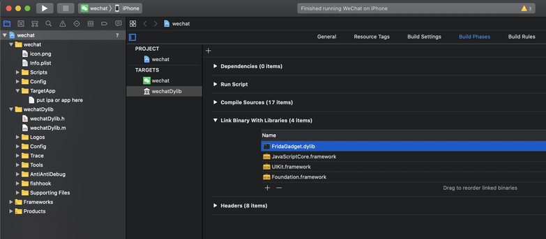
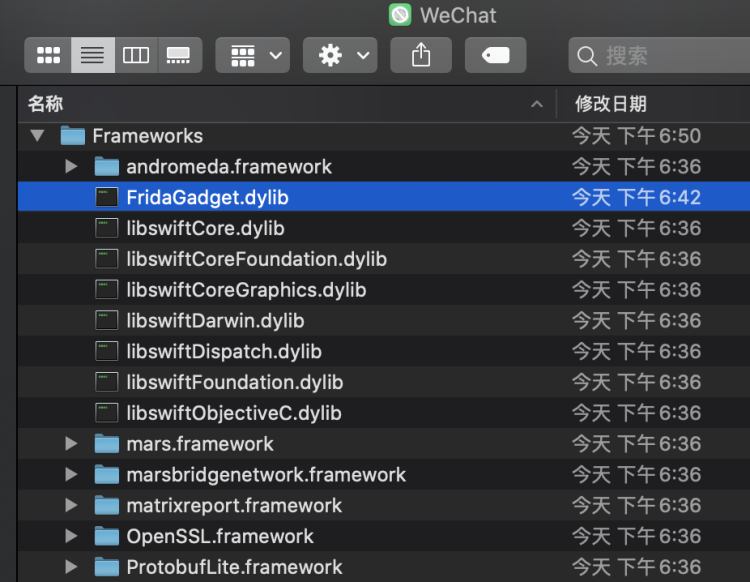
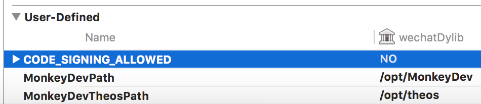

本文是 Frida 实战系列教程的第六篇，讲解非越狱环境下使用 MonkeyDev 注入 FridaGadget.dylib 愉快地玩转 Frida。
在之前的教程里我们学习 Frida 都是在越狱环境操作的，如果不越狱可以使用 Frida 吗？当然也可以，操作步骤如下：
(1) 首先下载 FridaGadget.dylib。打开[https://github.com/frida/frida/releases](https://github.com/frida/frida/releases)， 选择一个版本下载，比如下载 frida-gadget-12.11.7-ios-universal.dylib.gz 这个文件，下载完成后解压文件，里面是一个 dylib 动态库文件，将它重命名为 FridaGadget.dylib。(2) 准备一个脱壳过的应用包，比如我们用微信做测试。使用 MonkeyDev 新建一个 MonkeyApp 工程，将脱壳后的应用包放入 TargetApp 目录，然后引入 FridaGadget.dylib，如下图所示：

(3) 在 TargetApp 目录打开 WeChat.app，将 FridaGadget.dylib 放入 Framework 目录，如下图所示：

(4) 在 Xcode 上选择好你的证书，运行程序，此时微信运行后如果 Frida 加载成功会提示下面的信息。
```jsx
2020-08-05 18:51:45.538126+0800 WeChat[290:7576] Frida: Listening on 127.0.0.1 TCP port 27042
```
有一点需要注意的是在 Xcode 11 使用 MonkeyDev 新建的工程编译时提示需要在 "Signing & Capabilities"  配置证书，但是可能没有 "Signing & Capabilities" 这个选项，此时可以在 build settings 中点击 + 号，然后在弹出的菜单里点击 “Add User Define Setting”，添加一个自定义配置项 "CODE_SIGNING_ALLOWED=NO" 就可以解决这个问题，如下图所示：

如果提示错误信息 "CydiaSubstrate.tbd built for iOS Simulator"，解决的的方法是打开 /opt/theos/vendor/lib/CydiaSubstrate.framework/CydiaSubstrate.tbd，内容如下，删除两个 archs 里的 i386 和 x86_64 即可。
```jsx
archs:           [ armv7, armv7s, arm64, arm64e, i386, x86_64 ]
platform:        ios
install-name:    /Library/Frameworks/CydiaSubstrate.framework/CydiaSubstrate
current-version: 0.0.0
compatibility-version: 0.0.0
exports:
  - archs:            [ armv7, armv7s, arm64, arm64e, i386, x86_64 ]
    symbols:          [ _MSDebug,
                        _MSFindSymbol, _MSGetImageByName,
                        _MSHookFunction, _MSHookMessageEx ]
......
```
(5) 在计算机上使用 frida-ps 命令可以验证 frida 在手机上是否加载成功。
```jsx
% frida-ps -U -a   
PID  Name    Identifier          
---  ------  --------------------
316  Gadget  re.frida.Gadget     
316  微信      com.test.wechat     
227  邮件      com.apple.mobilemail
```
(5) 编写一段测试代码，让微信加载咱们的 JS 脚本，代码如下，功能是打印沙盒目录的路径和 App 自身目录的路径。
```jsx
//获取沙盒目录
function getHomeDir(){
    var NSHomeDirectory = new NativeFunction(ptr(Module.findExportByName("Foundation", "NSHomeDirectory")), 'pointer', []);
    var path = new ObjC.Object(NSHomeDirectory());
    console.log('homeDir: ' + path);
    return path;
}

//获取App目录
function getAppDir(){
  var bundle = ObjC.classes.NSBundle;
  var mainBundle = bundle.mainBundle();
        var appDir =  mainBundle.bundlePath();
        console.log('appDir: ' + appDir);
        return appDir;
}

getHomeDir();
getAppDir();
```
在计算机上执行 frida 加载上面我们写的脚本，316 是上面我们看到微信的进程 ID。脚本加载之后，输出的信息如下，此时我们已经能够在不越狱的情况使用 Frida 愉快地玩耍。
```jsx
% frida -U -l test.js 316
homeDir: /var/mobile/Containers/Data/Application/054500C2-0D26-45BD-A7E0-B2689D070FFF
appDir: /var/containers/Bundle/Application/EBECBBA3-2BA7-48C2-8D57-DB635D1898F7/wechat.app
```
结合 MonkeyDev 是不是感觉其实在不越狱环境下使用 Frida 也很简单，最后给大家补充两个平时很有用的脚本，一个是加载指定的任一动态库，还有一个是枚举进程加载的模块，比如调用 dlopen 加载 /usr/lib/test.dylib 的代码如下：
```jsx
function loadDylib() {
        var dlopen = new NativeFunction(Module.findExportByName(null, 'dlopen'), 'pointer', ['pointer', 'int']);
        var path = Memory.allocUtf8String("/usr/lib/test.dylib");
        dlopen(path, 10);
}
```
如果想验证某个动态库是否加载成功，可以将进程模块枚举出来做判断。调用 Process.enumerateModules 可以枚举模块信息，比如获取当前进程加载的所有模块的名称、基地址、大小、路径的代码如下：
```jsx
function getModuleList(){

        Process.enumerateModules({
                onMatch: function(module){

                        console.log('Module name: ' + module.name);
                        console.log('Base address: ' + module.base);
                        console.log('Size: ' + module.size);
                        console.log('Path: ' + module.path);
                        console.log('--------------------------------------------------------');
                }, 

                onComplete: function(){
                }

        });
}
```
